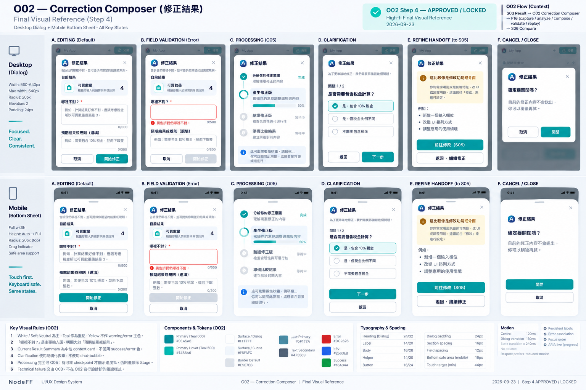

# O02 — Correction Composer

> Overlay ID：O02
>
> 狀態：**WORKING — ④A LOW_FI_APPROVED / ④B HIGH_FI_STEP1–4 APPROVED — WORKING BASELINE**
>
> Phase：Phase 1
>
> Screen-level canonical owner：`working/UI-UX/overlays/O02-CORRECTION-COMPOSER.md`
>
> Function behavior source：F16 Result Correction + F00 Experience Shell。
>
> ④A Low-fi與④B High-fi Step 1–4已完成 User Review並鎖定；Formal Spec與 Cursor implementation仍維持 HOLD。

# 1. User Outcome

O02 的核心任務：

> **User 發現目前結果 / 規則 / 邏輯不符合預期時，可以直接說「哪裡不對」，NodeFF 保留原 App 與目前結果，開始 correction flow。**

O02 不是一般 Refine Composer。

# 2. Entry / Exit

Entry：

    S03 Result Surface
    → 調整結果 / 邏輯不對 / 結果不是我想要的
    → O02

Exit：

    Cancel
    → 回 S03，同一 App / inputs / result保留

Submit：

    O02
    → F16 correction lifecycle
    → 必要時 clarification / assumption
    → replay / compare
    → S06

# 3. Correction vs Refine Boundary

O02 只處理：

- 結果算錯。
- 規則理解錯。
- 假設錯。
- 邏輯不符合原本意圖。

不處理：

- 加新功能。
- 大幅改 UI。
- 新增 / 刪除 input。
- 改成不同用途。

若 User feedback混入上述功能修改，F16 / F01 可引導轉 S05 Refine，而不是讓 O02 偷偷變成功能編輯器。

# 4. Minimum Information

F16 已固定 Correction Entry minimum：

- current result摘要。
- natural-language correction input。
- optional expected result / rule hint。
- Cancel。
- Continue。

O02 不顯示：
- Blueprint hash。
- Runtime state keys。
- Correction Delta。
- JSON。
- model/provider。
- technical error code。

# 5. Proposed Desktop Low-fi

    ┌──────────────────────────────────────────────────┐
    │ 調整結果                                    [×] │
    │                                                  │
    │ 目前結果                                         │
    │ ┌──────────────────────────────────────────────┐ │
    │ │ $1,200                                       │ │
    │ └──────────────────────────────────────────────┘ │
    │                                                  │
    │ 哪裡不對？                                       │
    │ ┌──────────────────────────────────────────────┐ │
    │ │ 主管應該付兩倍，但現在沒有算進去…           │ │
    │ └──────────────────────────────────────────────┘ │
    │                                                  │
    │ 預期結果或規則（選填）                           │
    │ ┌──────────────────────────────────────────────┐ │
    │ │ 例如：主管權重應為 2x                        │ │
    │ └──────────────────────────────────────────────┘ │
    │                                                  │
    │ [取消]                              [開始修正]   │
    └──────────────────────────────────────────────────┘

Desktop 建議 lightweight dialog / side panel，不跳全頁。

# 6. Proposed Mobile Low-fi

    ╭────────────────────────────╮
    │ 調整結果               [×] │
    │                            │
    │ 目前結果                   │
    │ $1,200                     │
    │                            │
    │ 哪裡不對？                 │
    │ ┌────────────────────────┐ │
    │ │ correction feedback    │ │
    │ └────────────────────────┘ │
    │                            │
    │ 預期結果或規則（選填）     │
    │ ┌────────────────────────┐ │
    │ │ optional hint          │ │
    │ └────────────────────────┘ │
    │                            │
    │ [      開始修正      ]     │
    ╰────────────────────────────╯

Mobile 建議 bottom sheet / full-height sheet，但仍保留目前 App context，不另開獨立 route。

Cross-screen layering rule：
- O02 active時，underlying S03 Shell controls與 permanent bottom navigation必須 inert / unavailable。
- 不允許 tap-through到 Runtime或 Shell action。
- Close / Cancel後 focus回「調整結果」trigger或合理 safe surface。

# 7. Current Result Summary

O02 顯示的是 F03 / F16 canonical result summary。

Rules：
- 不從 DOM 猜。
- 多個 outputs 時只顯示主要 / material result，其他可展開。
- output ERROR 不 fake value。
- protected / sensitive result依 F16 privacy policy處理。
- 目的只是讓 User確認「我正在修哪個結果」。

# 8. Main Input — 哪裡不對？

Primary field：

> **哪裡不對？**

User可用自然語言，例如：

- 主管應該付兩倍。
- 這個總額不對。
- 你把週末也算進工作日了。
- 這個排名規則跟我原本說的不一樣。

這是 correction semantic source。

# 9. Optional Expected Result / Rule Hint

Secondary field：

> **預期結果或規則（選填）**

可以填：
- 明確預期數值。
- 正確規則。
- 正確假設。
- 判斷方式。

例如：

    正確結果應該是 1450
    主管權重 = 2x

Rules：
- User沒填也能 Continue。
- LLM / System不能自己把 expected result填成 User fact。
- 如果 correction feedback已很清楚，不要求重複輸入。

# 10. Submit Behavior

Primary CTA：

    開始修正

Submit後：

    CAPTURING_BEFORE
    → ANALYZING
    → ...

Consumer不顯示 internal state names。

Low-fi copy可用：

    正在確認目前結果…
    正在理解你指出的問題…
    正在準備修正版…

處理中 presentation 統一遵循 **O05 Current Truth**：

- 有可靠 checkpoints → Stage label + checkpoint-derived Progress %。
- 沒有可靠 checkpoints → Stage label only。
- 百分比只代表已完成 work，不是 ETA。
- clarification等待 User input時暫停，不假裝持續增加。
- 進入 child compose / validation / replay時，只在真實 checkpoint完成時更新。
- 不為了動畫故意延長 operation。
- 不允許 fake smooth / fake %。

O02本身在 submit後可：
- 保持 sheet/panel並轉 progress state，或
- 收合為 bounded progress state。

不能立即把原 App清掉。

# 11. Clarification After Submit

若 F16 / F01發現 correction仍有 material ambiguity：

- 沿用 S02 / S05同一 clarification presentation。
- 最多 1–3 material questions。
- 保留 correction draft。
- 不要求 User重打目前結果。

# 12. Cancel / Close

EDITING 狀態：
- Close / Cancel → 回 S03。
- 原 App / current inputs / current result保持。
- correction draft可依 F00 draft policy保留。

Submit後若 operation仍在進行：
- 可安全 cancel時允許取消。
- 不能安全 cancel時，不假裝已中止；依 F00 operation semantics處理。
- 不破壞 base App。

# 13. Failure

任何 correction technical failure：

    修正沒有完成
    原本的 App 和結果都還在

    [再試一次]
    [修改說明]
    [回原 App]

詳細由 O03 / F12承接。

# 14. Accessibility

- Field有明確 label。
- Current Result summary可被 assistive tech讀取。
- Optional欄位明確標示「選填」。
- Error與field programmatic association。
- Mobile keyboard開啟時 CTA仍可達。
- Close後 focus回 S03 correction trigger。
- submit progress透過 aria-live適度通知。

# 15. Confirmed O02 Low-fi Decisions

User 已確認：

1. Desktop 使用 lightweight dialog / side panel；Mobile 使用 bottom sheet / full-height sheet，不做獨立頁。
2. O02 固定顯示：**目前結果摘要 +「哪裡不對？」+「預期結果或規則（選填）」**。
3. Primary CTA 固定為 **「開始修正」**；Submit 後先進 progress / clarification，最後才進 S06 Compare。
4. Correction 處理中遵循 **O05 Current Truth**：有可靠 checkpoints 才顯示 checkpoint-derived Progress %；沒有可靠 checkpoints 則 Stage only，不做 fake % / ETA。
5. 若 User其實是在加功能 / 改 UI / 改用途，由系統引導轉 S05 Refine，不把 O02 擴張成通用修改器。

# 16. ④B High-fi Contract

> Step 1 approved by User：2026-09-23
>
> Canonical rule：本節是 O02 High-fi 的唯一 canonical contract。後續 Step 2–4 必須在本節續寫，不得另建重複 High-fi summary / shadow copy。
>
> Current status：
> - Step 1 — Structure Lock ✅
> - Step 2 — Geometry + Visual Hierarchy Lock ✅
> - Step 3 — Detailed High-fi Visual Rules Lock ✅
> - Step 4 — Final Visual Reference Lock ✅

## Step 1 — Structure Lock ✅

### 1. O02 Role / Correction Boundary

O02只處理 **結果 / 規則 / 假設 / 邏輯不符合原本意圖**。

O02不是一般 Refine Composer，也不是 S05的替代入口。

不屬 O02：
- 加新功能；
- 大幅改 UI；
- 新增 / 刪除 input；
- 改成不同用途；
- 一般 derivative / remix。

若 User feedback其實屬上述需求，必須明確 handoff到 S05 / F06，不得在 O02背後偷偷改 intent kind。

### 2. Canonical Flow

~~~text
S03 Result
→ O02 Correction Composer
→ F16 correction lifecycle
→ capture / analyze / compose / validate / replay
→ S06 Correction Compare
~~~

Cancel / Close：
~~~text
O02
→ 原本 S03
~~~

原 App、current inputs、current result必須保留。

### 3. Overlay Boundary

O02是 Overlay，不是獨立 Screen / route。

- Active時 underlying S03仍存在但 inert。
- 不允許 tap / click-through到 Runtime或 Shell controls。
- Close / Cancel後 focus回 S03 correction trigger或合理 safe surface。
- O02不得自行複製一套 S03 Runtime shell。

### 4. EDITING Information Order

固定順序：
~~~text
Title / Close
→ 目前結果摘要
→ 哪裡不對？
→ 預期結果或規則（選填）
→ Cancel / 開始修正
~~~

不得把 technical metadata插進上述 consumer hierarchy。

### 5. Current Result Summary

`目前結果摘要`必須存在，目的只為確認「我正在修哪個結果」。

來源必須是 F03 / F16 canonical result，不得從 DOM猜。

Rules：
- 多個 outputs只顯示主要 / material result，其他可展開。
- output ERROR不得 fake value。
- protected / sensitive result依 F16 privacy policy。
- 不把 summary做成第二個 Runtime。

### 6. Primary Semantic Input

Primary field固定為：

> **哪裡不對？**

這是 Correction Intent的主要 semantic source，使用自然語言。

### 7. Optional Expected Result / Rule Hint

Secondary field固定為：

> **預期結果或規則（選填）**

可提供：
- expected value；
- correct rule；
- correct assumption；
- judgment method。

Rules：
- 不填也能 Continue。
- correction feedback已清楚時不得強迫重複輸入。
- System / LLM不得自行把猜測填成 User fact。

### 8. Primary CTA / Submit Boundary

Primary CTA固定為：

~~~text
開始修正
~~~

Submit後不得直接跳 S06。

必須先完成 F16必要 lifecycle：capture before → analyze → compose → validate → replay / comparison preparation。

只有 child validated且 comparison truth已建立到可進 Compare的狀態，才進 S06。

不得先展示「修正版」再補 validation。

### 9. Clarification

若 correction仍有 material ambiguity，可在 correction lifecycle中進 clarification presentation；不新增獨立 Screen。

Rules：
- 沿用既有 clarification component language。
- 只問 material questions，通常 1–3題。
- 保留 correction draft。
- 不要求 User重打目前結果。

### 10. Refine Handoff

若 User其實在要求加功能 / 改 UI / 改用途：
- UI需明確告知這較像 Refine。
- handoff到 S05 / F06。
- 不得在 O02內靜默完成 feature change。

### 11. Processing Ownership — O05 Current Truth

O02 processing presentation完全交 **O05**。

Canonical rule：
~~~text
Reliable checkpoints
→ Stage label + checkpoint-derived Progress %

No reliable checkpoints
→ Stage label only
~~~

Rules：
- `%`代表已完成 work，不是 ETA。
- 不 fake smooth / fake %。
- clarification等待 User時進度不得假裝前進。
- 只有真實 checkpoint完成才更新。
- 不為了 animation故意拖慢 operation。

**Progress rule = O05 Current Truth.**

因此舊 Low-fi「處理中固定顯示 Progress %」不再作為 High-fi contract。

### 12. Technical Failure / Recovery Ownership

Technical failure不在 O02自行建立 recovery system。

Canonical ownership：
~~~text
O03 + F12
~~~

原 App / inputs / result / correction draft應依既有 recovery semantics保留。

### 13. Consumer Technical Boundary

O02不得顯示：
- Blueprint hash；
- Runtime state keys；
- Correction Delta；
- JSON；
- model / provider；
- technical error code。

### 14. Step 1 Locked Decisions

1. O02只處理 semantic correction，不是一般 Refine。
2. Canonical flow = S03 → O02 → F16 lifecycle → S06。
3. O02是 Overlay；underlying S03 inert但 context保留。
4. EDITING順序固定為 Title/Close → Current Result → 哪裡不對 → Optional Expected Result/Rule → actions。
5. Current Result Summary必須來自 F03 / F16 canonical result，不從 DOM猜。
6. `哪裡不對？`是 Primary semantic input。
7. `預期結果或規則（選填）`保持 optional，System不得自行填成 User fact。
8. Primary CTA = `開始修正`。
9. Submit後必須先完成必要 capture / analyze / compose / validate / replay truth，Compare Ready才進 S06。
10. Clarification保留在 correction lifecycle，不新增 Screen。
11. Feature/UI/use-case change明確 handoff到 S05 / F06，不在 O02偷偷處理。
12. **Progress rule = O05 Current Truth：有可靠 checkpoints才顯示 %；否則 Stage only。**
13. Technical failure / recovery交 O03 + F12。
14. Consumer UI不顯示 internal technical metadata。

> Step 1：**APPROVED / LOCKED**。下一步：Step 2 — Geometry + Visual Hierarchy Lock。

## Step 2 — Geometry + Visual Hierarchy Lock ✅

> Approved by User：2026-09-23
>
> Step 2：**APPROVED / LOCKED**
>
> Scope：鎖定 O02 Desktop / Mobile overlay geometry、Current Result份量、Primary / Optional input比例、actions位置、processing / clarification / refine handoff時的版面穩定性。不得改寫 Step 1 Function / state semantics；color / border / shadow / motion留給 Step 3。

### 1. Desktop Overlay Geometry

Desktop baseline採 **centered lightweight dialog**，不採 side panel。

Recommended width：
~~~text
560–640px
max-width：約 640px
~~~

O02比 O01需要更多輸入空間，但仍保持 focused correction task，不做 full page。

### 2. Desktop Vertical Structure

固定順序：
~~~text
Title + Close
→ Current Result Summary
→ 哪裡不對？
→ 預期結果或規則（選填）
→ Actions
~~~

### 3. Current Result Summary Scale

Current Result Summary只作 context，不是第二個 S03 Runtime。

Recommended：
- 高度自適應。
- 常態約 `72–120px`。
- 多 outputs時顯示 material summary + expandable details。
- 不得讓 Result區壓過 Composer主體。

### 4. Primary Feedback Field

`哪裡不對？`是 O02最大輸入區，也是主要 visual / semantic focus。

Recommended：
~~~text
textarea min-height：約 120–160px
~~~

它必須明顯大於 optional field。

### 5. Optional Expected Result / Rule Field

`預期結果或規則（選填）`是 Secondary input。

Recommended：
~~~text
height：約 72–96px
~~~

不得與 Primary feedback field做成等量，避免 User誤以為兩欄都必填。

### 6. Desktop Actions

Desktop actions固定在內容底部：
~~~text
[取消]                              [開始修正]
Ghost / low emphasis               Primary
~~~

Rules：
- Primary靠右。
- Step 2 baseline不採 sticky footer。
- actions不得壓縮主要輸入區。

### 7. Submit → Processing / Clarification Stability

Submit後同一 O02 Overlay轉為 Processing / Clarification presentation。

Rules：
- 外框位置與寬度保持穩定。
- State Body原地替換。
- 不讓 User感覺跳到另一個產品流程。
- Processing presentation仍由 O05 owner。

### 8. Clarification Geometry

Clarification不新增第二層 modal。

在 O02原 overlay中顯示必要 material questions，保留 correction summary / draft context。

若有 1–3題：
- 採單欄 stacked。
- 不做多欄 questionnaire。
- 不要求重輸 current result。

### 9. Refine Handoff Geometry

若判定應轉 S05 / F06，handoff在 O02原位置完成。

Recommended structure：
~~~text
簡短說明
→ 前往修改（Primary）
→ 返回 / 繼續修正（僅 semantics 允許時）
~~~

不得從 O02再打開第三個 overlay。

### 10. Mobile Sheet Geometry

Mobile採 bottom sheet；必要時可升 full-height sheet。

Canonical order：
~~~text
Title
→ Current Result
→ 哪裡不對？
→ 預期結果或規則（選填）
→ 開始修正
→ 取消
~~~

Rules：
- horizontal padding沿 Design System約 16–20px。
- keyboard開啟時可擴張到 full-height。
- content region可 scroll。
- Primary CTA不可被 keyboard / safe area遮住。

### 11. Mobile Action Order

Mobile固定：
~~~text
[開始修正]
[取消]
~~~

`開始修正`接近 full-width，min-height ≥ 44px。

### 12. Visual Hierarchy

O02預設 hierarchy：
~~~text
哪裡不對？
> Current Result context
> Primary CTA
> Optional expected-result field
> secondary chrome / helper copy
~~~

第一眼應該是「告訴我哪裡不對」，不是「再看一次結果」。

### 13. Step 2 Locked Decisions

1. Desktop baseline = centered lightweight dialog，不用 side panel。
2. Desktop width約 560–640px，max-width約 640px。
3. 固定結構 = Title + Close → Current Result → Primary feedback → Optional hint → Actions。
4. Current Result Summary保持 compact，常態約72–120px。
5. `哪裡不對？`是最大輸入區，textarea min-height約120–160px。
6. Optional expected-result field約72–96px，明顯小於 Primary feedback field。
7. Desktop actions = 取消（Ghost）+ 開始修正（Primary），不預設 sticky。
8. Processing / Clarification在同一 Overlay原地切換，保持 geometry穩定。
9. Clarification採單欄 stacked，不新增第二層 modal。
10. Refine handoff在原 O02位置完成，不新增第三個 overlay。
11. Mobile = bottom sheet，必要時可升 full-height sheet。
12. Mobile action order = 開始修正 → 取消。
13. **Main feedback field 明顯大於 Optional expected-result field = YES。**

> Step 2：**APPROVED / LOCKED**。下一步：Step 3 — Detailed High-fi Visual Rules Lock。

## Step 3 — Detailed High-fi Visual Rules Lock ✅

> Approved by User：2026-09-23
>
> Step 3：**APPROVED / LOCKED**
>
> Scope：鎖定 O02 color usage、typography、Current Result summary、Primary / Optional input hierarchy、CTA、Clarification、Refine handoff、Processing presentation、field validation、motion、interaction states與 accessibility。不得改寫 Step 1 Function / state semantics或 Step 2 geometry。

### 1. Core Visual Character

O02採 **Focused Correction Composer** visual direction。

Rules：
- White / Soft Neutral為主。
- Teal用於 focus / Primary CTA / active controls。
- Yellow不作 warning / error主色。
- 不做 AI glow。
- 不做 gradient background。
- 不做大型 decorative effect。
- 視覺應比 S05更克制、更問題導向。

### 2. Desktop Dialog Visual

沿 Design System：
- radius = `20px`。
- elevation = `2`。
- White surface。
- padding約 `24px`。
- Title使用 `heading-lg 24/32` 或 `heading-md 20/28`。
- Close icon約20px，hit area ≥ 44px。

Underlying S03保持可辨識但 inert。

### 3. Current Result Summary

Current Result Summary採 neutral context card：
- Soft surface。
- radius = `16px`。
- border default。
- elevation = `0–1`。
- 明確 label：`目前結果`。
- material result可適度強調，但不得套 success / error semantics。

它的角色是確認 correction target，不是第二個 Result Screen。

### 4. Primary Feedback Field

`哪裡不對？`是 O02最強輸入區。

Visual baseline：
- White surface。
- neutral border。
- radius = `12px`。
- focus = Teal treatment。
- persistent visible label。
- body-lg約 `16/26`。
- placeholder只作 example，不得像 System替 User提出答案。

它的視覺重量必須明顯高於 Optional field。

### 5. Optional Expected Result / Rule Field

`預期結果或規則（選填）`沿用同一 input family，但明確降階。

Rules：
- 尺寸較小。
- helper copy較輕。
- `選填`必須可讀，不可只靠超淡小字。
- 不使用「建議填寫」等造成壓力的文案。
- 空白不是 error。

### 6. CTA Visual Hierarchy

`開始修正` = Primary：
- Teal 600 background。
- White text。
- radius `12px`。
- min-height `44px`。
- Hover → Teal 500。
- visible focus。

`取消` = Ghost / low emphasis。

`取消`不得使用 destructive red。

### 7. Field Validation

若 `哪裡不對？` 為空：
- 使用 inline field error。
- icon + text。
- 與 field programmatically associated。
- 不只靠紅框。
- 不另開 modal。

Optional field空白不觸發 error。

### 8. Clarification Presentation

Clarification固定使用 **structured form / choice blocks**，不使用 chat-bubble / assistant conversation UI。

**Clarification chat-bubble = NO。**

Rules：
- 沿用既有 Input / Choice component language。
- 每題清楚編組。
- 1–3 material questions採單欄 stacked。
- 不做 chatbot transcript。
- 不把 O02變成聊天介面。

### 9. Refine Handoff

若判定應轉 S05 / F06：
- 使用 neutral / informational Inline Notice。
- 說明「這比較像修改功能 / UI / 用途」。
- `前往修改` = Primary。
- 返回 correction = Secondary / Ghost（僅 semantics允許時）。
- 不使用 warning / error styling。

這是 intent handoff，不是 failure。

### 10. Processing Presentation

Processing完全沿 O05：

~~~text
Reliable checkpoints
→ Stage + checkpoint-derived %

No reliable checkpoints
→ Stage only
~~~

Visual rules：
- Teal / Aqua progress visual。
- 不 fake %。
- 不巨大 spinner。
- 不用 pulse假裝仍在工作。
- clarification waiting時不持續灌進度。
- 不為動畫延遲 READY / Compare。

### 11. Technical Failure Boundary

O02不得自行發明新的 Error / Warning visual system。

Technical failure / recovery由 O03 + shared Recovery system承接。

Rules：
- O02可 host recovery handoff。
- 不自行建立 red modal。
- 不把 Brand Yellow當 warning box。
- exact semantic Warning / Danger palette由 O03 / shared semantic system owner。

### 12. Motion

- Button / control feedback = `120ms`。
- Dialog / state transition = `180ms`。
- Processing / clarification transition ≤ `240ms`。
- 不做 bounce。
- 不使用 morph暗示「修好了」。
- `prefers-reduced-motion`必須有 fallback。

### 13. Interaction States

O02共用元件至少支援：
~~~text
DEFAULT
HOVER
FOCUS_VISIBLE
PRESSED
DISABLED
INVALID
LOADING where applicable
~~~

Rules：
- Submit後避免 duplicate submission。
- Loading不得清空 User draft。
- Clarification返回後保留 feedback。
- Refine handoff不得遺失 correction draft context。

### 14. Accessibility

- 每個 field都有 persistent label。
- Error與 field programmatically associated。
- touch target ≥ 44px。
- focus order = Current Result → Primary feedback → Optional field → actions。
- Mobile keyboard不得遮 Primary CTA。
- Overlay focus trap / restore正確。
- Progress / clarification使用適度 aria-live。
- reduced-motion有 fallback。

### 15. Step 3 Locked Decisions

1. O02採 Focused Correction Composer visual。
2. Desktop = White dialog / radius20 / elevation2。
3. Current Result Summary使用 neutral context card，不套 success / error semantics。
4. `哪裡不對？`是最強輸入區，Teal focus，persistent label。
5. Optional expected-result field明確降階，`選填`保持可讀。
6. `開始修正` = Teal Primary；`取消` = Ghost。
7. Required field validation使用 inline error，不開 modal。
8. **Clarification固定使用 structured form / choice blocks，不用 chat-bubble / chatbot transcript。**
9. Refine handoff使用 informational Inline Notice，不視為 error。
10. Processing完全沿 O05，不 fake progress。
11. Technical failure visual交 O03 / shared Recovery system。
12. Motion採 `120 / 180 / ≤240ms` restrained system。
13. Accessibility / focus / keyboard / aria-live / reduced-motion列為 High-fi acceptance gate。

> Step 3：**APPROVED / LOCKED**。下一步：Step 4 — Final Visual Reference Lock。

## Step 4 — Final Visual Reference Lock ✅

> Approved by User：2026-09-23
>
> Step 4：**APPROVED / LOCKED**
>
> Approved visual：
>
> 
>
> Canonical path：
>
> `working/UI-UX/references/O02-Hi-FI-v1.png`
>
> Repository PNG blob SHA：
>
> `6101290c686673e192af583805c6fdde70599bf0`

### Reference Boundary

- 圖片鎖定 Correction Composer 的 Desktop / Mobile composition、input hierarchy、validation / submit presentation。
- sample correction text只作 visual example，不自動成為 F16 requirement。
- Correction semantics、required fields、submit lifecycle與 processing truth仍以 Step 1–3 + F16 / O05為 authority。
- 圖片不得新增 technical metadata或另一套 processing model。
- Step 1–3 textual contract + Design System + Fxx Function truth優先於圖片生成 / rendering誤差。
- 此 PNG 為本 Screen / Overlay 唯一 canonical High-fi visual reference；後續若要取代，必須 reopen Step 4。

> Step 4：**APPROVED / LOCKED**。

# 17. Review Status

> **④A LOW_FI_APPROVED / ④B HIGH_FI_STEP1–4 APPROVED — WORKING BASELINE**

O02 ④A Low-fi與④B Step 1–4已完成 User Review並鎖定。

Final Cross-Screen High-fi Review：**OPEN — FG-02 / FG-03 PENDING**。

Formal Spec、Backlog / Sprint、Cursor implementation維持 HOLD。

### Final Cross-Screen High-fi Review — OPEN

> Repair checkpoint：2026-09-24
>
> FG-01 / FG-04 / FG-05 / FG-06 / FG-07 deterministic consistency repair已處理；**FG-02 / FG-03仍待 S03 ↔ S05A/S05B + returnable inspection context 決策，因此 Final Gate不得標 PASSED / CLOSED。**
>
> Final cross-screen authority：**Step 1–3 textual contract + Design System + Fxx Function truth > Step 4 visual reference。**
>
> 本輪 deterministic repair不修改 PNG artifacts；是否需要 reopen S03 Step 4，待 FG-02 / FG-03決策後判定。
