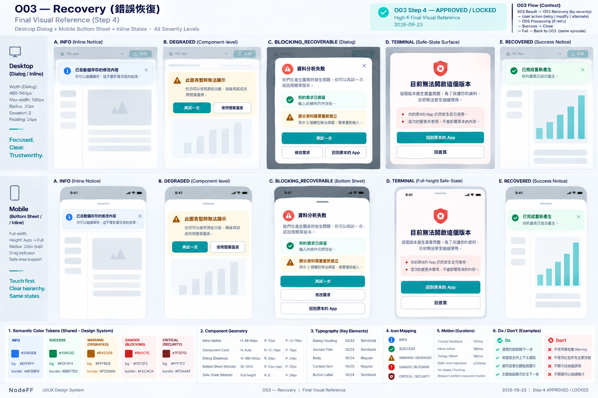

# O03 — Recovery Overlay

> **GOVERNANCE NOTICE**：本檔內任何 `spec/`、Formal Spec、Spec Promotion 字樣均屬 **RETIRED / NO-USE FOR CURRENT AUTHORITY**。Current UI/UX Truth = 本 Working；current next gate = Build Freeze reconciliation → Human approval → NFFBuild locked BS-*。

> Overlay ID：O03
>
> 狀態：**WORKING — ④A LOW_FI_APPROVED / ④B HIGH_FI_STEP1–4 APPROVED — WORKING BASELINE**
>
> Phase：Phase 1
>
> Screen-level canonical owner：`working/UI-UX/overlays/O03-RECOVERY.md`
>
> Function behavior source：F12 Humanized Recovery + F00 Experience Shell。
>
> ④A Low-fi與④B High-fi Step 1–4已完成 User Review並鎖定；Formal Spec與 Cursor implementation仍維持 HOLD。

# 1. User Outcome

O03 的核心任務：

> **當某一步失敗時，User 不需要懂技術錯誤；NodeFF 要先保住能保住的內容，再用人話說明發生什麼，最後只提供真正能執行的下一步。**

Recovery 的第一優先不是「顯示錯誤」，而是：

    Preserve Context
    → Explain Clearly
    → Offer Safe Next Action

# 2. Host Surfaces

O03 可套在：

- S02 Create Workspace。
- S03 App / Runtime。
- S05 Refine / Remix Workspace。
- S06 Correction Compare。

O03 不建立獨立產品 route。

# 3. Presentation Levels

依 F12 / F00 固定 mapping：

## A. INFO

Presentation：
- inline notice。

Example：

    沒有偵測到實際修改。
    [修改需求]

不擋主流程。

## B. DEGRADED

Presentation：
- inline / node-level notice。

Example：

    這個區塊暫時無法使用，其他部分仍可繼續。
    [再試一次]

不鎖整個 App。

## C. BLOCKING_RECOVERABLE

Presentation：
- blocking recovery overlay / creation panel。

Example：

    現在暫時無法完成這一步。
    你的需求已保留。

    [再試一次]
    [修改需求]

只阻擋「當前失敗操作」，不破壞 last-known-good App。

## D. TERMINAL / CRITICAL

Presentation：
- terminal safe-state view。

Example：

    這個版本目前無法安全繼續使用。

    [回到安全版本]
    [回首頁]

不提供明知會失敗的 Retry。

# 4. Core Information Hierarchy

任何 User-visible Recovery，資訊順序固定：

1. **現在發生什麼**
2. **哪些內容還在 / 哪些可能遺失**
3. **Primary next action**
4. 最多 2 個 Secondary actions
5. technical details 預設不顯示

Example：

    暫時無法完成這次修改

    原 App 和你的修改內容都還在。

    [再試一次]
    [修改需求]
    [回原 App]

# 5. Context Preservation Copy

如果 context有保留，應明確說：

- 「你的需求已保留」
- 「原 App 還在」
- 「目前結果還在」
- 「分享連結仍有效」

如果 material context遺失，必須明講：

    這次無法保留其中 2 個輸入，
    需要你重新輸入。

不能默默清空。

# 6. Next Action Rules

F12 已固定：

- Primary action最多 1 個。
- visible actions通常 1–3 個。
- 每個 action必須真的能執行。
- Retry不能無限。
- Security / integrity / unsupported 不提供假 Retry。

常見 actions：

    再試一次
    稍後再試
    修改需求
    回原 App
    保留目前版本
    使用較簡單版本
    回首頁
    重新整理

# 7. Retry Budget

Phase 1 同一 recovery episode：

    user-triggered immediate Retry max = 3

第 4 次後：

- transient → 稍後再試 / alternate path。
- terminal → 本來就不顯示 Retry。

UI 不顯示技術 retry counter，例如「attempt 2/3」作為主要文案；可視需要以人話提示：

    再試仍未成功，你可以稍後再試或先回原 App。

# 8. Desktop Low-fi — Blocking Recoverable

    ┌──────────────────────────────────────────────┐
    │ 暫時無法完成這一步                     [×] │
    │                                              │
    │ 你的修改內容和原 App 都還在。               │
    │                                              │
    │ [再試一次]                                   │
    │                                              │
    │ [修改需求]   [回原 App]                      │
    └──────────────────────────────────────────────┘

Desktop：
- centered/lightweight blocking dialog，或 host panel內 blocking state。
- 背後 safe context保持。
- 若 background App仍可安全操作，不應不必要鎖死全部互動。

# 9. Mobile Low-fi — Blocking Recoverable

    ╭────────────────────────────╮
    │ 暫時無法完成這一步         │
    │                            │
    │ 原 App 和修改內容都還在。 │
    │                            │
    │ [      再試一次      ]     │
    │ [      修改需求      ]     │
    │ [      回原 App      ]     │
    ╰────────────────────────────╯

Mobile：
- bottom sheet / full-height recovery sheet視嚴重度。
- Primary CTA單手可達。
- 不讓 User在錯誤狀態迷路。

# 10. Inline / Node-level Recovery

對 DEGRADED / PARTIAL_COMPONENT_FAILURE：

    ┌─────────────────────────────┐
    │ ⚠ 這個區塊暫時無法使用     │
    │ 其他部分仍可繼續            │
    │ [再試一次]                  │
    └─────────────────────────────┘

Rules：
- 不跳 blocking overlay。
- 不把整個 S03 Runtime變成 error page。
- node恢復後 notice移除。
- 其他 node照常使用。

# 11. Terminal Safe State

Terminal / Critical 不應還留一堆不安全操作。

Example：

    目前無法安全開啟這個版本

    我們保留了可用的 App reference，
    但這個版本不能繼續執行。

    [回到安全版本]
    [回首頁]

Rules：
- 不提供 silent bypass。
- 不重新 compile incompatible Blueprint。
- 不自動降級 security。
- technical trace只留 diagnostics。

# 12. Close Behavior

不是所有 Recovery 都可以直接 [×]。

Rules：

- INFO / DEGRADED：可 dismiss，前提是不會造成誤解。
- BLOCKING_RECOVERABLE：若 Close 等於安全地回到 host surface，可提供 Close。
- TERMINAL / CRITICAL：若 Close沒有明確 safe surface，不提供單純 [×]；必須選安全出口。
- 關閉不能造成 context silent loss。

# 13. Retry / Recovery Progress

User按「再試一次」後，如果進入實際 async operation：

- Recovery Overlay可轉成 recovery-in-progress state。
- **進度呈現交 O05 Loading / Building / Hydration 共用規則。**
- 若有可靠 work checkpoints可顯示 %。
- 沒有可靠 progress source不得 fake %。

O03 本身不另外發明第二套 loading規則。

# 14. Unsupported Is Not Error Retry

UNSUPPORTED：

    這個版本目前還做不到其中一部分。

Primary：
    修改需求

Secondary：
    使用較簡單版本

不顯示：
    再試一次

除非底層其實是 transient dependency，不是 capability unsupported。

# 15. Security / Integrity

Security / integrity問題：

- Fail closed。
- 停止 affected execution path。
- 保留安全 context。
- Consumer不看 raw security code。
- 不顯示「仍然執行」之類 bypass CTA。

# 16. Accessibility

- blocking recovery focus移到 heading / Primary action。
- Close後 focus回合理 trigger / safe surface。
- inline notice使用適度 aria-live。
- severity不只靠顏色。
- CTA至少44 CSS px。
- keyboard可完整操作。
- technical code不作 screen reader主要資訊。

# 17. Confirmed O03 Low-fi Decisions

User 已確認並固定：

1. **小問題**：使用 inline notice，User 可繼續使用 App。
2. **局部元件壞掉**：只在該 component 顯示 Recovery，不鎖整個 App。
3. **目前操作做不下去，但 App 還安全**：才使用 blocking Recovery Overlay。
4. **真的不能安全繼續**：才進 terminal safe-state。
5. Recovery 資訊順序固定為：**發生什麼 → 保留/遺失什麼 → 1 個 Primary + 最多 2 個 Secondary CTA**。
6. 同一 recovery episode 最多 3 次 immediate User Retry；第 4 次改成稍後再試或其他安全路徑，不提供無限 Retry。

# 18. ④B High-fi Contract

> Step 1 approved by User：2026-09-23
>
> Canonical rule：本節是 O03 High-fi 的唯一 canonical contract。後續 Step 2–4 必須在本節續寫，不得另建重複 High-fi summary / shadow copy。
>
> Current status：
> - Step 1 — Structure Lock ✅
> - Step 2 — Geometry + Visual Hierarchy Lock ✅
> - Step 3 — Detailed High-fi Visual Rules Lock ✅
> - Step 4 — Final Visual Reference Lock ✅

## Step 1 — Structure Lock ✅

### 1. O03 Role — Recovery Presentation System

O03正式鎖定為 **一套 Recovery Presentation System**，不是「所有錯誤都跳同一個 Modal」。

依 F12 severity使用不同 presentation：
~~~text
INFO
→ inline notice

DEGRADED
→ inline / node-level recovery

BLOCKING_RECOVERABLE
→ blocking recovery overlay

TERMINAL / CRITICAL
→ terminal safe-state
~~~

**Recovery Presentation System = YES.**

### 2. Core Recovery Principle

所有 User-visible recovery固定遵循：
~~~text
Preserve Safe Context
→ Explain Clearly
→ Offer Safe Next Action
~~~

Recovery第一優先不是顯示 technical error，而是先保住能安全保留的 context。

### 3. Consumer Information Order

任何 O03 consumer presentation固定依序：
1. 現在發生什麼。
2. 哪些內容仍保留 / 哪些 material context可能遺失。
3. Primary next action。
4. 最多 2 個 Secondary actions。
5. Technical diagnostics預設不顯示。

### 4. Context Preservation Copy

如果 context確實有保留，UI應明確說人話，例如：
- `你的需求已保留`。
- `原 App 還在`。
- `目前結果還在`。
- `分享連結仍有效`。

如果 material context有遺失，必須明講，例如需要重新輸入哪些 material values。

不得：
- 默默清空。
- 把 unsafe / corrupted context標成 preserved。
- 因 Recovery而違反 privacy / sensitivity policy。

### 5. Recovery Ownership Boundary

O03不自行決定 recovery policy。

Canonical ownership：
~~~text
Source Function
→ technical trigger / source error context

F12
→ recovery class
→ severity
→ retryability
→ preserved / lost context
→ safe surface
→ next actions

O03
→ consumer presentation
~~~

O03不得自行發明 source Function / F12未提供的安全路徑。

### 6. INFO

INFO不阻斷主要流程。

Presentation：
- inline notice。
- 可 dismiss only when dismissal不造成誤解。
- 不打斷 Runtime / creation flow。

### 7. DEGRADED

DEGRADED只限制 affected area。

例如 component / node failure：
- 只在 affected component顯示 Recovery。
- 其他 Runtime / App區域仍可使用。
- node恢復後 notice移除。

不得把 partial failure升級成整個 App error page。

### 8. BLOCKING_RECOVERABLE

只有以下情況才使用真正 blocking recovery overlay：
- 當前操作無法完成；
- 仍有安全 next action；
- last-known-good context可保留或可安全返回。

Blocking只阻擋 affected operation；不得無理由破壞 safe App context。

### 9. TERMINAL / CRITICAL

TERMINAL / CRITICAL必須進 safe-state。

Rules：
- 停止 affected execution path。
- 不提供明知無效的 Retry。
- 不 silent bypass。
- 不降低 validation / compatibility / security gate。
- 必須提供 safe exit，例如 `回到安全版本` / `回首頁`。

如果不存在安全 Close destination，不得只放 `×`。

### 10. Action Contract

Visible recovery actions遵循：
- Primary action最多 1 個。
- visible actions通常總共 1–3 個。
- 每個 action必須真的可執行。
- action內容來自 F12 next_actions / safe_surface contract。

O03不得自行增加看似合理但底層不支援的 CTA。

### 11. Retry Budget

Retry必須 bounded。

Phase 1同一 recovery episode：
~~~text
user-triggered immediate Retry max = 3
~~~

超過 immediate Retry budget後，應轉：
- 稍後再試；
- alternate safe path；
- 或 terminal / safe-state action。

UI不以 `attempt 2/3` 等 technical counter作主要 consumer copy。

### 12. UNSUPPORTED Boundary

`UNSUPPORTED`不是一般 retryable error。

Preferred actions：
- 修改需求。
- 使用較簡單版本。

不得顯示 `再試一次`，除非底層實際 failure是 transient dependency而不是 capability unsupported。

### 13. Security / Integrity

Security / integrity問題固定：
- fail closed。
- retryability = NO_RETRY。
- 停止 affected execution path。
- 保留安全 context。
- 不提供 `仍然執行` / bypass action。
- 不降低 security / validation semantics。
- raw security code只留 diagnostics。

### 14. Close / Dismiss Boundary

不是所有 Recovery都可以 Close。

- INFO / DEGRADED：可 dismiss，前提是不造成誤解。
- BLOCKING_RECOVERABLE：只有 Close能安全回 host surface時才提供。
- TERMINAL / CRITICAL：若沒有明確 safe surface，不提供單純 `×`。
- Close不得造成 context silent loss。

### 15. Retry Processing Ownership

User按 `再試一次` 後，async processing presentation完全交 O05。

~~~text
Reliable checkpoints
→ Stage label + checkpoint-derived %

No reliable checkpoints
→ Stage + bounded activity indicator
~~~

Rules：
- 不 fake %。
- 不用 ETA灌高 progress。
- 不另發明 O03-specific loading system。

### 16. Technical Boundary

O03 consumer UI不得顯示：
- source_error_code。
- recovery policy id。
- diagnostic_ref。
- trace_id。
- provider / Runtime stack details。

Technical diagnostics只能留在 diagnostic / evidence context。

### 17. Safe Surface Is First-class Structure

Recovery結束後回哪裡，不由 O03自行猜。

由 F12 safe_surface + F00 presentation / navigation決定，例如：
~~~text
DISCOVER
CREATE
APP_CURRENT
APP_PREVIOUS
COMPARE
SHARE_ROUTE
NONE_FATAL
~~~

### 18. Step 1 Locked Decisions

1. **O03 = Recovery Presentation System，不是單一 Modal。**
2. INFO / DEGRADED / BLOCKING_RECOVERABLE / TERMINAL-CRITICAL使用不同 presentation level。
3. Recovery順序固定為 Preserve Safe Context → Explain Clearly → Offer Safe Next Action。
4. Consumer資訊順序固定為 what happened → preserved/lost context → Primary →最多2個 Secondary。
5. Context preservation / loss必須 truthful且明確。
6. Recovery policy由 F12擁有；O03只負責 consumer presentation。
7. INFO不阻斷。
8. DEGRADED只影響 affected area，不把 partial failure升級成整頁 error。
9. BLOCKING_RECOVERABLE才使用 blocking overlay。
10. TERMINAL / CRITICAL進 safe-state，不提供假 Retry / bypass。
11. Primary action最多1個，visible actions通常總共1–3個。
12. Immediate User Retry同一 episode最多3次。
13. UNSUPPORTED預設不顯示 Retry。
14. Security / Integrity = fail closed / NO_RETRY。
15. Close只有在存在安全返回語意時才顯示。
16. Retry processing完全交 O05。
17. Consumer UI不顯示 technical diagnostics。
18. Safe surface由 F12 + F00決定，O03不自行猜。

> Step 1：**APPROVED / LOCKED**。下一步：Step 2 — Geometry + Visual Hierarchy Lock。

## Step 2 — Geometry + Visual Hierarchy Lock ✅

> Approved by User：2026-09-23
>
> Step 2：**APPROVED / LOCKED**
>
> Scope：鎖定 O03 各 severity presentation 的尺寸、位置、資訊層級、CTA排列、Desktop / Mobile adaptation、Retry-in-progress與 long-copy版面穩定性。不得改寫 Step 1 recovery semantics；semantic color / warning-danger palette留給 Step 3。

### 1. INFO Geometry

INFO固定為 host-local inline notice。

Rules：
- 不建立 dialog。
- 不 dim background。
- 寬度跟隨所在 content container。
- 內容順序 = message → optional action。
- 不得比 host content更搶視覺。

### 2. DEGRADED Geometry

DEGRADED固定為 affected-area recovery surface。

Rules：
- Recovery card只取代或附著在失敗 component / node範圍內。
- 不因單一 node failure擴張成整個 screen banner。
- 其他 App geometry保持不動或只做最小必要 reflow。
- 其他 Runtime區域持續可用。

### 3. Desktop BLOCKING_RECOVERABLE

Desktop採 centered lightweight dialog。

Recommended width：
~~~text
480–560px
max-width：約 560px
~~~

固定結構：
~~~text
Heading
→ What happened
→ Preserved / Lost Context
→ Actions
→ optional Close
~~~

不建立 sidebar，不做 full-page。

### 4. Preserved / Lost Context Placement

Preserved / Lost Context是獨立正式區塊。

固定放在 problem explanation之後、Actions之前。

不得藏在：
- footer。
- tooltip。
- technical details。

### 5. Desktop Action Geometry

Desktop BLOCKING_RECOVERABLE固定採：
~~~text
[Primary Safe Action]   ← full-row / dominant

[Secondary 1] [Secondary 2]
~~~

**Primary Action full-row = YES.**

Rules：
- Primary最多1個。
- Secondary最多2個。
- 不做三個等權三欄 button。
- User必須一眼看懂最安全 next action。

### 6. Retry-in-progress Stability

User按 `再試一次` 後，不開新 Modal。

同一 blocking dialog保留 geometry；原 Action region原地切換成 O05 processing presentation。

Flow：
~~~text
Recovery
→ Retry selected
→ same Recovery surface + O05 processing
→ success → host safe surface
→ fail again → same recovery episode presentation
~~~

不得用視覺跳頁假裝新 operation。

### 7. Terminal / Critical Safe-State Geometry

TERMINAL / CRITICAL不使用普通 blocking dialog。

改用 **Safe-State Surface**：
- 保留產品 Shell。
- 主要內容區使用 centered bounded content column。
- recommended max-width約 `560–720px`。
- 可佔據主要內容區。
- 不呈現可誤認為仍能正常操作的 Runtime surface。

### 8. Terminal / Critical Actions

TERMINAL / CRITICAL不提供普通 `×`。

Safe exit actions直接放在內容下方，例如：
- 回到安全版本。
- 回首頁。

Action hierarchy高於 surrounding Shell / brand chrome。

### 9. Mobile INFO / DEGRADED

Mobile仍維持 inline / local presentation。

不得因 viewport較窄就把 INFO / DEGRADED自動升級成 bottom sheet。

### 10. Mobile BLOCKING_RECOVERABLE

Mobile採 bottom sheet。

Recommended：
- horizontal padding約 `16–20px`。
- Primary full-width。
- Secondary actions直向排列。
- safe-area aware。

若 preserved/lost copy或 actions內容較多，可升 full-height sheet，但維持同一 information hierarchy。

### 11. Mobile TERMINAL / CRITICAL

Mobile採 full-height safe-state。

不使用一般短 bottom sheet，避免 User誤以為可直接 dismiss回 unsafe content。

Safe exit CTA必須在 bottom safe area內可達。

### 12. Visual Hierarchy

Recovery固定 hierarchy：
~~~text
What happened
> Preserved / Lost Context
> Primary Safe Action
> Secondary Actions
> surrounding Shell / chrome
~~~

Severity不靠任意放大標題或增加更多 UI元件表達；semantic emphasis留 Step 3。

### 13. Close Geometry

Close只有在語意安全時存在。

若可 Close：
- Desktop放右上角，hit area ≥ 44px。
- Mobile放 sheet / header可達位置。

若不可 Close：
- control直接不存在。
- 不留下 disabled `×`。

### 14. Long Recovery Copy

BLOCKING_RECOVERABLE以簡短 consumer copy為主。

若內容超出合理高度：
- body region可 scroll。
- Primary safe action仍保持可達。
- technical details仍不進主 flow。

### 15. Responsive Semantics

Responsive adaptation不得改變 recovery severity semantics。

Desktop dialog ↔ Mobile sheet只是 presentation adaptation。

不得因 breakpoint：
- 把 BLOCKING變 INFO。
- 把 DEGRADED變 full-screen。
- 改變 Retry / safe-surface semantics。

### 16. Step 2 Locked Decisions

1. INFO = host-local inline notice。
2. DEGRADED = affected-area recovery surface。
3. Desktop BLOCKING_RECOVERABLE = centered lightweight dialog，約480–560px。
4. Preserved / Lost Context固定在 explanation之後、Actions之前。
5. **Desktop Primary Safe Action固定獨立一整列；Secondary Actions再放下一列。**
6. Retry-in-progress沿同一 Recovery surface原地切換 O05 processing。
7. TERMINAL / CRITICAL = Safe-State Surface，不用普通 blocking dialog。
8. Terminal / Critical不放普通 Close `×`。
9. Mobile INFO / DEGRADED仍維持 inline / local。
10. Mobile BLOCKING_RECOVERABLE = bottom sheet；Primary full-width，Secondary直向。
11. Mobile TERMINAL / CRITICAL = full-height safe-state。
12. Close只有在安全語意成立時存在；不可 Close時 control完全不存在。
13. Long copy允許 body scroll，但 Primary safe action保持可達。
14. Responsive只改 presentation，不改 severity semantics。

> Step 2：**APPROVED / LOCKED**。下一步：Step 3 — Detailed High-fi Visual Rules Lock。

## Step 3 — Detailed High-fi Visual Rules Lock ✅

> Approved by User：2026-09-23
>
> Step 3：**APPROVED / LOCKED**
>
> Scope：鎖定 O03 Recovery component styling、shared semantic palette、severity visual treatment、Preserved / Lost Context、Recovery CTA、Retry exhausted、Unsupported、Terminal / Critical、Security / Integrity、O05 retry-processing handoff、motion、icons與 accessibility。不得改寫 Step 1 semantics或 Step 2 geometry。

### 1. Core Visual Character

O03 visual role固定為：

> **清楚、有分級、可信任，但不製造恐慌。**

Rules：
- White / Soft Neutral仍為主要 surface。
- Brand Teal保留給 safe Primary action / focus。
- Recovery severity使用獨立 semantic colors。
- Brand Yellow不得作 Warning semantic color。
- Brand Teal不得作 Success唯一訊號。
- 不做大型紅底 error page。
- 不使用警報式 flashing / shake / continuous pulse。

### 2. Shared Semantic Palette

O03 Step 3正式建立 cross-screen shared semantic palette；canonical token SSOT同步到 `working/UI-UX/DESIGN-SYSTEM.md`。

~~~text
INFO
semantic-info-600    = #2563EB
semantic-info-bg     = #EFF6FF
semantic-info-border = #BFDBFE

SUCCESS
semantic-success-600    = #15803D
semantic-success-bg     = #F0FDF4
semantic-success-border = #BBF7D0

WARNING / DEGRADED
semantic-warning-700    = #B45309
semantic-warning-bg     = #FFFBEB
semantic-warning-border = #FDE68A

DANGER / BLOCKING FAILURE
semantic-danger-700    = #B91C1C
semantic-danger-bg     = #FEF2F2
semantic-danger-border = #FECACA

CRITICAL / SECURITY
semantic-critical-800    = #7F1D1D
semantic-critical-bg     = #FFF1F2
semantic-critical-border = #FDA4AF
~~~

Severity永遠不能只靠顏色表達。

### 3. INFO Visual

INFO採 small inline notice：
- info icon + title / sentence。
- `semantic-info-bg`。
- border = `semantic-info-border`。
- emphasis / icon = `semantic-info-600`。
- radius約 `12px`。
- padding約 `12–16px`。
- 不使用 modal shadow。
- action通常為 Ghost / text action。

### 4. DEGRADED Visual

DEGRADED表達「這一部分有問題，但其他部分仍能使用」。

Rules：
- warning icon + human copy。
- Warning soft background。
- 只在 affected component / node內呈現。
- radius約 `12–16px`。
- optional Retry / alternate action放 notice底部。
- 不使用巨大 warning icon或大片黃色。

### 5. BLOCKING_RECOVERABLE Visual

Desktop blocking dialog沿 Step 2 geometry，視覺採：
- White main surface。
- radius `20px`。
- elevation `2`。
- severity icon約 `24px`。
- heading使用 `heading-lg` 或 `heading-md`。
- Danger accent集中在 icon / small border / notice。
- **整張 Dialog不得鋪紅色。**

固定 hierarchy：
~~~text
Failure Heading
→ Human explanation
→ Preserved / Lost Context
→ Primary Safe Action
→ Secondary Actions
~~~

### 6. Preserved Context Styling

Preserved Context不是完整 Success state。

例如：
`✓ 原 App 和你的修改內容都還在`

Recommended：
- small success indicator。
- neutral / soft background。
- readable Ink text。
- 不畫成大型 Success Card。

目的：給 User安心感，但不得誤導成「整個 operation成功」。

### 7. Lost Context Styling

Material context真的遺失時，通常使用 Warning treatment。

例如：
`其中 2 個輸入無法保留，需要重新輸入。`

只有 context loss本身造成無法安全繼續時，才由 F12升級 severity；O03不得自行升級。

### 8. Recovery Primary Action

Recovery Primary Button的顏色代表「安全下一步」，不是 failure severity。

Default：
- Brand Teal 600。
- White text。
- radius `12px`。
- min-height ≥ `44px`。

可包含：
- 再試一次。
- 回到安全版本。
- 修改需求。
- 回首頁。

不得因 error state就把所有 Primary CTA改成 red。

### 9. Secondary Actions

Secondary：
- White / Neutral surface。
- default border。
- Ink text。

Ghost只用於低優先返回 / dismiss。

真正 destructive action若未來存在，才使用 Danger component。

`回原 App`不得畫成 destructive。

### 10. Retry Budget Exhausted

Immediate Retry budget耗盡後，不顯示：
- `Retry limit exceeded`。
- `Attempt 3/3`。

Consumer copy應改成例如：
`再試仍沒有完成，你可以稍後再試，或先回到原本的 App。`

Visual轉為 Warning / alternate-path state；Primary / Secondary仍由 F12指定。

### 11. UNSUPPORTED

Unsupported不是 Danger。

Presentation使用 Info / Warning family，依 F12 policy決定。

Actions通常：
- Primary：`修改需求`。
- Secondary：`使用較簡單版本`。

預設不顯示 Retry。

### 12. TERMINAL / CRITICAL

TERMINAL / CRITICAL採 Safe-State Surface。

Rules：
- Critical icon + heading。
- Critical accent。
- 保持大量 White / Neutral space。
- 不把整頁染成深紅。
- 不顯示正常 Runtime controls。
- 不提供 fake Retry。
- Safe exit actions清楚可達，例如 `回到安全版本` / `回首頁`。

Critical UI必須冷靜、明確、不可誤操作。

### 13. Security / Integrity

Security / Integrity特別禁止：
- `忽略並繼續`。
- `仍然執行`。
- hidden bypass。
- Retry。
- 用 Brand Yellow做「仍可繼續」式警告。

Consumer headline應直接說明目前不能安全繼續。

Consumer UI不顯示 raw security / diagnostic internals。

### 14. Retry Processing

Retry selected後：
- Recovery geometry維持。
- Action region原地切換 O05 processing。
- Progress使用 Teal / Aqua。
- reliable checkpoints才顯示 %。
- failure回同一 recovery episode。
- success才離開 Recovery。

不使用 red progress bar。

### 15. Motion

~~~text
control feedback       = 120ms
inline notice          = 180ms
dialog / bottom sheet  = 180ms
safe-state transition  ≤ 240ms
~~~

禁止：
- shake。
- flashing。
- bounce。
- continuous pulse。
- red blinking。
- fake loading animation。

`prefers-reduced-motion`必須支援。

### 16. Icon Language

沿 Design System單一 outline icon family：
- INFO → info circle。
- SUCCESS → check。
- WARNING / DEGRADED → warning triangle。
- DANGER → error / alert。
- CRITICAL / Security → shield / stop family。

Default約 `20–24px`。

Severity永遠必須搭配文字與結構，不得只靠 icon或顏色。

### 17. Accessibility

- semantic state不只靠 color。
- text / icon / control contrast需達標。
- blocking dialog focus移至 heading / Primary action。
- inline notice使用適度 `aria-live`。
- critical safe-state進入時需正確 announce。
- CTA ≥ 44px。
- Close只在安全時存在。
- keyboard可完整操作。
- focus restore到 safe surface。
- reduced-motion fallback必須存在。

### 18. Step 3 Locked Decisions

1. O03建立 cross-screen **Shared Semantic Palette**，canonical token同步進 Design System。
2. INFO = Blue family。
3. SUCCESS = Green family。
4. WARNING / DEGRADED = Amber family。
5. DANGER / BLOCKING FAILURE = Red family。
6. CRITICAL / SECURITY = Dark Crimson family。
7. **Brand Yellow ≠ Warning。**
8. **Brand Teal ≠ Success。**
9. Recovery Primary Safe Action仍預設使用 Brand Teal。
10. Preserved Context不畫成完整 Success state。
11. Lost Context通常使用 Warning treatment。
12. Unsupported使用 Info / Warning family，不用 Danger。
13. Critical採 Safe-State Surface，不鋪滿紅色、不提供 Retry。
14. Retry Processing完全沿 O05。
15. Motion採 `120 / 180 / ≤240ms` restrained system。
16. Severity必須由 color + icon + copy + structure + actions共同表達。

> Step 3：**APPROVED / LOCKED**。下一步：Step 4 — Final Visual Reference Lock。

## Step 4 — Final Visual Reference Lock ✅

> Approved by User：2026-09-23
>
> Step 4：**APPROVED / LOCKED**
>
> Approved visual：
>
> 
>
> Canonical path：
>
> `working/UI-UX/references/O03-Hi-FI-v1.png`
>
> Repository PNG blob SHA：
>
> `6e9bcb1fab30430340c96f21f32a25f0053560bc`

### Reference Boundary

- 圖片鎖定 Recovery presentation family的 visual hierarchy、Desktop / Mobile relationship與 representative severity treatment。
- sample error copy / action只作 visual reference；retry eligibility與 safe surface仍由 F12 truth決定。
- shared semantic status palette仍以 Design System + Step 3文字 contract為 authority。
- 圖片不得把所有 Recovery解讀成同一個 blocking modal。
- Step 1–3 textual contract + Design System + Fxx Function truth優先於圖片生成 / rendering誤差。
- 此 PNG 為本 Screen / Overlay 唯一 canonical High-fi visual reference；後續若要取代，必須 reopen Step 4。

> Step 4：**APPROVED / LOCKED**。

# 19. Review Status

> **④A LOW_FI_APPROVED / ④B HIGH_FI_STEP1–4 APPROVED — WORKING BASELINE**

O03 ④A Low-fi與④B Step 1–4已完成 User Review並鎖定。

Final Cross-Screen High-fi Review：**CLOSED / VERIFIED**。

Build Freeze / NFFBuild activation / Cursor implementation 維持 HOLD。

### Final Cross-Screen High-fi Review — CLOSED / VERIFIED

> Verified：2026-09-24
>
> FG-01–FG-07 已全部完成修正與決策；2026-09-24 final full-set re-audit 未發現新的 material cross-screen finding。**Final Cross-Screen High-fi Gate = CLOSED / VERIFIED。**
>
> Final cross-screen authority：**Step 1–3 textual contract + Design System + Fxx Function truth > Step 4 visual reference。**
>
> Final re-audit確認：S03 使用 approved v2 canonical reference；其餘既有 canonical PNG維持不變。圖片不覆蓋 Step 1–3 textual contract / Design System / Fxx Function truth。
