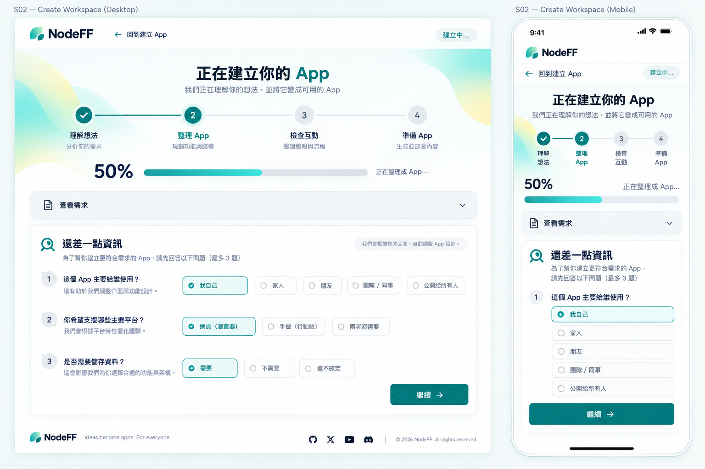

# S02 — Create Workspace

> Screen ID：S02
>
> 狀態：**WORKING — ④A LOW_FI_APPROVED / ④B HIGH_FI_STEP1–4 APPROVED — WORKING BASELINE**
>
> Phase：Phase 1
>
> Screen-level canonical owner：working/UI-UX/screens/S02-CREATE-WORKSPACE.md
>
> Function behavior sources：working/functions/F00-EXPERIENCE-SHELL.md、working/functions/F01-INTENT-COMPILATION.md
>
> 本文件的④A Low-fi與④B High-fi Step 1–4已完成 User Review；Formal Spec仍 frozen，Cursor implementation仍 HOLD。

# 1. User Outcome

S02 的核心任務：

> **讓 User 感覺 NodeFF 正在把他的想法往「可用 App」推進；只有真的缺少關鍵資訊時才打斷他，而且任何回答、假設與失敗都不讓他從頭重來。**

S02 不是 AI chat room，也不是 engineering status console。

# 2. Core UX Principles — Proposed

1. **One Workspace, Changing State**：ANALYZING / CLARIFICATION / ASSUMPTION / BUILDING / HYDRATING 都留在同一 Create Workspace，不為每個 state 跳新頁。
2. **Fast Path First**：Intent 已足夠時，ANALYZING 後直接進 BUILDING；不插入 clarification / assumption，也不增加固定「確認建立」步驟。
3. **Interrupt Only for Material Decisions**：只有 material clarification / assumption 才停下來問 User。
4. **Visible Progress, No Fake Precision**：採 stage-based progress；有可靠 work checkpoints 時顯示 checkpoint-derived Progress %，沒有可靠 checkpoints 就不假造百分比。
5. **Preserve Context**：原始 Intent、回答、assumptions、draft 持續保留。
6. **Human Language**：不顯示 Prompt A / Prompt B / validator / registry 等工程術語。

# 3. Entry From S01

流程：S01 Prompt Composer → 建立 App → S02。

進入 S02 後不顯示新的空白 prompt。Fast Path 預設只呈現 creation progress；原始需求不作為常駐主區塊。只有 Clarification / Assumption / Recovery 需要 context 時，才顯示可展開的「查看／修改需求」。

# 4. S02 State Model

    ANALYZING
    ├─ FAST PATH → BUILDING
    ├─ CLARIFICATION_REQUIRED → ANALYZING
    └─ ASSUMPTION_REVIEW → BUILDING

    BUILDING → HYDRATING → APP_READY → S03

任何適用 state 都可進 O03 Recovery Overlay。

READY_TO_BUILD 是內部 transition。若 Intent 已足夠且沒有 material clarification / assumption，S02 直接進 BUILDING，不建立額外確認頁。

# 5. Proposed Desktop Low-fi

    ┌─────────────────────────────────────────────────────┐
    │ NodeFF                                  [取消/返回] │
    │                                                     │
    │                                                     │
    │ ● 理解想法   ○ 整理成 App   ○ 檢查互動   ○ 準備 App│
    │ ███████────────────  checkpoint-derived % when valid │
    │                                                     │
    │ ┌─────────────────────────────────────────────────┐ │
    │ │ Dynamic Workspace Body                          │ │
    │ │ Clarification / Assumption / Building / Loading │ │
    │ └─────────────────────────────────────────────────┘ │
    │                                                     │
    │              contextual Primary CTA                 │
    └─────────────────────────────────────────────────────┘

Desktop 預設採 single-focus workspace，不做 permanent sidebar / dashboard。

# 6. Proposed Mobile Low-fi

    ┌────────────────────────────┐
    │ NodeFF              [返回] │
    │                            │
    │ ● ━ ○ ━ ○ ━ ○            │
    │ 理解  組合  檢查  準備     │
    │ ┌────────────────────────┐ │
    │ │ Dynamic State Content  │ │
    │ └────────────────────────┘ │
    │ [        Continue        ] │
    └────────────────────────────┘

Mobile 採單欄；Primary CTA 易觸及，但不能遮住表單。

# 7. ANALYZING

User-facing copy 方向：

    正在理解你的想法…
    我們正在整理你要做的 App，有需要你決定的地方才會問你。

不顯示 model name、token usage、Prompt A、JSON 或 policy ID。

# 8. CLARIFICATION_REQUIRED

F01 最多提供 1–3 個 material questions，直接嵌在 Workspace。

範例：

    還差一點資訊
    1. 每個人可以選幾家餐廳？
       ( ) 1 家   ( ) 最多 3 家   ( ) 不限制
    2. 投票結果要即時顯示嗎？
       [是] [否]
                                      [繼續]

required / optional 清楚；答案可修改；Continue 後回 ANALYZING，不開新頁。

# 9. ASSUMPTION_REVIEW

只有 material、可逆但會影響 outcome 的假設才顯示。

    確認幾個設定
    投票截止時間  [今晚 9:00]   建議
    每人最多選    [3 家 ▼]      預設
    結果顯示      [即時]        建議

    [修改]                 [用這些設定繼續]

User-facing source labels只用：已提供 / 預設 / 建議 / 尚未決定。

# 10. BUILDING / Visible Generation Progress

Proposed 4 stages：

1. 理解你的想法
2. 整理成 App
3. 確認互動可以執行
4. 準備你的 App

規則：
- stage-based bar / stepper。
- Active stage 有 bounded motion。
- 有可靠 work checkpoints時顯示 checkpoint-derived Progress %；沒有可靠 checkpoints時不顯示假百分比。
- validation-driven recompose 保持在同一 BUILDING surface。
- 若需要 User decision，才回 Clarification / Assumption。

# 11. HYDRATING

Blueprint validated 後顯示短暫：

    正在打開你的 App…

保留 progress visual continuity；不再顯示 Compiler 類 copy。READY 後直接進 S03，不增加「完成」中介頁。

# 12. Recovery

Recoverable failure 使用 O03，不離開 S02：

    目前沒完成，但你的內容還在。
    [再試一次] [修改需求]

必須保留 original intent、answers、accepted assumptions 與 safe progress context。

# 13. CTA Mapping

| State | Primary CTA |
|---|---|
| ANALYZING | none / Cancel secondary |
| CLARIFICATION_REQUIRED | Continue |
| ASSUMPTION_REVIEW | 用這些設定繼續 |
| BUILDING | none |
| HYDRATING | none |
| RECOVERABLE_FAILURE | Retry / context-specific action |

Fast Path 不要求額外確認；只有 Clarification / Assumption 需要 User decision。

# 14. Visual Guardrails

- Clean / low distraction。
- Must not resemble Google/Search UI。
- Tiffany Blue → Yellow 只作未來 High-fi direction。
- progress 要像「創作正在形成」，不能像下載器或 deployment console。
- 不堆滿 technical badges / status chips。

# 15. Accessibility / Responsive

- Stepper 不只靠顏色表示 state。
- Active stage有 text / icon / aria-current equivalent。
- Motion支援 reduced-motion。
- Question具有 label / error association。
- Keyboard可完成 clarification / assumption。
- Mobile CTA不可遮住最後一題。

# 16. Low-fi Review Result

四個核心 Low-fi 問題已完成 User Review；最終方向見第 19 節。

# 17. Low-fi Review Status

> **④A LOW_FI_APPROVED — ④B HIGH_FI_APPROVED**

# 18. Contextual Intent Edit — Approved Low-fi Direction

「修改需求」保留，但**不作為 Fast Path 常駐 UI**。

顯示時機：
- CLARIFICATION_REQUIRED：User 需要回看原始需求時。
- ASSUMPTION_REVIEW：User 發現前提本身要改時。
- RECOVERABLE_FAILURE：User 想修改需求再重試時。

Presentation：
- 預設是一個輕量「查看／修改需求」secondary action。
- 展開後在同一 S02 Workspace 編輯，不跳回 S01。
- Apply 後重新進 F01 semantic analysis。
- 受新 intent 影響的 clarification / assumptions 失效並重新判斷。
- UI 不直接 patch Blueprint。

邊界：
- S02 修改需求 = 生成前修改 creation intent。
- F06 Refine = 已生成 App 後修改。
- F16 Correction = 修正結果／邏輯。
- F03 Runtime input = 操作 App。

# 19. Confirmed S02 Low-fi Decisions

User 已確認：

1. S02 預設是低干擾、近乎隱形的 creation layer；不是 Chat conversation / dashboard。
2. 4-stage visible progress：理解 → 整理 App → 檢查互動 → 準備 App。
3. 只有兩類情況打斷 Fast Path：
   - 缺 material information → 1–3 clarification questions。
   - material assumption → 顯示必要 assumptions 供確認。
4. Clarification / Assumption 留在同一 Workspace，不跳 modal / 新頁。
5. Clear Intent Fast Path 不增加固定「確認建立」頁；直接 BUILDING。
6. 「查看／修改需求」是 contextual secondary action，不是 Fast Path 常駐 UI。
7. BUILDING / HYDRATING 採「有可靠 checkpoints就顯示 %；沒有就不假造」；百分比代表 work completion，不代表剩餘時間。

# 20. ④B High-fi Contract — Approved

> Approved by User：2026-09-22
>
> 狀態：**Step 1–4 CLOSED / WORKING BASELINE**
>
> Canonical rule：本節是 S02 唯一有效的 High-fi Current Truth。舊的 High-fi structure / detailed contract / image summary / canonical summary已全部合併至此。
>
> Implementation precedence：
> 1. 本節 Step 1–4；
> 2. `working/UI-UX/DESIGN-SYSTEM.md`；
> 3. approved visual reference；
> 4. 其他示意圖。
>
> Function semantics仍由 F00 / F01 / O05擁有；S02不得自行發明 checkpoint semantics。

## Step 1 — Structure Lock ✅

### Workspace Header

User-facing：

~~~text
NodeFF
← 回到建立 App
~~~

- S02是 focused creation workspace。
- 不顯示 S01 / S02 / S03等 internal Screen ID。
- 不放首頁 / 探索靈感 / 我的 App / Share / Profile等一般 navigation。
- Mobile不顯示 permanent bottom navigation。

### Original Intent Access

- 原始 Intent必須保留。
- Fast Path不常駐大型 Prompt card。
- 預設輕量 secondary action：`查看需求`。
- Clarification / Assumption / Recovery時可變為：`查看／修改需求`。
- 展開後可完整閱讀 long-form intent。
- 修改仍在 S02內完成，不返回 S01重填。

### Creation Progress

固定 consumer stages：

~~~text
理解想法
→ 整理 App
→ 檢查互動
→ 準備 App
~~~

Progress是 S02主要視覺。

### Dynamic Workspace

只保留一個 adaptive body：
- Normal Processing。
- Clarification。
- Assumption Review。
- Recovery。

Clarification：
- heading方向：`還差一點資訊`。
- 每輪最多 3 個最高優先 material questions。
- 回答後重新分析；若仍有必要問題，再顯示下一輪最多3題。
- 不把初始問題機械切組全部問完。
- 上一輪收起 / 替換，只保留可展開 `已提供的資訊`摘要。
- 不顯示「第1輪 / 第2輪」。

Assumption Review：
- 顯示 `設定名稱 | 目前值 | 已提供/預設/建議/尚未決定`。
- Primary：`用這些設定繼續`。
- Secondary：`修改需求`。

### Completion / Handoff

完成後同一 surface轉為：

~~~text
100%
你的 App 已完成
[開啟 App →]
~~~

- 不建立額外 Success Page。
- User不看到 internal `S03`。
- Primary CTA只有 `開啟 App`。

### Explicitly Not Present

Cursor不得自行新增：
- general navigation；
- Share / Profile；
- permanent bottom nav；
- chat transcript / AI avatar；
- technical status console / validation logs；
- fake percentage；
- second Create CTA；
- unrelated promo / dashboard cards。

## Step 2 — Geometry + Visual Hierarchy Lock ✅

### Desktop

- Header：約 `64–72px`。
- primary content max-width：約 `760–840px`。
- Creation Progress置於主要內容上方。
- %約 `36–44px`。
- progress rail約 `8px`。
- Dynamic Workspace位於 progress下方。
- 正常 processing時Dynamic Workspace可近乎隱形；Clarification / Assumption / Recovery才形成較明確 surface。

Attention hierarchy：

~~~text
Creation Progress
> Current Dynamic Workspace task
> Contextual intent access
> Shell chrome
~~~

### Mobile

順序：

~~~text
Header
→ compact stage indicator
→ current stage label
→ % / Stage-only presentation
→ Dynamic Workspace
→ contextual CTA
~~~

Compact stage方向：

~~~text
✓ 理解   ● 整理   ○ 檢查   ○ 準備
~~~

- Header約 `60px`。
- 不硬塞四個完整長標籤。
- Clarification單欄。
- Primary CTA可 full-width。
- keyboard / viewport resize時不得遮最後一題。
- 唯一離開入口：`回到建立 App`。

### Original Intent Geometry

- `查看需求`為輕量 disclosure，不佔主要 vertical real estate。
- 展開 / 收合避免造成劇烈 layout jump。

## Step 3 — Detailed High-fi Visual Rules Lock ✅

### Screen Character

- Direction A：white / neutral background為主。
- Teal = creation / progress主色。
- Aqua = transition support。
- Yellow = completion / energy小面積 accent。
- 不鋪大面積 gradient。
- 整體：quiet / focused / creator-oriented。
- 不像 AI chat / Dashboard / deployment console。

### Progress Truth

~~~text
reliable checkpoints
→ Stage + checkpoint-derived Progress %

no reliable checkpoints
→ Stage only
~~~

- 不存在「沒有 reliable checkpoints但顯示 %」模式。
- %代表 work completion，不代表 time remaining。
- checkpoint停住時保持最後真實值。
- 不以 elapsed time / animation timer灌高進度。
- 100%只在 target ready condition成立後。
- completed = Teal check。
- current = Teal active；只有 indeterminate activity indicator可使用 restrained bounded motion，determinate rail不得用 pulse / flow假裝前進。
- future = neutral gray。
- O05 progress在 `0–99%` 不使用 Yellow；只有 actual `100% / ready / committed` 後才允許小面積 Yellow completion accent。
- F01 creation checkpoint backend contract已由 `SD-20260922-002` 完成 Working closure；Current Truth以 F01/F00 Working contract為準。

### Clarification Surface

- choice優先使用大面積 selectable row / pill。
- selected = Teal border / soft selected surface + icon/label，不只靠顏色。
- 避免密集表單。
- 上輪內容不累積成 chat history。

### Assumption Surface

- 與 Clarification共用 surface family。
- metadata tags使用 neutral treatment。
- Yellow不得表示 warning。
- Primary / Secondary hierarchy沿用 Design System。

### Processing / Waiting

- 不 full-screen spinner。
- stage / progress只反映真實 operation。
- bounded animation只表示「仍在工作」，不代表進度。
- Soft / Hard timeout semantics依 O05 / F00 / source Function，不由視覺自行判斷。

### Completion

- Teal → Aqua為正常 processing；actual `100% / ready / committed` 後才可出現少量 Yellow completion accent。
- check / completion motion約 `180–240ms`。
- reduced-motion時直接 state change。
- 不做 confetti / fireworks。

### Component States / Accessibility

Button、choice、disclosure、progress、input至少定義：
- Default
- Hover
- Focus Visible
- Pressed / Active
- Disabled
- Loading where applicable
- Error / Invalid where applicable
- Selected where applicable

Rules：
- touch target ≥44 CSS px。
- visible focus不造成 layout shift。
- progress不只靠 motion。
- loading status使用適度 aria-live。
- clarification question / error與 control需 programmatic association。
- Mobile CTA不得遮最後一題。

## Step 4 — Final Visual Reference Lock ✅

Approved visual：

Canonical path：

`working/UI-UX/references/S02-Create-Workspace-Highfi-v1.png`

Repository PNG blob SHA：

`2284e26770f1a15f89fecf5f7a630f76e594885e`

Reference boundary：
- 圖片鎖定 composition / hierarchy / visual language / responsive relationship。
- sample question copy / choice content是 presentation example，不自動成為 F01 semantic requirement。
- 圖片不得新增 general navigation / Share / Profile / bottom nav / fake percentage / technical console。
- Step 1–3文字 contract + Design System + F00/F01/O05 truth優先於圖片生成誤差。

# 21. Review Status / Change Control

> **④A LOW_FI_APPROVED / ④B HIGH_FI_STEP1–4 APPROVED — WORKING BASELINE**

- S02 High-fi Step 1–4已 CLOSED。
- 任何已批准 Structure / Geometry / Visual Rule / image reference改動，必須 reopen對應 Step。
- 若後續需要 component anatomy / clarification state matrix / progress mapping等額外層，可新增 `Step 4.5 — <Layer Name> Lock`。
- Step 4.5不得偷改 Step 1–4；涉及 Function behavior必須回相關 Fxx Working Delta Review。
- Formal Spec仍待 pre-Cursor refresh。

### Final Cross-Screen High-fi Review — OPEN

> Repair checkpoint：2026-09-24
>
> FG-01 / FG-04 / FG-05 / FG-06 / FG-07 deterministic consistency repair已處理；**FG-02 / FG-03仍待 S03 ↔ S05A/S05B + returnable inspection context 決策，因此 Final Gate不得標 PASSED / CLOSED。**
>
> Final cross-screen authority：**Step 1–3 textual contract + Design System + Fxx Function truth > Step 4 visual reference。**
>
> 本輪 deterministic repair不修改 PNG artifacts；是否需要 reopen S03 Step 4，待 FG-02 / FG-03決策後判定。
