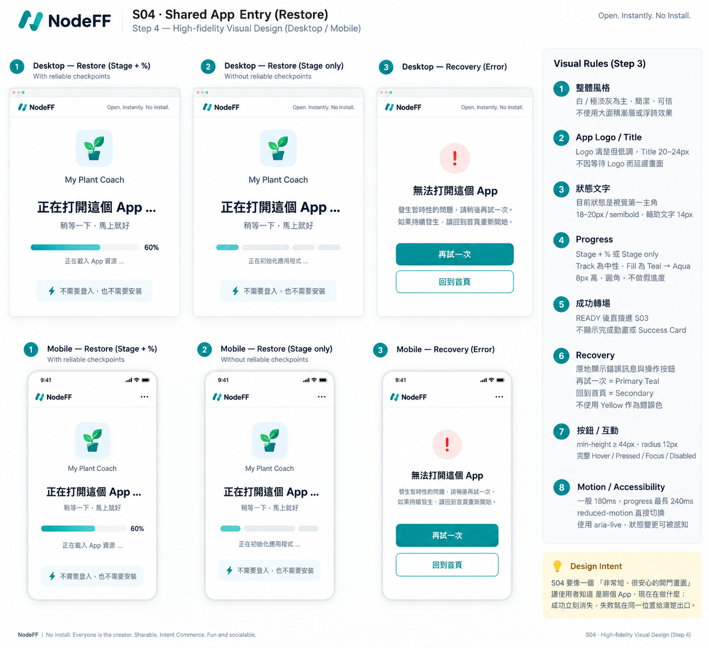

# S04 — Shared App Entry / Restore

> Screen ID：S04
>
> 狀態：**WORKING — ④A LOW_FI_APPROVED / ④B HIGH_FI_STEP1–4 APPROVED**
>
> Phase：Phase 1
>
> Screen-level canonical owner：`working/UI-UX/screens/S04-SHARED-APP-ENTRY.md`
>
> Function behavior sources：F05 Share / Restore + F00 Experience Shell + F03 Runtime。
>
> 本文件的 ④A Low-fi 與 ④B High-fi Step 1–4 已完成 User Review；Formal Spec仍維持 freeze，待 pre-Cursor Formal Spec Refresh。

# 1. User Outcome

S04 的核心任務：

> **Recipient 點開分享連結後，不用安裝、不用登入、不用重新生成，盡快直接進入可使用的同一個 App。**

因此 S04 不應變成 Landing Page、Creator Profile、Share Preview Page 或登入牆。

# 2. Core UX Direction — Proposed

S04 預設是一個 **transitional entry surface**，不是長時間停留的正式產品頁。

正常成功路徑：

    /share/{share_id}
    → S04 short restore transition
    → S03 App / Runtime

若 restore 足夠快，S04 可以只短暫出現，甚至幾乎感覺不到。

只有兩類情況需要讓 S04 明顯存在：

1. Restore 尚在進行，需要避免白畫面。
2. Share / Blueprint / Trust / Compatibility / Hydration 發生錯誤，需要 humanized recovery。

# 3. Important Product Truth

Recipient 取得的是：

    same immutable Blueprint
    + fresh Runtime Instance

不是：

    Creator 當時的輸入
    Creator 當時的結果
    Creator 當時的 Runtime state

UI 不應暗示「接續 Creator 當時的進度」。

# 4. Normal Restore Flow

F05 internal states：

    OPEN_ROUTE
    → RESOLVING_SHARE
    → FETCHING_BLUEPRINT
    → CHECKING_TRUST
    → HYDRATING
    → READY

Consumer 不顯示這些工程狀態名稱。

User-facing restore UI 固定顯示：
- App Logo / App Title（可取得時）。
- Loading progress %。
- 簡短人話狀態。

Proposed consumer stages：

    正在打開這個 App…
    ↓
    正在確認可以安全使用…
    ↓
    正在準備 App…
    ↓
    S03

Loading % 必須表示「已完成的 restore work」，不是預估剩餘時間。

# 5. Proposed Desktop Low-fi

    ┌──────────────────────────────────────────────┐
    │ NodeFF                                       │
    │                                              │
    │                                              │
    │              [ App Logo ]                    │
    │               App Title                      │
    │                                              │
    │            正在打開這個 App…                 │
    │                  42%                         │
    │            ████████────────                  │
    │                                              │
    │        不需要登入，也不需要安裝              │
    │                                              │
    └──────────────────────────────────────────────┘

正常情況不顯示額外 CTA。

若 Blueprint metadata 已安全取得，可在不延遲 READY 的前提下顯示：

    App Logo / App Title

但不得為了做漂亮 preview 而延後進 S03。

# 6. Proposed Mobile Low-fi

    ┌──────────────────────────┐
    │ NodeFF                   │
    │                          │
    │      [ App Logo ]        │
    │       App Title          │
    │                          │
    │   正在打開這個 App…      │
    │          42%             │
    │     ███████──────        │
    │                          │
    │ 不需要登入，也不需要安裝 │
    └──────────────────────────┘

Mobile 不顯示 navigation / bottom navigation，因為還沒有進入真正 S03 Runtime。

READY 後再由 S03 接管 Header / Bottom Navigation。

Cross-screen rule：
- permanent NodeFF bottom navigation只屬於 S03 Runtime。
- S04 restore期間不預先顯示 S03 Shell navigation，也不讓 User在 restore中誤進其他 Shell flow。

# 7. Progress Behavior

S04 progress 是 restore progress，不是 AI generation progress。

Rules：
- 不使用 S02 的「理解 / 組 App」copy。
- 不顯示 LLM / Compile / Validation engineering terminology。
- **有 reliable restore checkpoints 時顯示 Stage + checkpoint-derived %；沒有 reliable checkpoints 時顯示 Stage only。**
- 若顯示百分比，只能根據已完成的 restore checkpoints / hydration work推進，不能假裝預測剩餘秒數。
- 不為了動畫而故意延長 loading。
- 當 metadata 已取得時，同時顯示 App Logo / Title。

Low-fi progress checkpoints：

1. Share resolved。
2. Blueprint fetched / trust checked。
3. Runtime hydration completed。

UI 可以把這些 checkpoint 映射成連續 Loading %，但不把 internal technical names直接顯示給 User。

# 8. No Login / No Install

First Value 前：

- 不要求 Sign in。
- 不要求註冊。
- 不要求下載 App。
- 不要求 Creator 授權。
- 不要求重新輸入 Prompt。

若未來要做 account CTA，只能在 S03 使用 App 後再討論，不屬 S04 Phase 1 baseline。

# 9. App Identity

若在 Blueprint fetch 後已取得安全 metadata：

顯示：
- App Logo。
- App Title。
- Loading progress %。

不顯示：
- Creator anonymous ID。
- raw Prompt。
- Blueprint hash。
- model/provider。
- Runtime inputs/results。

App identity 是輔助，不是 blocking dependency。

# 10. Error / Recovery States

S04 必須承接 F05 / F12 的 humanized failure。

## A. Link Not Found

    這個分享連結找不到了。

    [回到 NodeFF]
    [建立自己的 App]

不 Retry 無意義 permanent 404。

## B. Expired / Revoked

    這個分享 App 已經無法使用。

    [回到 NodeFF]

不假裝重新生成舊 App。

## C. Temporary Blueprint / Network Failure

    暫時打不開，但分享連結還在。

    [再試一次]
    [回到 NodeFF]

保留原 share route / reference。

## D. Incompatible / Unsafe To Run

    這個 App 目前無法安全開啟。

    [重新整理再試]
    [回到 NodeFF]

不 silently reinterpret、不偷偷 recompile。

## E. Hydration Recoverable

依 F12 / F03：
- 若 core App仍可安全使用 → 進 S03 + inline Recovery。
- 若不能安全 READY → 留 S04 blocking recovery。

# 11. Back / Close Behavior

Recipient 從外部 link 進來時：

- Browser Back → 回前一個外部頁面，正常。
- S04 不需要自創 Back stack。
- 不在 restore 中要求 User 選擇是否繼續，除非有 material recovery decision。

# 12. Transition To S03

READY 後：

    S04
    → S03

Transition 原則：
- 不增加「App 已準備好，按繼續」頁。
- 不要求再按一次 Enter / Open。
- S03 建立 fresh Runtime Instance。
- S03 接管 App identity、Share、Remix、Correct、bottom navigation等 Shell。

# 13. Share → Remix

Recipient 在 S04 不直接 Remix。

先：

    S04 → S03

User 實際看到 / 使用 App後，再從 S03 進：

    Remix → S05

這避免 Recipient 還沒看到 App，就被推去 Creator flow。

# 14. Accessibility Baseline

- Restore status透過 aria-live適度通知。
- Progress不能只靠顏色。
- 長 loading需有可理解文字。
- Error primary action可 keyboard / assistive tech操作。
- reduced-motion preference被尊重。
- 進 S03後 focus移到 App主要內容，而不是留在消失的 loading UI。

# 15. Confirmed S04 Low-fi Decisions

User 已確認：

1. **S04 採幾乎隱形的過渡層**；成功時自動進 S03，不建立 Share Landing Page。
2. Restore 過程遵循 **reliable checkpoints → Stage + checkpoint-derived %；no reliable checkpoints → Stage only**。
3. S04 顯示 **App Logo / App Title + truthful restore status**；有 reliable checkpoints 才加 checkpoint-derived %；不顯示 Login、Creator資料、Prompt、Result Preview。
4. 永久失效的 Share 不重新生成舊 App；只有暫時性錯誤才提供 Retry，其餘提供 Home / Create New 等安全出口。
5. 若顯示 Loading %，必須由已完成 restore work推進，不代表預估剩餘時間；沒有 reliable checkpoints 時不顯示 %。

# 16. Review Status

> **④A LOW_FI_APPROVED / ④B HIGH_FI_STEP1–4 APPROVED**

S04 ④A Low-fi 與 ④B High-fi Step 1–4 已完成 User Review。S04 High-fi Current Truth 已閉合；任何 material change 必須依 Change Control reopen 對應 Step。

---

# 17. ④B High-fi Contract

> Step 1 approved by User：2026-09-22
>
> Canonical rule：本節是 S04 High-fi 的唯一 canonical contract。後續 Step 2–4 必須在本節內續寫，不得另建重複 High-fi summary / shadow copy。
>
> Current status：
> - Step 1 — Structure Lock ✅
> - Step 2 — Geometry + Visual Hierarchy Lock ✅
> - Step 3 — Detailed High-fi Visual Rules Lock ✅
> - Step 4 — Final Visual Reference Lock ✅

## Step 1 — Structure Lock ✅

### 1. S04 Role

S04 是 **Shared App Entry / Restore transitional surface**。

它的任務只有：

~~~text
外部分享連結
→ 安全恢復同一 immutable Blueprint
→ 建立 fresh Runtime Instance
→ READY
→ S03 App / Runtime
~~~

S04 不是：
- Share Landing Page；
- Creator Profile；
- App Preview Page；
- Login / Sign-up wall；
- Builder / Editor；
- 第二個 Runtime surface。

### 2. Minimal Entry Chrome

Desktop / Mobile 一致：

- 只保留必要的 NodeFF brand / entry chrome。
- 不顯示 S01完整 navigation。
- 不顯示「首頁 / 探索靈感 / 我的 App / 修改 / 分享 / Profile」。
- 不顯示 hamburger。
- 不顯示 S03 permanent bottom navigation。

S03 navigation只能在 Runtime真正 READY並完成 S04 → S03 handoff後出現。

### 3. App Identity

若安全 metadata 已取得，可顯示：

~~~text
App Logo
App Title
~~~

Rules：
- App identity是 contextual aid，不是 blocking dependency。
- 不得為了等待 Logo / Title而延遲 READY。
- 不顯示 Creator anonymous ID、raw Prompt、Blueprint hash、provider/model、Creator inputs/results。

### 4. Restore Status Surface

Normal restore body固定只需要：

~~~text
App Identity（when available）
↓
Human-readable restore stage
↓
Progress presentation
↓
「不需要登入，也不需要安裝」
~~~

Progress presentation只鎖位置與存在條件，不在 S04自行定義完整 cross-flow checkpoint contract。

Canonical presentation boundary：

~~~text
reliable restore checkpoints
→ Stage + checkpoint-derived %

no reliable restore checkpoints
→ Stage only
~~~

詳細 cross-flow progress model留待 O05 High-fi / Processing Review統一處理。

S04不得：
- 用 elapsed time推算進度；
- fake smooth %；
- 顯示 LLM / Compiler / Validator等工程語言；
- 為了 loading animation故意延遲 READY。

### 5. Success Path — Direct to S03

Desktop / Mobile一致：

~~~text
restore READY
→ immediately enter S03
~~~

成功後：
- 不顯示「開啟 App」中繼按鈕；
- 不顯示「完成，按繼續」頁；
- 不要求 User再次確認；
- S03立即接管 App identity、Runtime、Share、Modify、Correct與 Mobile bottom navigation。

### 6. Failure / Recovery Path — Must Always Have Home Escape

Desktop / Mobile一致。

只要 S04 無法進入正常 READY，UI必須提供 **可返回 NodeFF 首頁 S01 的安全出口**，讓 User離開失敗 share flow並可重新建立自己的 App。

Canonical safe exit：

~~~text
[回到首頁]
→ S01 Discover / Start
→ User 可重新建立 App
~~~

若 source Function truth判定該錯誤可 retry，可另外顯示：

~~~text
[再試一次]
[回到首頁]
~~~

Rules：
- `回到首頁`在失敗狀態不得被移除。
- Desktop / Mobile recovery capability一致；只能因版面不同改排列，不得改可用出口。
- UI不得自行判定 retryable。
- permanent not-found / revoked / expired不可假裝 Retry能恢復。
- incompatible / unsafe不得偷偷 recompile或 reinterpret舊 App。
- 若未來加入「建立自己的 App」快捷 CTA，其 destination仍是 S01 Create entry，不建立另一套 creation flow。

### 7. No App Preview / Creator Runtime Carry-over

S04不預先 render：
- App screenshot preview；
- Creator當時的 inputs；
- Creator當時的 result；
- Creator Runtime state；
- fake Generated App skeleton。

Recipient得到：

~~~text
same immutable Blueprint
+ fresh Runtime Instance
~~~

不是 Creator session continuation。

### 8. Mobile Structure

Mobile與 Desktop採相同 semantic structure：

~~~text
NodeFF brand
↓
App Identity（when available）
↓
Restore Status / Recovery
~~~

Mobile restore期間沒有 permanent bottom navigation。

只有進入 S03後才出現：

~~~text
目前 App | 修改 | 分享
~~~

Clarification：
- `目前 App = current S03 Runtime destination, not S01.`
- 此處引用 S03 重新批准後的 Mobile nav wording；S04 不另外定義或改名。
- S03 Step 1 已於 2026-09-22 reopen並把原 `App` 改為 `目前 App`；本文件已同步。

### 9. Function Handoff Boundary

Canonical handoff：

~~~text
/share/{share_id}
→ F05 resolve Share
→ immutable Blueprint reference
→ trust / compatibility truth
→ F03 fresh Runtime hydration
→ READY
→ S03
~~~

S04 presentation不得：
- 重新 compile Blueprint；
- restore Creator inputs / results；
- mutation immutable Blueprint；
- 自己決定 READY；
- 自己發明 checkpoint；
- 自己推進 progress；
- silently reinterpret incompatible content。

## Step 2 — Geometry + Visual Hierarchy Lock ✅

### 1. Full-screen Transitional Canvas

Desktop / Mobile皆採 full-viewport transitional canvas：

~~~text
min-height: 100dvh
~~~

S04不是 Dashboard / Landing Page，因此不建立多欄、sidebar、hero marketing section或大面積資訊卡。

主要 restore / recovery content：
- 置於 viewport中央區域；
- 視覺上略微偏上；
- 保留足夠 breathing room；
- 不讓 User誤以為進入另一個正式產品頁。

### 2. Desktop Main Content Width

Desktop restore / recovery主內容：

~~~text
max-width：約 480–560px
~~~

不做寬版 content panel。

Normal restore order：

~~~text
App Logo
→ App Title
→ Human-readable restore stage
→ Progress presentation
→ 「不需要登入，也不需要安裝」
~~~

此 single-column content stack是 S04 Desktop主要視覺焦點。

### 3. App Identity Scale

App Identity必須清楚可見，但不是 Hero。

Recommended geometry：

~~~text
Desktop App Logo：約 64–72px
Mobile App Logo：約 56–64px
App Title：約 20–24px
~~~

App Identity只回答：

> 「現在正在開哪個 App？」

不得在尺寸或位置上壓過 restore status / recovery decision。

### 4. Visual Hierarchy

Normal restore attention hierarchy固定為：

~~~text
Current Restore Status
> Progress Presentation
> App Identity
> No-login / No-install reassurance
> NodeFF entry chrome
~~~

User第一眼應理解：

> 「現在正在打開這個 App，而且系統仍在真實處理。」

若 O05最終判定該 operation只有 Stage、沒有可靠 %，同一 geometry仍成立，不另建另一套 layout。

### 5. Progress Geometry

Progress presentation預留穩定位置，但不強迫一定存在百分比。

Desktop：

~~~text
progress visual width：約 320–400px
~~~

Mobile：
- 主要 progress visual接近可用內容寬度；
- 仍保留左右 safe padding。

同一 geometry必須支援：

~~~text
Stage + checkpoint-derived %
~~~

以及：

~~~text
Stage only
~~~

S04不得因是否有 \`%\` 而切換成不同 information architecture。

### 6. Recovery Replaces Restore In-place

Failure / Recovery不開 modal、不另跳 recovery page。

原本中央 Restore content直接被同位置 Recovery content取代。

Desktop recommended order：

~~~text
Error title
→ Humanized explanation
→ Primary / secondary recovery actions
~~~

若 source Function truth允許 Retry：

~~~text
[再試一次] [回到首頁]
~~~

Desktop可橫向排列。

若不可 Retry：

~~~text
[回到首頁]
~~~

\`回到首頁\`必須保持可見，不得收進 overflow / menu。

Mobile：
- recovery actions改為 vertical stack；
- 接近 full-width；
- 保持 \`回到首頁\`明顯可操作；
- Desktop / Mobile只允許排列方式不同，不允許 recovery capability不同。

### 7. Mobile Geometry

Mobile採單欄 transitional layout：

~~~text
Top NodeFF chrome
→ App Identity
→ Restore Status / Recovery
~~~

Recommended geometry：

~~~text
Top chrome：約 56–64px
Horizontal padding：約 16–20px
~~~

Mobile restore期間：
- 不顯示 permanent bottom navigation；
- 不顯示 floating CTA；
- recovery CTA留在主要內容 flow內；
- 不使用 sticky bottom action，避免與 S03 permanent bottom navigation語意混淆。

READY後才切換到 S03，並由 S03顯示：

~~~text
目前 App | 修改 | 分享
~~~

## Step 3 — Detailed High-fi Visual Rules Lock ✅

### 1. Screen Character / Color Usage

S04沿用 NodeFF Design System Direction A：

> **Clean Creator Canvas + Playful Energy**

但 S04屬短暫 restore transitional surface，因此視覺必須比 S01 / S02 更安靜。

Rules：
- Background以 White / Soft Neutral為主。
- Teal用於主要狀態、progress、focus與 recovery primary action。
- Aqua只作 progress / restore supporting accent。
- Yellow只允許小面積 completion / energy accent。
- 不使用大面積 gradient。
- 不使用 neon / rainbow / glassmorphism。
- 不使用重 shadow把 restore body做成大型浮島卡片。
- Brand Yellow不得代表 warning / error / unsafe。

Exact Error / Warning semantic color不由 S04自行發明；留待 O03 Recovery High-fi統一鎖定。

### 2. App Identity Visual Treatment

App Logo / App Title清楚但低調，不可搶過 restore status。

Rules：
- metadata已取得時直接顯示 App Logo / Title。
- metadata尚未取得時先顯示 truthful restore status，不做 shimmer skeleton等候。
- App Logo可使用乾淨 neutral container，但不做 decorative glow。
- App Title沿用 Step 2約 20–24px / semibold。
- 不以 heavy shadow、glow、gradient frame把 App identity做成 hero。
- 不為了 identity完整而延遲 READY。

### 3. Restore Status Typography

Restore status是 S04正常狀態的最高視覺優先。

Recommended treatment：
- Current human-readable stage：Ink primary，約 18–20px / semibold。
- Supporting copy：約 14px，Secondary text。
- 「不需要登入，也不需要安裝」是 reassurance，視覺權重低於 stage / progress。
- 不顯示工程狀態名稱、provider、LLM、Compiler、Validator、Blueprint technical labels。

### 4. Progress Visual Contract

S04沿用 Design System / O05 presentation rule：

~~~text
reliable restore checkpoints
→ Stage + checkpoint-derived %

no reliable restore checkpoints
→ Stage only
~~~

Progress visual：
- Track = neutral border / soft surface。
- Fill = Teal → Aqua direction。
- Rail約 8px，高度沿用 Step 2 geometry。
- Pill-like radius。
- Yellow不得表示「等待中」。
- 100%只在 source Function truth達成 actual READY。
- 真實 checkpoint前進時，visual fill可在約 180–240ms內移到新真值。
- 不使用 elapsed time、timer interpolation、fake smooth growth。
- 不為了讓 100% 看得到而延遲 S03 handoff。

### 5. Success Transition

S04成功不是一個獨立 Success Screen。

READY後：

~~~text
S04
→ S03 immediately
~~~

Visual rules：
- 可有很短的自然 state/route transition。
- 不停留在 100% 等動畫完成。
- 不顯示「完成！」Success Card。
- 不顯示 confetti / fireworks。
- 不增加「開啟 App / 繼續」CTA。
- READY非常快時 User可能看不到完整 100% frame，視為正常。

### 6. Recovery Visual Family

Failure時同位置 Restore body切換為 Recovery body，不跳 modal /另一頁。

Recommended order：

~~~text
Error / recovery icon
→ Humanized title
→ Short explanation
→ Recovery actions
~~~

Temporary / retryable：
- \`再試一次\` = Primary Teal。
- \`回到首頁\` = Secondary。

Permanent / non-retryable：
- \`回到首頁\` = Primary。

Rules：
- \`回到首頁\`永遠可見，不得藏進 overflow。
- Brand Yellow不得當 warning / error色。
- Exact danger / warning semantic color由 O03統一。
- 不用大面積紅色背景 /警報式 visual作預設。
- 不用 bounce / playful motion表達 serious recovery。

### 7. Button / Interaction States

S04 action controls沿用 Design System Button System。

Baseline：
- min-height ≥ 44 CSS px。
- radius = 12px。
- Primary = Teal 600 + White text。
- Hover = Teal 500。
- Secondary = neutral / white surface + default border。
- Focus Visible必須清楚，不只靠顏色。
- Pressed不得造成 layout shift。
- Disabled保持可讀，不只降低 opacity。
- Loading保留原 label geometry；spinner不得成為唯一狀態資訊。
- Mobile recovery buttons接近 full-width。
- Desktop / Mobile capability一致，只允許排列不同。

### 8. Motion / Accessibility

Motion：
- control feedback約 120ms。
- general state transition約 180ms。
- progress / restore transition最長約 240ms。
- 不做持續 pulse假裝 progress。
- operation完成不得為 motion故意延遲。
- prefers-reduced-motion移除非必要 pulse / slide，直接切換真實狀態。

Accessibility：
- restore status使用適當 aria-live。
- progress不能只靠顏色。
- failure state變更可被 assistive technology感知。
- recovery actions完整支援 keyboard / assistive tech。
- focus ring清楚可見。
- READY進 S03後，focus移交 S03主要 App content / heading，不留在已消失的 S04 node。

### Step 3 Lock Summary

S04 High-fi Detailed Visual Rules：

> **安靜、可信、低干擾；restore stage是主角，progress只反映真實工作；READY不演成功頁，failure則在同一位置提供清楚、可操作的 recovery與首頁出口。**

Step 3：**APPROVED / CLOSED**。

Next：

> **S04 Step 4 — Final Visual Reference Lock**

### Step 2 Lock Summary

S04 High-fi Geometry + Visual Hierarchy：

> **S04是一個短暫、安靜、中央聚焦的開門畫面：User先看懂目前 restore狀態，再看到 App identity；成功立即消失進 S03，失敗就在相同位置取得清楚的 Recovery與首頁出口。**

Step 2：**APPROVED / CLOSED**。

Next：

> **S04 Step 4 — Final Visual Reference Lock**

### Step 1 Lock Summary

S04 High-fi Structure Lock：

> **成功就直接消失進 S03；失敗就留在同一 S04 recovery surface，而且 Desktop / Mobile 都一定有「回到首頁」的安全出口，讓 User 可回 S01重新建立 App。**

Step 1：**APPROVED / CLOSED**。

Next：

> **S04 Step 3 — Detailed High-fi Visual Rules Lock**

## Step 4 — Final Visual Reference Lock ✅

> **PNG Re-upload Reference Repair — 2026-09-23**
>
> User 已刪除舊 reference 並重新上傳同一批准 visual；本次只更新 canonical file path / reference integrity。
>
> Canonical path：
>
> `working/UI-UX/references/S04-Highfi-v1.png`
>
> Repository PNG blob SHA：
>
> `629c7156e149ff4cc4c4d33298f5797165f7b84b`
>
> 此次只修正 visual artifact path / integrity；**S04 Step 1–4 semantics、layout、interaction contract 完全不變，Step 4 不 reopen**。
>
> User approved：2026-09-22
>
> Approved visual reference：
> \`working/UI-UX/references/S04-Highfi-v1.png\`

### 1. Reference Coverage

Final Visual Reference覆蓋 Desktop / Mobile三種代表狀態：

1. Restore — reliable checkpoints → **Stage + checkpoint-derived %**。
2. Restore — no reliable checkpoints → **Stage only**。
3. Recovery — restore failure於同一 S04 surface提供 recovery actions。

### 2. Authority / Precedence

若圖片與文字 contract有任何衝突：

~~~text
S04 Text Contract
> NodeFF Design System
> Approved Visual Reference
~~~

Cursor不得用圖片細節反向改寫 Step 1–3。

### 3. Illustrative Content Boundary

圖片中的 sample App \`My Plant Coach\`、plant logo、\`60%\`、示例 copy、error icon與 exact error hue皆為 illustrative reference，不自動形成 Function requirement。

尤其：
- exact Error / Warning semantic color仍由 O03 Recovery High-fi統一鎖定；
- S04不建立第二套 status palette。

### 4. Non-overridable Current Truth

- READY → **立即進 S03**；無 Success Page / Open / Continue。
- Failure → Desktop / Mobile都必須保留可見的 **\`回到首頁\`**。
- Retry只在 source Function truth判定 retryable時顯示。
- reliable checkpoints → Stage + checkpoint-derived %。
- no reliable checkpoints → Stage only。
- 不 fake progress、不以 elapsed time推算、不為動畫延遲 READY。
- S04 restore期間沒有 S03 permanent bottom navigation。
- 進 S03後 Mobile nav = \`目前 App | 修改 | 分享\`。
- Recipient = same immutable Blueprint + fresh Runtime Instance；不承接 Creator inputs / results / Runtime state。

### 5. Step 4 Lock

> **S04 Step 4 visual reference 已由 User批准，作為 Desktop / Mobile High-fi implementation reference；文字 contract仍為最高 authority。**

Step 4：**APPROVED / CLOSED**。

S04 ④B High-fi：**STEP 1–4 COMPLETE / CLOSED**。

