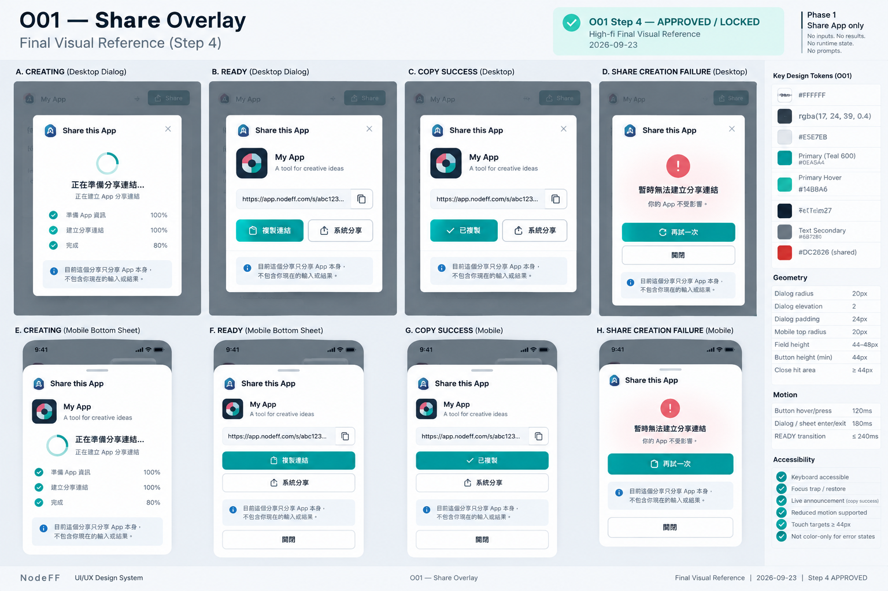

# O01 — Share Overlay

> Governance：本檔為 UI/UX Working Current Truth；Build Freeze / delivery lifecycle 以 `working/common-core/DESIGN-TO-DELIVERY.md` 為準。

> Overlay ID：O01
>
> 狀態：**WORKING — ④A LOW_FI_APPROVED / ④B HIGH_FI_STEP1–4 APPROVED — WORKING BASELINE**
>
> Phase：Phase 1
>
> Screen-level canonical owner：`working/detailed-design/UI-UX/overlays/O01-SHARE.md`
>
> Function behavior source：F05 Share / Restore + F00 Experience Shell。
>
> ④A Low-fi與④B High-fi Step 1–4已完成 User Review並鎖定；implementation input 仍需 Human-approved Build Freeze。

# 1. User Outcome

O01 的核心任務：

> **User 在不離開目前 App、不打斷 Runtime 的情況下，快速取得可分享連結，複製或呼叫系統分享。**

# 2. Entry / Exit

Entry：

    S03 Share CTA
    → O01

Exit：

    Close
    → 回 S03，同一 Runtime context保留

Share success / failure都不導航離開 S03。

# 3. Function Truth

F05 已固定：

    CLOSED
    → CREATING
    → READY
       ├─ COPY_SUCCESS
       └─ SHARE_SHEET_OPEN
    → FAILED

Rules：
- Share failure不破壞 current App。
- pending不 lock Runtime normal interaction。
- duplicate tap不建立 duplicate logical share。
- copy failure只影響 copy action，不讓 share本身失效。
- Native Share是 convenience，不是 dependency。

# 4. Presentation Direction

O01 不採全頁。

Low-fi 建議：
- Desktop：**centered lightweight dialog**；④B final geometry為約 480–560px，**不採 anchored popover / anchored panel**。
- Mobile：bottom sheet。
- 都可隨時 Close。
- 不使用阻斷整個 App 的 full-screen loading。

目的：
> Share 是高頻輕操作，不該讓 User 覺得離開 App。

# 5. Desktop Low-fi

    ┌────────────────────────────────────────┐
    │ 分享這個 App                      [×] │
    │                                        │
    │ [ App Logo ]  App Title               │
    │                                        │
    │ 分享連結                               │
    │ ┌────────────────────────────────────┐ │
    │ │ appf2.../share/xxxxx              │ │
    │ └────────────────────────────────────┘ │
    │                                        │
    │ [複製連結]          [系統分享]         │
    │                                        │
    │ 收到連結的人可直接開啟使用             │
    └────────────────────────────────────────┘

# 6. Mobile Low-fi

    ╭────────────────────────────╮
    │ 分享這個 App           [×] │
    │                            │
    │ [Logo] App Title           │
    │                            │
    │ appf2.../share/xxxxx      │
    │                            │
    │ [      複製連結      ]     │
    │ [      系統分享      ]     │
    │                            │
    │ 收到連結即可直接使用       │
    ╰────────────────────────────╯

Bottom sheet不遮掉整個 Runtime；關閉後回到原位置。

Cross-screen layering rule：
- O01 active時，underlying S03 Shell controls與 permanent bottom navigation必須 inert / unavailable。
- Runtime context仍保留，但不能穿透 Overlay操作。
- Close後 focus回 Share trigger或合理 safe surface。

# 7. CREATING State

若 Share 尚未建立：

    正在準備分享連結…

Processing presentation統一交 O05：

- 有可靠 checkpoints → Stage label + checkpoint-derived Progress %。
- 沒有 reliable checkpoints → Stage label + bounded activity indicator；不顯示 fake % / empty rail。
- 不 fake %，不以時間估算灌高進度。
- 不為了 animation故意拖慢 Share ready。

Rules：
- Create CTA duplicate tap disabled / coalesced。
- App仍保留。
- 不顯示 content hash / internal ID。
- User可關閉 O01；背景 share operation依 existing lifecycle繼續或安全收束，不影響 App。

# 8. READY State

成功後主要資訊：

- App Logo / Title。
- public share URL。
- Copy Link。
- Native Share（supported時）。
- Close。

READY 後保留兩種分享方式：

    複製連結
    系統分享

差異：
- **複製連結**：把同一個 public share URL 放入 clipboard，User自行貼到 LINE / Discord / Email / 社群等。
- **系統分享**：呼叫 OS / Browser Share Sheet，少一步貼上，但依裝置 / Browser支援而定。

兩者分享的是同一個 App Link；Copy Link是基本能力，System Share是快捷能力。

# 9. Copy Success

按 Copy後：

    已複製

應是短暫 inline feedback，不另開新 Overlay。

不能：
- 關閉整個 O01才顯示成功。
- 把 copy success當成 share creation success的唯一判定。

# 10. Copy Failure

如果 clipboard失敗：

    無法自動複製
    你仍可以選取上方連結手動複製

    [再試一次]

Share URL仍有效。

# 11. Native Share

若 Web Share API supported：

    系統分享

呼叫 OS / browser share sheet。

若不 supported：
- 不顯示 disabled dead button。
- 只保留 Copy Link。

Native Share cancel不是 error。

# 12. Create Failure

若 Share creation失敗：

    暫時無法建立分享連結
    你的 App 不受影響

    [再試一次]
    [關閉]

不離開 S03，不清 Runtime state。

# 13. Privacy Copy

O01 使用精準 consumer copy：

> **目前這個分享只分享 App 本身，不包含你現在的輸入或結果。**

這對 appf2 很重要，因為 F05 明確規定 Share只指向 Blueprint，不含 Runtime input / Result。

不顯示：
- anonymous ID
- Blueprint hash
- raw Prompt
- Result snapshot
- provider/model data

# 14. Re-open Behavior

若同一 logical Share 已 READY 且 UI仍持有有效 share URL：
- 再開 O01 直接顯示 READY。
- 不因 UI reopen 重複觸發 create。

若沒有現成 READY context：
- 依 F05正常 create lifecycle。

這是 UI operation reuse，不改 F05 durable semantics。

# 15. Accessibility

- Overlay有明確 accessible title。
- Desktop dialog/panel與Mobile bottom sheet focus管理清楚。
- Close後 focus回 S03 Share trigger。
- Copy success用 polite live announcement。
- URL可 keyboard select/copy。
- Native Share不可用時不留下不可操作控制。
- Touch target至少44 CSS px。

# 16. Confirmed O01 Low-fi Decisions

User 已確認：

1. Desktop 使用 compact Share panel / lightweight dialog；Mobile 使用 bottom sheet，不做 full-screen Share page。
2. READY 後同時保留 **複製連結** 與 **系統分享**：
   - Copy Link = 基本、跨平台分享能力。
   - System Share = 裝置支援時的快捷入口。
3. Privacy copy 固定為：**「目前這個分享只分享 App 本身，不包含你現在的輸入或結果。」**
4. Copy failure 保留有效 URL並允許手動複製 / Retry；Share creation failure提供 Retry + Close；兩者都不離開 S03。
5. Future capability boundary：
   - 分享目前結果 / Runtime snapshot：Phase 1 尚未有正式 Function。
   - 即時共同遊玩 / 共享狀態：由 F09 Realtime Room方向承接，目前為 Deferred，不納入 O01 Phase 1。

# 17. ④B High-fi Contract

> Step 1 approved by User：2026-09-23
>
> Canonical rule：本節是 O01 High-fi 的唯一 canonical contract。後續 Step 2–4 必須在本節續寫，不得另建重複 High-fi summary / shadow copy。
>
> Current status：
> - Step 1 — Structure Lock ✅
> - Step 2 — Geometry + Visual Hierarchy Lock ✅
> - Step 3 — Detailed High-fi Visual Rules Lock ✅
> - Step 4 — Final Visual Reference Lock ✅

## Step 1 — Structure Lock ✅

### 1. O01 Role / Phase 1 Share Boundary

O01只服務 **「分享這個 App」**。

Phase 1分享的是 immutable App / Blueprint reference。

O01不分享：
- current Runtime inputs；
- current Result；
- Runtime mutable state；
- raw Prompt；
- realtime shared session / Live Room state。

Future Share Result / Runtime Snapshot與Realtime Room需要獨立 Function contract，不得在 O01 High-fi偷偷擴張。

### 2. Entry / Exit

Canonical entry：

~~~text
S03 Share
→ O01
~~~

Canonical exit：

~~~text
O01 Close
→ 原本 S03 Runtime context
~~~

Share success / failure都不導航離開 S03；Close不得清掉 current App / Runtime context。

### 3. Overlay Boundary

O01是 Overlay，不是 Share Page。

- Desktop = **centered lightweight dialog（約 480–560px）**，不採 anchored popover / anchored panel。
- Mobile = bottom sheet。
- 不建立 full-screen Share route。
- O01 active時 underlying S03 Shell controls與 permanent bottom navigation必須 inert / unavailable。
- Runtime context仍完整保留，但禁止 click-through。
- Close後 focus回 S03 Share trigger或合理 safe surface。

### 4. Consumer States

O01固定承接以下 consumer states：

~~~text
CREATING
→ READY
   ├─ COPY feedback
   └─ SYSTEM SHARE
→ FAILURE when applicable
~~~

不得把所有狀態壓成單一 ambiguous「分享」button。

### 5. CREATING

CREATING只呈現：
- App identity（可取得時）；
- `正在準備分享連結…`；
- O05 processing presentation；
- Close。

Rules：
- 不顯示 fake URL。
- 不顯示 content hash / internal ID。
- 不要求第二個「建立連結」確認步驟。
- duplicate create gesture依 F05去重 / coalesce。
- User可Close；operation依既有 lifecycle安全繼續或收束，不影響 App。

### 6. READY

READY是 O01核心狀態。

固定資訊順序：

~~~text
分享這個 App
→ App Logo / Title
→ Share URL
→ 複製連結
→ 系統分享（supported only）
→ Privacy copy
→ Close
~~~

Share URL是同一 public App Link；O01不得顯示 raw Blueprint hash等 internal metadata。

### 7. Copy Link / System Share

`複製連結`是 Phase 1基本、跨平台能力，READY時必須存在。

`系統分享`是 convenience capability，只在裝置 / Browser支援時顯示。

Native Share不支援時：
- 不顯示 disabled dead button；
- 保留 Copy Link即可。

兩者分享的是同一 App Link，不建立兩種 Share semantics。

### 8. Privacy Copy — Always Visible

READY主體內固定可見：

> **目前這個分享只分享 App 本身，不包含你現在的輸入或結果。**

**Privacy copy always visible = YES.**

Rules：
- 不收進 tooltip / info icon / hidden disclosure。
- 不降級成難以注意的 legal footer。
- 此文字是 Phase 1 Share trust boundary的正式 consumer message。

### 9. Copy Success

`複製連結`成功後：

~~~text
已複製
~~~

只做短暫 inline feedback / polite live announcement。

不得：
- 關閉 O01才顯示成功；
- 開第二個 Overlay；
- 把 copy success誤當成 share creation的唯一成功判定。

### 10. Copy Failure

Copy failure只影響 clipboard action，不讓已READY的 Share失效。

必須保留：
- 有效 Share URL；
- 手動選取 / 複製能力；
- Retry when eligible。

不得把整個 O01轉成 Share creation failure state。

### 11. Share Creation Failure — Behavior

Share creation failure才進 O01真正 recovery state：

~~~text
暫時無法建立分享連結
你的 App 不受影響

[再試一次]
[關閉]
~~~

Retry eligibility與 recovery semantics仍由 F05 / F12 truth決定；O01不得自行發明。

### 12. Re-open Behavior

若同一 logical Share已有有效 READY context：

~~~text
re-open O01
→ READY directly
~~~

不得重新 create、不得重播 fake loading、不得建立 duplicate logical share。

若沒有有效 READY context，才依 F05正常 create lifecycle。

### 13. Native Share Cancel

User關閉 / cancel OS或Browser Share Sheet不是 Error。

Canonical return：

~~~text
System Share cancelled
→ O01 READY
~~~

不得顯示「分享失敗」。

### 14. Step 1 Locked Decisions

1. O01 Phase 1只分享 App / immutable Blueprint reference。
2. O01是 Overlay，不是獨立 Share Page。
3. Entry = S03 Share → O01；Close回同一 S03 Runtime context。
4. O01 consumer states固定為 CREATING / READY / COPY or SYSTEM SHARE feedback / FAILURE。
5. CREATING不顯示 fake URL / hash / second confirmation。
6. READY固定呈現 App identity → URL → Copy → supported System Share → Privacy copy → Close。
7. Copy Link是基本能力；System Share只在supported時顯示。
8. **Privacy copy always visible = YES**。
9. Copy success只做 inline feedback，不換頁、不關 Overlay。
10. Copy failure保留有效 URL與手動複製，不升級成 Share failure。
11. Share creation failure提供 Retry + Close，且明確告知 App不受影響。
12. Re-open READY不得重新 create。
13. Native Share cancel不是 Error。
14. O01不新增 Share Result / Runtime Snapshot / Live Room等 Phase 1外能力。

> Step 1：**APPROVED / LOCKED**。下一步：Step 2 — Geometry + Visual Hierarchy Lock。

## Step 2 — Geometry + Visual Hierarchy Lock ✅

> Approved by User：2026-09-23
>
> Step 2：**APPROVED / LOCKED**
>
> Scope：鎖定 O01 Desktop / Mobile overlay geometry、state body placement、URL / action hierarchy、Privacy copy位置與不同 state 的版面穩定性。不得改寫 Step 1 Function / state semantics；color / border / shadow / motion留給 Step 3。

### 1. Desktop Overlay Geometry

Desktop採 **centered lightweight dialog**，不採 anchored popover。

Recommended width：
~~~text
480–560px
max-width：約 560px
~~~

原因：O01需同時承接 URL、Privacy copy、Copy / System Share、Creating / Failure state；centered dialog可提供穩定結構，又不會像完整頁面。

### 2. Desktop Vertical Structure

固定順序：
~~~text
Title + Close
→ App Identity
→ State Body
→ Actions
→ Privacy Copy
~~~

READY / CREATING / FAILURE都沿用同一外框與主要區塊位置，避免 state transition時整個 dialog大幅跳動。

### 3. App Identity Scale

App Identity只作 context，不是主視覺。

Recommended：
- Logo：約 40–48px。
- App Title：約 16–20px。

不得做大型 hero / identity card。

### 4. Share URL Geometry

READY時 Share URL是第一操作焦點。

Rules：
- 佔主要內容寬度。
- 單行顯示。
- 可 keyboard select / manual copy。
- overflow安全處理。
- 不做大型 textarea。
- Desktop field高度約 44–48px。

### 5. Desktop READY Actions

Desktop READY actions預設同列：
~~~text
[複製連結]    [系統分享]
Primary        Secondary
~~~

`複製連結` = Primary。
`系統分享` = Secondary，只有 supported時存在。

若 System Share不支援：
- 不保留空槽。
- 不顯示 disabled placeholder。
- Copy自然成為唯一主要 action。

### 6. Privacy Copy Placement

Privacy copy固定放在 actions下方、overlay主體底部。

Rules：
- Always visible。
- 視覺優先低於 URL / actions。
- 仍屬主體內容，不縮成難以注意的 legal footer / tiny caption。
- line length保持易讀。

### 7. CREATING Layout Stability

CREATING不改 dialog外框 geometry。

App Identity保留；原 READY URL / action所在 State Body位置改呈現：
~~~text
正在準備分享連結…
+ O05 processing presentation
~~~

READY後只替換 State Body，不重建另一套 layout。

### 8. FAILURE Layout Stability

Share creation failure同樣在原 State Body位置替換：
~~~text
暫時無法建立分享連結
你的 App 不受影響

[再試一次]
[關閉]
~~~

不另開第二個 modal，不轉成 full-screen error。

### 9. Copy Feedback Locality

Copy success / failure只影響 URL + Copy action附近。

`已複製`放在 Copy action附近。

Copy failure message放在 URL field下方，保留有效 URL與其餘 READY layout。

不得因 clipboard feedback重排整個 Overlay。

### 10. Mobile Bottom Sheet Geometry

Mobile採 bottom sheet：
- full available width。
- horizontal padding約 16–20px。
- top radius = 20px。
- 預設由內容決定高度，不強制 full-height。
- 小螢幕 /內容增加時可延伸。

### 11. Mobile Action Order

Mobile固定：
~~~text
[複製連結]
[系統分享]  supported only
Privacy copy
Close
~~~

Rules：
- 主要 actions直向堆疊。
- 接近 full-width。
- min-height ≥ 44px。
- safe-area aware。
- Close使用明確 close control；Step 2不預設增加額外大型 Cancel button。

### 12. Visual Hierarchy

READY：
~~~text
Share URL / Primary Copy Action
> Overlay Title
> App Identity
> Secondary System Share
> Privacy Copy
> underlying appf2 / Runtime context
~~~

CREATING：
~~~text
Processing state
> Overlay Title
> App Identity
~~~

FAILURE：
~~~text
Failure message + Recovery action
> Overlay Title
> App Identity
~~~

### 13. Step 2 Locked Decisions

1. Desktop = centered lightweight dialog，不用 anchored popover。
2. Desktop width約 480–560px，max-width約 560px。
3. 固定結構：Title + Close → App Identity → State Body → Actions → Privacy Copy。
4. App Identity保持 context scale：Logo約40–48px，Title約16–20px。
5. READY的Share URL是第一操作焦點。
6. `複製連結` = Primary；`系統分享` = Secondary。
7. Unsupported System Share不留 disabled placeholder / empty slot。
8. Privacy copy固定在 actions下方且 always visible。
9. CREATING / FAILURE原地替換 State Body，不另建另一套 Overlay geometry。
10. Copy success / failure維持 local feedback，不推倒 READY layout。
11. Mobile = bottom sheet，actions直向堆疊。
12. Mobile order = 複製連結 → 系統分享（supported only）→ Privacy copy → Close。

> Step 2：**APPROVED / LOCKED**。下一步：Step 3 — Detailed High-fi Visual Rules Lock。

## Step 3 — Detailed High-fi Visual Rules Lock ✅

> Approved by User：2026-09-23
>
> Step 3：**APPROVED / LOCKED**
>
> Scope：鎖定 O01 color usage、typography、Share URL field、button hierarchy、Copy feedback、Privacy copy、CREATING / FAILURE presentation、motion、interaction states與 accessibility。不得改寫 Step 1 Function / state semantics或 Step 2 geometry。

### 1. Core Visual Character

O01採 **lightweight, trustworthy Share Overlay** visual direction。

Rules：
- White / Soft Neutral為主。
- Teal = Primary / focus / active。
- Aqua只作少量 supporting accent。
- Yellow不作 Share success / warning主色。
- 不使用 gradient background。
- 不做 glass / neon / heavy shadow。
- Dialog / Bottom Sheet應保持輕量，不像設定頁或 wizard。

### 2. Desktop Dialog Visual

沿 Design System：
- radius = `20px`。
- elevation = `2`。
- White surface。
- subtle border。
- padding約 `24px`。
- Title使用 `heading-lg 24/32` 或較克制的 `heading-md 20/28`。
- Close icon約20px，hit area ≥ 44px。

Underlying S03 context保持可辨識但 inert；backdrop只做克制 dim，不將 Runtime完全遮黑。

### 3. App Identity

App Identity只回答「你正在分享哪個 App」。

Rules：
- Logo = `40–48px`。
- Title約 `16–20px / semibold`。
- 不做大型卡片。
- 不加 gradient halo / glow。
- 不顯示 Creator、hash、Prompt、provider等 metadata。

### 4. Share URL Field

READY時 Share URL是最重要操作區。

Recommended：
- White / Soft surface。
- neutral border。
- radius = `12px`。
- height約 `44–48px`。
- URL使用 `body-md`。
- 可使用 readable monospace-like treatment，但不得像 developer console。
- Focus / selection使用 Teal focus treatment。
- URL過長可 truncate，但完整內容仍必須可 select / copy。

不得：
- 使用 textarea。
- 顯示 raw hash style。
- 做 code block。
- 自行新增 QR code。

### 5. Copy Link = Primary

`複製連結`使用 Primary Button：
- Teal 600 background。
- White text。
- radius `12px`。
- min-height `44px`。
- Hover → Teal 500。
- Focus visible。
- Pressed使用 restrained feedback。

Copy success後，Primary label可短暫由：
~~~text
複製連結
→ 已複製
~~~

**Copy success button label = YES.**

Rules：
- Button geometry不得改變。
- 不造成 layout shift。
- 數秒後恢復 `複製連結`。
- 同時提供 polite live announcement。

### 6. System Share = Secondary

`系統分享`使用 Secondary Button：
- White / Neutral surface。
- border default。
- Ink text。
- 可搭 outline share icon。
- 不與 Copy搶 Primary權重。

Unsupported時完全不顯示，不留下 disabled dead button。

### 7. Privacy Copy

Privacy copy固定 always visible，但低於主要 action。

Recommended：
- `body-md 14/22`。
- Secondary text。
- 可搭 small privacy / info icon。
- 不做 warning box。
- 不做 legal fine print。
- 不收進 tooltip。

固定文案：

> **目前這個分享只分享 App 本身，不包含你現在的輸入或結果。**

它是 trust reassurance，不是 warning。

### 8. Copy Success

Copy success只做 local positive feedback。

Allowed：
- Primary label短暫變 `已複製`。
- 或在 URL / Copy附近顯示 small success feedback。

Not allowed：
- confetti。
- blocking toast。
- 關閉 O01。
- layout jump。

Exact Success semantic color等待 shared semantic palette；O01不得自行發明另一套 success green。

### 9. Copy Failure

Copy failure只在 URL / Copy區域附近呈現：

~~~text
無法自動複製
你仍可以選取上方連結手動複製
~~~

Rules：
- inline message。
- icon + text。
- 不只靠顏色。
- Share URL繼續正常顯示。
- Retry使用 Secondary / low emphasis。
- 不把整個 dialog轉成 Error UI。

### 10. CREATING

CREATING完全沿 O05 processing system：
- reliable checkpoints → Stage + checkpoint-derived %。
- no reliable checkpoints → Stage + bounded activity indicator。

Rules：
- 不用巨大 spinner。
- 不 fake smooth %。
- Progress color沿 Teal / Aqua。
- 不畫假的 skeleton URL。
- 不為 animation延遲 READY。

### 11. Share Creation Failure — Visual Treatment

Share creation failure是較高層 recovery：

~~~text
暫時無法建立分享連結
你的 App 不受影響
~~~

Visual rules：
- 沿 shared Recovery visual family。
- `再試一次` = Primary。
- `關閉` = Secondary / Ghost。
- Brand Yellow不作 Warning。
- exact Error / Warning palette由 O03 / shared semantic system統一。

O01只負責 host presentation，不建立自己的 Error color system。

### 12. Mobile Bottom Sheet

Mobile沿同一 visual hierarchy：
- top radius = `20px`。
- elevation = `2`。
- safe-area aware。
- drag handle只有真的支援 gesture dismiss才顯示。
- actions full-width。
- URL field full-width。
- Privacy copy保持可讀。
- Close容易觸及。

不預設 full-screen sheet；只有內容量 / 裝置空間真的需要時才延伸。

### 13. Motion

- Button / hover = `120ms`。
- Dialog / Bottom Sheet enter / exit = `180ms`。
- READY transition ≤ `240ms`。
- Copy success feedback短暫且無 bounce。
- 不做 pulse假裝 Share仍在工作。
- 不為 transition延遲 READY。
- `prefers-reduced-motion`必須有 fallback。

### 14. Interaction States

O01共用元件至少支援：
~~~text
DEFAULT
HOVER
FOCUS_VISIBLE
PRESSED
DISABLED
LOADING where applicable
ERROR where applicable
~~~

Rules：
- duplicate create / copy gesture需安全處理。
- Copy loading不得清掉 URL。
- System Share開啟時不把 O01切成 loading page。
- System Share cancel回 READY。
- Close保持可操作，除非 Function明確禁止。

### 15. Accessibility

- URL keyboard可 select / copy。
- Close hit target ≥ 44px。
- Actions ≥ 44px。
- Overlay focus trap / restore正確。
- Close後 focus回 S03 Share trigger。
- Copy success使用 polite live announcement。
- Error / failure不得只靠顏色。
- unsupported System Share不留下不可操作元素。
- Mobile safe-area aware。
- reduced-motion有 fallback。

### 16. Step 3 Locked Decisions

1. O01採輕量、可信任的 Share Overlay visual。
2. Desktop = White dialog / radius 20 / elevation 2。
3. Share URL使用 neutral field，不做 developer / code風格。
4. `複製連結` = Teal Primary。
5. `系統分享` = Secondary，只在 supported時存在。
6. Privacy copy always visible，但視覺低於 URL / actions。
7. Copy success只做 local feedback，不關 Overlay、不跳 layout。
8. **Copy success button label = YES：`複製連結`可短暫變成`已複製`，button geometry不變，數秒後恢復。**
9. Copy failure只影響 Copy區域，不升級成 Share failure。
10. CREATING完全沿 O05，不 fake progress。
11. Share creation failure沿 shared Recovery visual family。
12. Brand Yellow不作 Warning / Error。
13. Mobile Bottom Sheet沿同一 hierarchy。
14. Motion採 `120 / 180 / ≤240ms` restrained system。
15. Accessibility / focus / live announcement / reduced-motion列入 High-fi acceptance gate。

> Step 3：**APPROVED / LOCKED**。下一步：Step 4 — Final Visual Reference Lock。

## Step 4 — Final Visual Reference Lock ✅

> Approved by User：2026-09-23
>
> Step 4：**APPROVED / LOCKED**
>
> Approved visual：
>
> 
>
> Canonical path：
>
> `working/detailed-design/UI-UX/references/O01-Hi-FI-v1.png`
>
> Repository PNG blob SHA：
>
> `c7776fb726674bf43afbb25f8d8eb3a246a816aa`

### Reference Boundary

- 圖片鎖定 Desktop dialog / Mobile bottom sheet、CREATING / READY / action hierarchy與 privacy-copy visual placement。
- sample URL / App identity只作 presentation example。
- Share semantics、retryability、Copy/System Share capability仍由 F05 / F12與 Step 1–3文字 contract擁有。
- 圖片不得被解讀為分享 Runtime inputs / results / mutable state。
- Step 1–3 textual contract + Design System + Fxx Function truth優先於圖片生成 / rendering誤差。
- 此 PNG 為本 Screen / Overlay 唯一 canonical High-fi visual reference；後續若要取代，必須 reopen Step 4。

> Step 4：**APPROVED / LOCKED**。

# 18. Review Status

> **④A LOW_FI_APPROVED / ④B HIGH_FI_STEP1–4 APPROVED — WORKING BASELINE**

O01 ④A Low-fi與④B Step 1–4已完成 User Review並鎖定。

Final Cross-Screen High-fi Review：**CLOSED / VERIFIED**。

未經 Human-approved Build Freeze，Backlog / Sprint / Cursor implementation不得由本 UI 文件啟動。

### Final Cross-Screen High-fi Review — CLOSED / VERIFIED

> Verified：2026-09-24
>
> FG-01–FG-07 已全部完成修正與決策；2026-09-24 final full-set re-audit 未發現新的 material cross-screen finding。**Final Cross-Screen High-fi Gate = CLOSED / VERIFIED。**
>
> Final cross-screen authority：**Step 1–3 textual contract + Design System + Fxx Function truth > Step 4 visual reference。**
>
> Final re-audit確認：S03 使用 approved v2 canonical reference；其餘既有 canonical PNG維持不變。圖片不覆蓋 Step 1–3 textual contract / Design System / Fxx Function truth。
