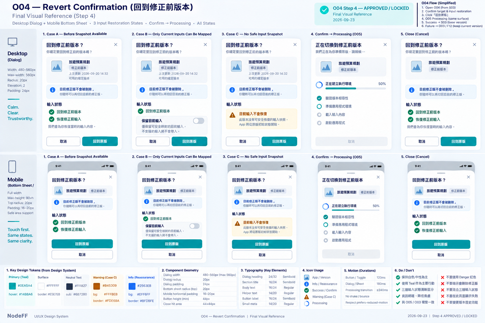

# O04 — Revert Confirmation

> **PHASE 1 FREEZE AUDIT：PASS — Phase 1 applicable truth passed Final Audit and is eligible for Human-approved Build Freeze; Phase 2/3+ and deferred content are excluded.**

> Governance：本檔為 UI/UX Working Current Truth；Build Freeze / delivery lifecycle 以 `working/common-core/DESIGN-TO-DELIVERY.md` 為準。

> Overlay ID：O04
>
> 狀態：**WORKING — ④A LOW_FI_APPROVED / ④B HIGH_FI_STEP1–4 APPROVED — WORKING BASELINE**
>
> Phase：Phase 1
>
> Screen-level canonical owner：`working/detailed-design/UI-UX/overlays/O04-REVERT-CONFIRMATION.md`
>
> Function behavior source：F00 Experience Shell + F16 Result Correction。
>
> ④A Low-fi與④B High-fi Step 1–4已完成 User Review並鎖定；implementation input 仍需 Human-approved Build Freeze。

# 1. User Outcome

O04 的核心任務：

> **User 已接受某次修正版後，如果想回到修正前版本，可以清楚知道會回哪一版、輸入會不會一起恢復，而且修正版不會被刪除。**

# 2. Entry Preconditions

O04 只在以下條件成立時可進：

    current active Blueprint
    = same-session previously ACCEPTED correction child

並且：

    previous/base Blueprint
    still trusted + compatible

若 previous/base 已 REVOKED / INCOMPATIBLE：

- 不顯示可執行 Revert CTA。
- 交 O03 / F12 說明不能安全返回。

# 3. Entry

S03：

    Previous Version
    / 回到修正前版本
    → O04

O04 不是版本歷史頁。

Phase 1 不承諾：
- account-level history。
- cross-device完整版本列表。
- 任意多版本 timeline。

# 4. Core Message

主訊息固定要讓 User知道兩件事：

1. 會回到修正前版本。
2. 目前修正版不會被刪除。

Low-fi：

    回到修正前版本？

    目前修正版不會被刪除。

# 5. Version Target

O04 必須顯示 target identity，避免 User不知道「回到哪一版」。

可顯示：
- App Logo / Title。
- 「修正前版本」label。
- 若有簡短 result summary，可顯示 previous result摘要。

不顯示：
- Blueprint hash。
- lineage ID。
- correction_id。
- internal version enum。

# 6. Input Restoration — Three Cases

## Case A — Before Snapshot Available

如果 same-session correction前 snapshot仍在 memory且 compatible：

    會恢復：
    ✓ 修正前版本
    ✓ 修正前輸入

這是 default。

## Case B — Only Current Inputs Can Be Safely Mapped

如果原 snapshot不存在，但 current inputs可安全映射：

    回到修正前版本
    [ ] 保留目前輸入

Toggle default = OFF。

只有 User explicit opt-in才帶 current compatible inputs。

## Case C — No Safe Input Snapshot

如果沒有安全可恢復的 input snapshot：

    會回到修正前版本，
    但目前輸入不會恢復。

    App 將從原版初始狀態開始。

這件事必須在 Confirm 前說清楚。

# 7. Desktop Low-fi

    ┌──────────────────────────────────────────────┐
    │ 回到修正前版本？                       [×] │
    │                                              │
    │ [App Logo] App Title                         │
    │ 修正前版本                                   │
    │                                              │
    │ 目前修正版不會被刪除。                       │
    │                                              │
    │ 輸入狀態                                     │
    │ ✓ 將恢復修正前的輸入                         │
    │                                              │
    │ [取消]                         [回到原版]     │
    └──────────────────────────────────────────────┘

# 8. Mobile Low-fi

    ╭────────────────────────────╮
    │ 回到修正前版本？       [×] │
    │                            │
    │ [Logo] App Title           │
    │ 修正前版本                 │
    │                            │
    │ 修正版不會被刪除           │
    │                            │
    │ ✓ 恢復修正前輸入           │
    │                            │
    │ [取消]                     │
    │ [      回到原版      ]     │
    ╰────────────────────────────╯

Mobile 可用 bottom sheet / confirmation sheet。

# 9. CTA Semantics

Primary：

    回到原版

Secondary：

    取消

不建議寫：
- Delete New Version
- Undo Forever
- Restore Data

因為這些都會造成錯誤心智。

# 10. Successful Revert

Confirm 後：

    fresh ExecutionAdmission for base
    → fresh F03 Runtime Instance
    → APP on base Blueprint

結果：

- active App切回 base。
- correction outcome = REVERTED。
- 修正版 child不刪除。
- lineage不刪除。
- 回 S03，不回 S06 Compare。

# 11. Failure

若 confirm 後發現 target不能安全執行：

    無法安全回到這個版本
    目前修正版仍保持可用

    [保留目前版本]
    [回到 App]

交 O03 / F12。

不能：
- force execute unsafe base。
- silent downgrade trust。
- 重新 compile old Blueprint來假裝 revert成功。

# 12. Close / Cancel

Cancel / Close：

- 保持 current corrected App active。
- 不修改 correction outcome。
- 不 mutation任何 Blueprint。
- focus回 S03 Previous Version / Revert trigger。

# 13. Accessibility

- confirmation heading明確。
- target version不只靠顏色識別。
- input restoration狀態可被 screen reader讀取。
- destructive-looking action wording清楚。
- Primary / Cancel keyboard可達。
- Mobile touch target至少44 CSS px。
- Confirm後進度由 O05共用 loading規則承接。

# 14. Confirmed O04 Low-fi Decisions

User 已確認：

1. O04 固定先說 **「回到修正前版本？」**，並明確補一句 **「目前修正版不會被刪除」**。
2. Confirm 前明確顯示輸入恢復狀態：可恢復 / 可選擇保留目前輸入 / 無法恢復。
3. CTA 固定為 **取消 + 回到原版**，不使用 Delete / Undo Forever 等容易誤解的 wording。
4. 若 previous/base 已不安全或 incompatible，不提供可執行 Revert；改由 O03 / F12 說明並保留目前修正版。
5. 「目前修正版不會被刪除」對應 F16 既有 Function truth：成功 Revert 後 child Blueprint 與 CORRECT lineage 都保留，只是 active App 切回 previous/base。

# 15. ④B High-fi Contract

> Step 1 approved by User：2026-09-23
>
> Canonical rule：本節是 O04 High-fi 的唯一 canonical contract。後續 Step 2–4 必須在本節續寫，不得另建重複 High-fi summary / shadow copy。
>
> Current status：
> - Step 1 — Structure Lock ✅
> - Step 2 — Geometry + Visual Hierarchy Lock ✅
> - Step 3 — Detailed High-fi Visual Rules Lock ✅
> - Step 4 — Final Visual Reference Lock ✅

## Step 1 — Structure Lock ✅

### 1. O04 Role / Revert Boundary

O04只處理 **已 ACCEPTED correction 的 Revert Confirmation**。

Entry preconditions：
~~~text
current active App
= same-session previously ACCEPTED correction child

AND

previous / base Blueprint
= still trusted + compatible
~~~

O04不是 Version History，也不提供任意版本挑選。

### 2. Canonical Flow

~~~text
S03 Previous Version / 回到修正前版本
→ O04 Revert Confirmation
→ Confirm
→ fresh ExecutionAdmission for base
→ fresh F03 Runtime Instance
→ S03 on base Blueprint
~~~

成功 Revert後回 S03，不回 S06 Compare。

### 3. Confirmation Heading

Heading固定為：

> **回到修正前版本？**

它必須明確表達這是一個 version switch decision，而不是 delete。

### 4. Corrected Version Preservation Message

`目前修正版不會被刪除。` 必須永遠可見。

Rules：
- 不藏在 tooltip。
- 不只放 helper fine print。
- 不因 breakpoint移除。
- Revert只改 active App；child Blueprint與 CORRECT lineage保留。

### 5. Target Version Identity

O04必須顯示 User即將返回的 target identity。

至少包含：
- App Logo / Title。
- `修正前版本` label。

若有可靠 previous result summary，可補充 material summary。

Consumer UI不得顯示：
- Blueprint hash。
- lineage ID。
- correction_id。
- internal version enum。

### 6. Input Restoration Block — Always Visible

Input Restoration是 O04的正式 decision / truth block，必須永遠顯示。

只允許以下三種 mutually exclusive state。

#### Case A — Before Snapshot Available

當 same-session before snapshot仍在 memory且 compatible：
~~~text
✓ 回到修正前版本
✓ 恢復修正前輸入
~~~

這是 default。

Rules：
- 不需要 User再確認 input restoration。
- 不顯示 `保留目前輸入` Toggle。

#### Case B — Only Current Inputs Can Be Safely Mapped

當 before snapshot不存在，但 current inputs可安全映射：
~~~text
回到修正前版本
[ ] 保留目前輸入
~~~

**Toggle default = OFF。**

只有 User explicit opt-in才帶 current compatible inputs。

#### Case C — No Safe Input Snapshot

若沒有安全可恢復的 input snapshot：
~~~text
會回到修正前版本，
但目前輸入不會恢復。

App 將從原版初始狀態開始。
~~~

這件事必須在 Confirm前明確說明。

### 7. Input Restoration Cases Are Mutually Exclusive

三種 input restoration state不得混用。

Rules：
- Case A不得再出現 Case B Toggle。
- Case B只有在 safe mapping成立時出現。
- Case C不得提供看似可保留 input的 control。
- UI不得把未知狀態假裝成可恢復。

### 8. CTA Semantics

Primary固定為：
~~~text
回到原版
~~~

Secondary固定為：
~~~text
取消
~~~

不得使用：
- Delete New Version。
- Undo Forever。
- Restore Data。

因為這些 wording會錯誤暗示 deletion / global data restore。

### 9. Revert Is Not Delete

O04是 Confirmation，不是 destructive deletion workflow。

Confirm的語意是：
~~~text
switch active App
→ previous / base Blueprint
~~~

不是：
~~~text
delete corrected child
delete lineage
erase correction history
~~~

### 10. Mutation Boundary

只有 User按下 Confirm後，才開始 Runtime / active-version transition。

以下行為不得造成 mutation：
- 打開 O04。
- 查看 target version。
- Case B Toggle尚未 Confirm前。
- Cancel。
- Close。

不得提前修改 correction outcome或 current active App。

### 11. Cancel / Close

Cancel / Close固定：
- current corrected App保持 active。
- correction outcome不變。
- 不 mutation任何 Blueprint。
- focus回 S03 Previous Version / Revert trigger或合理 safe surface。

### 12. Confirm Processing Ownership

Confirm後的 fresh ExecutionAdmission / Runtime建立若需要 async processing，presentation完全交 O05。

Rules：
- O04不自行建立第二套 loading。
- progress只依 O05 Current Truth。
- reliable checkpoints才顯示 checkpoint-derived %。
- otherwise Stage + bounded activity indicator。

### 13. Unsafe / Incompatible Target After Confirm

若 Confirm後 target變成不能安全執行：
~~~text
do not force execute
do not downgrade trust
do not recompile old Blueprint to fake revert success
~~~

交 O03 + F12 Recovery。

目前修正版維持可用；不得因 failed revert破壞 current corrected App。

### 14. Sensitive Input Boundary

`SENSITIVE / DO_NOT_PERSIST`資料不得因 Revert被額外 durable保存。

O04只呈現 Function contract已確認可安全恢復 / 映射的 truth。

不得為了讓 Revert看起來完整而繞過 privacy / persistence policy。

### 15. Step 1 Locked Decisions

1. O04只處理 same-session已 ACCEPTED correction的 Revert。
2. previous/base必須仍 trusted + compatible。
3. Canonical flow = S03 → O04 → fresh ExecutionAdmission → fresh F03 Runtime → S03 base。
4. Heading固定為 `回到修正前版本？`。
5. `目前修正版不會被刪除。` 必須永遠可見。
6. Target identity至少顯示 App Identity + `修正前版本` label。
7. **Input Restoration block永遠顯示。**
8. **Case A / B / C三種 restoration state明確互斥。**
9. **只有 Case B顯示 `保留目前輸入` Toggle，且 default OFF。**
10. Primary = `回到原版`；Secondary = `取消`。
11. O04不是 deletion workflow；child Blueprint與 lineage不刪除。
12. Confirm前不得 mutation active App / Blueprint / correction outcome。
13. Cancel / Close保持 corrected App active並 restore focus。
14. Confirm processing完全交 O05。
15. Unsafe / incompatible target交 O03 + F12；不得 fake revert success。
16. Sensitive / DO_NOT_PERSIST input不得因 Revert額外 durable保存。

> Step 1：**APPROVED / LOCKED**。下一步：Step 2 — Geometry + Visual Hierarchy Lock。

## Step 2 — Geometry + Visual Hierarchy Lock ✅

> Approved by User：2026-09-23
>
> Step 2：**APPROVED / LOCKED**
>
> Scope：鎖定 O04 Dialog / Bottom Sheet尺寸、Target Identity、reassurance、Input Restoration三種 Case、CTA排列、Confirm → Processing版面穩定性與 responsive hierarchy。不得改寫 Step 1 semantics；color / semantic styling留給 Step 3。

### 1. Desktop Overlay Geometry

Desktop baseline採 **centered lightweight confirmation dialog**。

Recommended width：
~~~text
480–560px
max-width：約 560px
~~~

Rules：
- 不做 side panel。
- 不做 full page。
- underlying S03保持可辨識但 inert。

### 2. Desktop Vertical Structure

固定順序：
~~~text
Heading + Close
→ Target Version Identity
→ `目前修正版不會被刪除`
→ Input Restoration
→ Actions
~~~

### 3. Target Version Identity Geometry

Target Version Identity採 compact context block。

至少包含：
- App Logo + Title。
- `修正前版本` label。

若有可靠 previous result summary，可補充一小段 material summary。

Recommended normal height：約 `72–104px`。

不得：
- 做成第二張 S03 Runtime。
- 做成 Before / After compare。
- 放入 technical metadata。

### 4. Reassurance Placement

`目前修正版不會被刪除。` 固定為獨立 reassurance row。

位置：
~~~text
Target Version Identity
→ Reassurance
→ Input Restoration
~~~

不得塞到 footer / tooltip / fine print。

### 5. Input Restoration Geometry

Input Restoration是 O04第二核心區塊。

建議 section label：
~~~text
輸入狀態
~~~

Case A / B / C共用同一 geometry family，但內容依 truth自然變化。

#### Case A

兩行 confirmed state：
~~~text
✓ 回到修正前版本
✓ 恢復修正前輸入
~~~

#### Case B

一行版本狀態 + 一整列 `保留目前輸入` Toggle。

#### Case C

兩到三行明確說明：
- 目前輸入不會恢復。
- App將從原版初始狀態開始。

三種 Case高度可自然變化，但 dialog不得出現劇烈 layout jump。

### 6. Case B Toggle Geometry

`保留目前輸入`使用 full-row control。

Recommended：
~~~text
Label / helper text      [Toggle]
~~~

Rules：
- Label在左，Toggle在右。
- 可有一行 helper copy。
- 不塞進 CTA row。
- 不做成 Primary decision button。
- default OFF仍依 Step 1 semantics。

### 7. Desktop Actions

Desktop baseline：
~~~text
[取消]                              [回到原版]
Secondary / Ghost                  Primary
~~~

Rules：
- `回到原版`靠右。
- baseline不 sticky。
- actions不得壓縮 Input Restoration內容。

### 8. Confirm → Processing Stability

Confirm後不開新 Overlay。

同一 O04 dialog geometry保持；Actions region原地轉成 O05 processing presentation。

Flow：
~~~text
O04 Confirmation
→ Confirm
→ same O04 surface + O05 processing
→ success → S03 base
→ failure → O03 / F12
~~~

不得用第二個 modal製造流程跳轉感。

### 9. Mobile Sheet Geometry

Mobile採 bottom sheet / confirmation sheet。

Recommended：
- horizontal padding `16–20px`。
- top radius `20px`。
- content-height baseline。
- safe-area aware。
- copy較長時 content region可 scroll。

Target / Input Restoration / Primary CTA都必須容易找到。

### 10. Mobile Canonical Order

Mobile固定順序：
~~~text
Heading
→ Target Identity
→ Reassurance
→ Input Restoration
→ 回到原版
→ 取消
~~~

### 11. Mobile Action Order

Mobile正式鎖定：
~~~text
[回到原版]
[取消]
~~~

**Mobile Primary First = YES.**

`回到原版`：
- full-width。
- min-height ≥ 44px。

`取消`：
- 下一列 Secondary / Ghost。

這取代 Low-fi草圖中先取消再 Primary的排列；Function semantics不變。

### 12. Close Geometry

Close與 Cancel語意相同。

若提供 Close：
- Desktop放右上角。
- Mobile放 sheet / header右上角。
- hit area ≥ 44px。

Close後 focus依 Step 1回 S03 Revert trigger / safe surface。

### 13. Visual Hierarchy

O04固定 hierarchy：
~~~text
回到哪一版？
> 修正版仍保留
> 輸入會怎麼處理
> 回到原版 CTA
> Cancel / chrome
~~~

第一眼應該是 version decision + input consequence，而不是 technical restore operation。

### 14. Responsive Semantics

Desktop ↔ Mobile只改排列，不改 Case semantics。

不得因 Mobile空間較小：
- 隱藏 Case C的「輸入不恢復」。
- 移除 reassurance。
- 把 Case B Toggle改成 implicit opt-in。
- 改變 default OFF。

### 15. Step 2 Locked Decisions

1. Desktop = centered lightweight confirmation dialog，約480–560px。
2. 固定結構 = Heading/Close → Target Identity → Reassurance → Input Restoration → Actions。
3. Target Identity保持 compact，常態約72–104px，不做第二個 Runtime / Compare。
4. `目前修正版不會被刪除。` 固定為獨立 reassurance row。
5. Input Restoration是第二核心區塊，三種 Case共用 geometry family。
6. Case B Toggle = full-row control，不塞進 CTA row。
7. Desktop actions = 取消（Secondary/Ghost）+ 回到原版（Primary right）。
8. Confirm → Processing沿同一 O04 surface原地切 O05。
9. Mobile = bottom sheet / confirmation sheet，safe-area aware。
10. Mobile固定順序 = Heading → Target → Reassurance → Input Restoration → Primary → Cancel。
11. **Mobile action order = 回到原版 → 取消；Primary full-width。**
12. Close與 Cancel語意相同，hit area ≥44px。
13. Responsive只改 presentation，不得改 Case A/B/C semantics。

> Step 2：**APPROVED / LOCKED**。下一步：Step 3 — Detailed High-fi Visual Rules Lock。

## Step 3 — Detailed High-fi Visual Rules Lock ✅

> Approved by User：2026-09-23
>
> Step 3：**APPROVED / LOCKED**
>
> Scope：鎖定 O04 visual character、Target Version Identity、reassurance、Input Restoration Case A/B/C、CTA treatment、Confirm→Processing、failure handoff、Mobile、motion與 accessibility。不得改寫 Step 1 semantics或 Step 2 geometry。

### 1. Core Visual Character

O04採 **Calm Version Confirmation** visual role。

Rules：
- White / Soft Neutral為主。
- Brand Teal用於 Primary action / focus。
- 不使用大面積 Warning / Danger treatment。
- 不把 Revert視覺塑造成 destructive deletion。
- 不使用紅色警報式 framing。

### 2. Desktop Dialog Visual

Desktop沿 Design System：
- White surface。
- radius `20px`。
- elevation `2`。
- padding約 `24px`。
- Heading使用 `heading-lg 24/32` 或 `heading-md 20/28`。
- Close icon約20px，hit area ≥44px。
- underlying S03可辨識但 inert。

### 3. Target Version Identity Styling

Target Version Identity採 neutral context card：
- soft surface。
- radius `16px`。
- default border。
- App Logo + App Title + `修正前版本` label。
- 不使用 Success / Warning / Danger styling。
- 不把 target畫成「被推薦的新版本」。

### 4. Reassurance Styling

`目前修正版不會被刪除。` 使用 neutral / Info-level reassurance。

Rules：
- 可搭 small info / check icon。
- 不做大型 Success card。
- 不使用整塊綠色 surface暗示 operation已成功。
- 必須保持 readable、always visible。

### 5. Input Restoration — Case A

Case A顯示：
~~~text
✓ 回到修正前版本
✓ 恢復修正前輸入
~~~

Visual：
- subtle positive indicator。
- neutral / soft surface。
- 不畫成完整 Success state。

這代表 restoration truth，不代表 Revert operation已完成。

### 6. Input Restoration — Case B

`保留目前輸入` full-row Toggle：
- default OFF。
- OFF = neutral state。
- ON = Brand Teal active state。
- label必須持續可讀。
- 不只靠 Toggle顏色表達 state。
- helper copy明確說明只保留「可安全映射的目前輸入」。

### 7. Input Restoration — Case C

Case C使用 shared Warning semantic family：
~~~text
semantic-warning-bg     = #FFFBEB
semantic-warning-border = #FDE68A
semantic-warning-700    = #B45309
~~~

Rules：
- Warning只作用在 Input Restoration block。
- 不把整張 Dialog變成 Warning。
- copy明確說明目前輸入不會恢復，App將從原版初始狀態開始。

### 8. Primary CTA — `回到原版`

`回到原版` 固定為 Brand Teal Primary：
- background = Teal 600。
- text = White。
- radius `12px`。
- min-height ≥44px。
- hover → Teal 500。
- visible focus。

**`回到原版` ≠ Destructive / Danger action。**

不得因為是 Revert就改成 Danger red。

### 9. Secondary CTA — `取消`

`取消` = Secondary / Ghost。

Rules：
- neutral treatment。
- 不做成與 Primary等權的 competing CTA。
- 不使用 Danger styling。

### 10. Confirm → Processing

Confirm後沿同一 O04 surface：
- Actions region原地切 O05 processing。
- reliable checkpoints → Stage + checkpoint-derived %。
- no reliable checkpoints → Stage + bounded activity indicator。
- 不 fake progress。
- 不使用 red progress bar。
- 不因 animation延遲成功 transition。

### 11. Confirm Failure Boundary

若 target不能安全執行：
- O04不自行建立新的 failure visual system。
- 交 O03 / F12。
- shared Danger / Recovery palette由 O03 presentation owner處理。
- corrected App維持 safe current truth。

### 12. Mobile Visual Rules

Mobile沿同一 visual language：
- Bottom sheet top radius `20px`。
- Primary `回到原版` full-width。
- `取消`在下一列。
- safe-area aware。
- Case C Warning block不得縮成一行 fine print。
- Input Restoration consequence必須保持與 Desktop同等可見。

### 13. Motion

~~~text
Button / Toggle feedback       = 120ms
Dialog / Bottom Sheet          = 180ms
Confirm → Processing transition ≤ 240ms
~~~

禁止：
- shake。
- bounce。
- warning pulse。
- flashing。

`prefers-reduced-motion`必須有 fallback。

### 14. Accessibility

- Case A/B/C不得只靠 color區分。
- Toggle具 programmatic label / state。
- Warning block使用 icon + text。
- overlay focus trap / restore正確。
- Close / Button touch target ≥44px。
- keyboard完整可操作。
- processing使用適度 `aria-live`。
- Mobile safe-area / keyboard不得遮 Primary。

### 15. Step 3 Locked Decisions

1. O04 = Calm Version Confirmation，不是 destructive deletion visual。
2. Desktop沿 White surface / radius20 / elevation2。
3. Target Version Identity使用 neutral context card。
4. Reassurance使用 neutral / Info-level treatment，不做大型 Success card。
5. Case A使用 subtle positive indicator，但不是 Success state。
6. Case B Toggle default OFF；ON使用 Brand Teal active state。
7. Case C使用 shared Warning semantic family，但只作用在 Input Restoration block。
8. **`回到原版` 永遠不是 Destructive / Danger action；固定使用 Brand Teal Primary。**
9. `取消` = Secondary / Ghost。
10. Confirm → Processing完全沿 O05。
11. Confirm failure交 O03 / F12，不在 O04發明第二套 failure UI。
12. Mobile保持 Primary full-width、Cancel下一列、Case C consequence完整可見。
13. Motion採 `120 / 180 / ≤240ms` restrained system。
14. Accessibility / focus / toggle state / aria-live / safe-area列為 High-fi gate。

> Step 3：**APPROVED / LOCKED**。下一步：Step 4 — Final Visual Reference Lock。

## Step 4 — Final Visual Reference Lock ✅

> Approved by User：2026-09-23
>
> Step 4：**APPROVED / LOCKED**
>
> Approved visual：
>
> 
>
> Canonical path：
>
> `working/detailed-design/UI-UX/references/O04-Hi-FI-v1.png`
>
> Repository PNG blob SHA：
>
> `a8ee8cca0f39f335820dcd6436b9a6fe416729de`

### Reference Boundary

- 圖片鎖定 Revert Confirmation的 dialog / sheet composition、Target Identity、reassurance、Input Restoration與 CTA hierarchy。
- Case A / B / C semantics、Case B default OFF與 `回到原版` Brand Teal Primary仍以 Step 1–3文字 contract為 authority。
- sample App / input copy只作 visual example。
- 圖片不得把 Revert解讀成 destructive deletion。
- Step 1–3 textual contract + Design System + Fxx Function truth優先於圖片生成 / rendering誤差。
- 此 PNG 為本 Screen / Overlay 唯一 canonical High-fi visual reference；後續若要取代，必須 reopen Step 4。

> Step 4：**APPROVED / LOCKED**。

# 16. Review Status

> **④A LOW_FI_APPROVED / ④B HIGH_FI_STEP1–4 APPROVED — WORKING BASELINE**

O04 ④A Low-fi與④B Step 1–4已完成 User Review並鎖定。

Final Cross-Screen High-fi Review：**CLOSED / VERIFIED**。

Build Freeze / appf2-build activation / Cursor implementation 維持 HOLD。

### Final Cross-Screen High-fi Review — CLOSED / VERIFIED

> Verified：2026-09-24
>
> FG-01–FG-07 已全部完成修正與決策；2026-09-24 final full-set re-audit 未發現新的 material cross-screen finding。**Final Cross-Screen High-fi Gate = CLOSED / VERIFIED。**
>
> Final cross-screen authority：**Step 1–3 textual contract + Design System + Fxx Function truth > Step 4 visual reference。**
>
> Final re-audit確認：S03 使用 approved v2 canonical reference；其餘既有 canonical PNG維持不變。圖片不覆蓋 Step 1–3 textual contract / Design System / Fxx Function truth。
