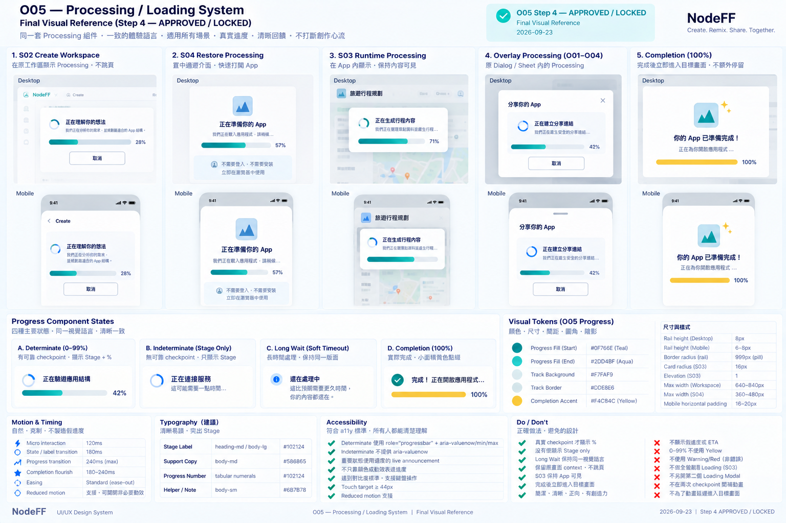

# O05 — Loading / Building / Hydration States

> Governance：本檔為 UI/UX Working Current Truth；Build Freeze / delivery lifecycle 以 `working/common-core/DESIGN-TO-DELIVERY.md` 為準。

> Overlay / State ID：O05
>
> 狀態：**WORKING — ④A LOW_FI_APPROVED / FUNCTION_DELTA_CLOSED / CROSS_SCREEN_REVIEW_APPROVED / ④B HIGH_FI_STEP1–4 APPROVED — WORKING BASELINE**
>
> Phase：Phase 1
>
> Screen-level canonical owner：`working/detailed-design/UI-UX/overlays/O05-LOADING-BUILDING-HYDRATION.md`
>
> Function behavior sources：F00 Experience Shell + F01 + F03 + F05 + F06 + F12 + F16。
>
> 本文件的 ④A Low-fi direction與 Runtime Loading / Timeout Function Delta已完成 User Review；implementation input 仍需 Human-approved Build Freeze。

# 1. User Outcome

O05 的核心任務：

> **任何需要等待的 operation，以及每個被 F03接受的 S03 Runtime interaction，都要有真實 processing state；User看到的 stage / %不能假造，也不能為了動畫而拖慢完成。**

O05 是跨畫面的共用 loading / progress presentation，不是獨立 route。

# 2. Host Surfaces

O05 可被以下畫面 / Overlay使用：

- S02 Create Workspace。
- S03 App / Runtime（每個被 F03 admitted 的 interaction都有 logical global processing state；極快完成時不強迫 paint loading frame）。
- S04 Shared App Restore。
- S05 Refine / Remix。
- S06 Correction Compare preparation / replay。
- O01 Share creation。
- O02 Correction Composer submit。
- O03 Recovery Retry。
- O04 Revert confirm → previous version hydration。

# 3. Core Rule — Processing Only For Real Work

沿用 F00：

- ANALYZING → 顯示 operation progress。
- BUILDING → 顯示 creation/build progress。
- HYDRATING → 顯示 App準備進度。
- normal local Runtime action被 F03接受後也進入 logical global processing state；Working F00/F03/F12已閉合此 contract。

禁止：
- 把每次 local interaction都強制畫成整頁 spinner；presentation應依 host surface穩定承接。
- spinner蓋掉整個產品。
- fake generated content skeleton。
- 為了讓動畫好看而故意延遲完成。

# 4. Progress Model

O05 final rule只允許兩種 presentation mode：

~~~text
DETERMINATE
→ Stage label + checkpoint-derived Progress %

INDETERMINATE
→ Stage label + bounded activity indicator
~~~

只有 reliable checkpoints存在時才顯示 %。

百分比代表：
- 已完成多少個「可驗證 work checkpoints」。

百分比不代表：
- 還剩幾秒。
- LLM多久會回。
- network多久會好。

沒有 reliable checkpoints時：
- 不顯示 fake %；
- 不顯示 empty progress rail；
- bounded activity indicator只表示 operation仍 active，不代表工作量增加。

例如 4 個 major checkpoints：

    0%   operation started
    25%  checkpoint 1 complete
    50%  checkpoint 2 complete
    75%  checkpoint 3 complete
    100% ready

若單一 checkpoint內等待很久：
- % 可以停在目前完成值。
- 顯示現在正在做什麼。
- **不平滑亂跑假進度。**

# 5. Why % Can Still Be Honest

Progress % 不是「時間進度」，而是「工作完成度」。

Example：

    50%
    正在檢查互動…

意思是：
> 目前定義的 restore/build/correction work已有一半 checkpoints完成。

不是：
> 還剩一半時間。

這可以同時滿足：
- User需要看到 %。
- appf2不提供假 precision。

# 6. Proposed Cross-Screen Consistency Delta

目前既有 Low-fi有一個差異：

- S02：已核准 stage-based / no fake %。
- S04：已核准 checkpoint-derived Loading %。
- O02：已核准 checkpoint-derived Progress %。

O05 final cross-screen rule：

    S02 / S04 / S05 / S06 / O01 / O02 / O03 retry / O04 revert
    → 能定義可靠 checkpoints時
    → Stage + %

因此如果 User批准 O05，本文件將構成 **presentation-only Low-fi consistency delta**：
- S02 不再是「完全不顯示 %」。
- 改為「不顯示假 %；有可靠 checkpoints時顯示 checkpoint-derived %」。

這不修改 F01 / F03 Function semantics。

# 7. S02 — Create / Build Progress

Proposed 4 stages：

1. 理解你的想法
2. 整理成 App
3. 確認互動可以執行
4. 準備你的 App

Presentation：

    50%
    確認互動可以執行…

Rules：
- clarification / assumption等待 User時，progress停住。
- User回答後繼續。
- READY直接進 S03，不增加完成確認頁。

# 8. S04 — Shared App Restore

已核准：

    App Logo / Title
    Loading %
    人話 stage

Example：

    67%
    正在準備 App…

不為了 animation拖慢 entry。

# 8.1 O01 — Share Creation

O01 Share creation也使用同一 processing presentation：

- 有可靠 Share creation checkpoints → Stage + checkpoint-derived %。
- 沒有 reliable checkpoints → 顯示「正在準備分享連結…」等 truthful stage + bounded activity indicator，不顯示 fake % / empty rail。
- READY立即轉 O01 READY，不為了動畫停留。
- Share failure仍由 F05 / F12 → O03 recovery semantics承接；O05只負責 processing presentation。

# 9. S05 — Refine / Remix

Proposed stages：

1. 理解修改
2. 更新 App
3. 檢查互動
4. 準備新版

Presentation：

    50%
    正在檢查新版互動…

原版始終安全。

# 10. O02 / F16 Correction

已核准處理中顯示 %。

Recommended checkpoints可跨：

1. capture before
2. understand correction
3. compose / validate child
4. replay / compare ready

Consumer copy不顯示 technical names。

Example：

    75%
    正在用相同輸入比較結果…

# 11. O03 Recovery Retry

User按 Retry後：

- 若 target Function有 checkpoints → 使用同一 Progress %。
- 若只是單一 external wait、沒有可驗證中間 checkpoint：
  - 顯示目前狀態文字。
  - % 停在上一個真實 checkpoint。
  - 不 fake smooth movement。

# 12. O04 Revert

Confirm「回到原版」後：

Possible checkpoints：

1. confirm target still safe
2. prepare previous Blueprint
3. initialize fresh Runtime
4. restore eligible inputs / ready

Example：

    75%
    正在恢復原版…

完成後直接回 S03 previous/base App。

# 13. S03 Local Runtime Rule — Closed Working Contract

User 已確認：

    click / input / toggle / local calculate
    → global loading / processing state

Presentation rules：
- Runtime interaction被 F03 accepted / admitted、token建立時進 logical global processing state；不是等 commit後才進。
- 有可靠 checkpoints時顯示 Stage + Progress %。
- 無可靠細分時至少顯示 operation stage；不得用時間估算亂灌 %。
- 只有 action成功 commit後才可顯示100%，並立即回正常 S03。
- 不為了讓 loading「看得到」而人工增加不必要等待。
- action在同一 render frame內完成時，完整 loading frame可能不 paint；logical state仍需存在，且不算 UX violation。

**Formal sync note：** 既有 Formal F00仍是舊語意；此 Working Current Truth待 pre-Build Freeze reconciliation一次同步。O05不擁有 operation / commit semantics，仍以 F03為 owner。

Node/component單獨 async仍可有 component-local detail，但不取消全域 processing feedback。

# 14. Loading Layout — Desktop

    ┌────────────────────────────────────────────┐
    │                                            │
    │              App / Operation              │
    │                                            │
    │                   50%                     │
    │          ██████████──────────              │
    │                                            │
    │         正在確認互動可以執行…             │
    │                                            │
    │              [取消 where safe]            │
    │                                            │
    └────────────────────────────────────────────┘

不要求 full-screen；依 host surface內嵌。

# 15. Loading Layout — Mobile

    ┌────────────────────────────┐
    │                            │
    │            50%             │
    │      ████████────────      │
    │                            │
    │   正在確認互動可以執行…    │
    │                            │
    │       取消 where safe      │
    │                            │
    └────────────────────────────┘

Primary content保持穩定，不讓 layout不停跳。

# 16. Progress Completion

100% 只在 actual ready / Runtime commit condition成立後顯示。

Rules：
- 不先跑到100%再等 backend。
- Ready後快速 transition到 target surface。
- 不另外加「完成，按繼續」頁，除非 Function明確需要 User decision。

# 17. Long Wait

如果同一 checkpoint等待較久：

顯示：

    50%
    還在處理這一步，你的內容都還在。

可安全 cancel時：

    [取消]

可 retry不是 loading state本身決定；由 source Function / F12決定。

# 18. Runtime Timeout → Normal UX Return

Working Function contract已閉合：
- F03擁有 operation token、deadline guard、atomic discard、stale completion與 integrity判斷。
- F12-POL-011擁有 `F03-ERR-021 → TIMEOUT → APP_CURRENT` recovery。
- F00/O05只呈現 lifecycle與 recovery outcome。

## Runtime interaction watchdog

每次被接受執行的 S03 Runtime interaction建立 operation token：

    STARTED
    → PROCESSING
    → COMMITTED
    or TIMED_OUT
    or FAILED
    or CANCELLED

Timeout分兩層：

### Soft Timeout

當 operation超過 policy-defined soft threshold：

    Progress %停在最後真實 checkpoint
    + 顯示：
      「還在處理，你的 App 和目前內容都還在。」

不亂灌 %。

Soft Timeout是 `PROCESSING` 上的 non-terminal wait condition，不是 operation terminal state。

### Hard Timeout

超過 policy-defined hard threshold：

    close operation token as TIMED_OUT
    → discard uncommitted transaction + staged effects/events
    → keep committed store unchanged
    → late/stale completion cannot commit
    → F03-ERR-021
    → F12-POL-011 TIMEOUT recovery
    → return to safe S03 UX when integrity holds

Default humanized outcome：

    「剛才這個操作處理太久，App 已回到上一個安全狀態。」

Actions依 F12：
- 再試一次（仍有 retry budget時）
- 回到 App / 保留目前狀態
- 稍後再試（budget exhausted時）

如果 timeout造成 integrity uncertainty：
- 不自動回正常 Runtime。
- F03直接產生既有 F03-ERR-018，由 F12-POL-001進 O03 terminal / critical safe-state；不把不安全狀況當成可恢復 TIMEOUT。

Retry：
- 同一 F12 recovery episode可 Retry，但每次 Retry建立新的 F03 operation token。
- closed token永不復用；成功回到 safe continuation後 episode才標 `RECOVERED`。

Browser limitation：
- Phase 1以 monotonic deadline + action-step / recompute / pre-commit guard檢查超時。
- main thread被 trusted synchronous code佔用時，`setTimeout()`不能強制中斷；handler晚回仍會在 pre-commit被拒絕。
- 真正無法返回的 trusted code由 Capability CI / review / resource guard防守；本 Delta不改成 Worker architecture。

Exact soft/hard timeout數值由 F03/F12 Function policy決定，不在 UI Low-fi硬編秒數。

# 19. Failure Transition

Loading失敗：

    O05
    → O03 Recovery

不能：
- spinner無限轉。
- 直接清空畫面。
- 自己發明另一套 error modal。

# 20. Accessibility

- progressbar提供 aria-valuenow / label。
- stage change透過 aria-live適度通知。
- 不只靠 animation表達進度。
- prefers-reduced-motion respected。
- keyboard可達 Cancel when safe。
- 100%後 focus移到 target main content。
- 長等待文案清楚，不用只有 spinner。

# 21. Confirmed O05 Low-fi Decisions

User 已確認：

1. O05 統一採 **Stage label + checkpoint-derived Progress %**；%代表工作完成度，不代表剩餘時間。
2. S02「no fake %」細化為：**有可靠 checkpoints就顯示 %；沒有就不假造**，與 S04 / O02一致。
3. **S03每個被 F03 admitted 的 Runtime interaction都有 logical global processing state。** F00/F03/F12 Material Function Delta已閉合；極快完成不強迫 paint loading frame。
4. 某 checkpoint卡住時，%停在最後真實完成值，不用動畫灌高。
5. Timeout → Recovery → safe S03 / terminal safe-state contract已由 F03 + F12閉合。

# 22. ④B High-fi Contract

> Step 1 approved by User：2026-09-23
>
> Canonical rule：本節是 O05 High-fi 的唯一 canonical contract。後續 Step 2–4 必須在本節續寫，不得另建重複 High-fi summary / shadow copy。
>
> Current status：
> - Step 1 — Structure Lock ✅
> - Step 2 — Geometry + Visual Hierarchy Lock ✅
> - Step 3 — Detailed High-fi Visual Rules Lock ✅
> - Step 4 — Final Visual Reference Lock ✅

## Step 1 — Structure Lock ✅

### 1. O05 Role — Shared Processing Presentation System

O05正式鎖定為 **Shared Processing Presentation System**，不是單一 Loading Overlay，也不是獨立 route。

它可被以下 host surface共用：
- S02 Create Workspace。
- S03 App / Runtime。
- S04 Shared App Restore。
- S05 Refine / Remix。
- S06 Correction Compare preparation / replay。
- O01 Share creation。
- O02 Correction Composer submit。
- O03 Recovery Retry。
- O04 Revert confirm。

### 2. Only Two Legal Progress Presentation Modes

O05 Consumer presentation只允許兩種 mode：

~~~text
DETERMINATE
→ Stage label + checkpoint-derived Progress %

INDETERMINATE
→ Stage label + bounded activity indicator
~~~

不得存在第三種「時間估算型」或平滑動畫灌高的假百分比。

### 3. Source Function Owns Progress Truth

是否能顯示百分比，不由 O05決定。

只有當 Source Function已提供可靠、finite、ordered checkpoint plan時，O05才可呈現 checkpoint-derived %。

O05只負責 consumer projection，不擁有：
- checkpoint定義。
- checkpoint completion truth。
- operation commit truth。
- retryability。
- cancelability。

### 4. O05 Must Not Invent Checkpoints

O05不得為了 UI想顯示 25 / 50 / 75 / 100，自行反推或補出 backend checkpoints。

如果 Source Function沒有可靠 checkpoint contract：
~~~text
Stage label + bounded activity indicator
~~~

不顯示 fake precision或 empty progress rail。

### 5. Progress Percentage Meaning

Progress %只代表：

> **已完成多少可驗證 work checkpoints。**

Canonical formula：
~~~text
progress_percent
= completed_checkpoints / planned_checkpoints × 100
~~~

它不代表：
- 剩餘時間。
- LLM ETA。
- network ETA。
- provider latency prediction。

### 6. 100% Completion Rule

`100%` 只可在 owner Function的 actual committed / ready condition成立後呈現。

以下不得自行等同 100%：
- commit_ready。
- validation passed。
- response received。
- last internal step started。

若 Function尚未 actual ready / committed，O05不得先跑到100%再等待。

### 7. Stage and Percentage May Advance Independently

Stage change與 % change不必一對一。

Rules：
- 同一 stage可完成多個 checkpoint。
- 某個 stage可長時間停在同一真實 %。
- 不因畫面看起來沒動，就人工增加 progress。
- checkpoint completion必須 monotonic。

### 8. Canonical Processing Information Structure

所有 O05 processing presentation固定依序：

~~~text
Operation / App context
→ Stage label
→ Progress indicator（only when determinate）
→ truthful support copy
→ Cancel（only when Source Function says safe）
~~~

不得讓 spinner成為唯一資訊。

### 9. Long Wait / Soft Timeout

Long Wait / Soft Timeout是 `PROCESSING` 上的 non-terminal wait condition，不是 Error。

此時：
- 保持最後真實 checkpoint %。
- 顯示現在仍在處理。
- 可顯示「你的內容都還在」等 truthful preservation copy。
- 不自行顯示 Retry。
- 不切 O03。

### 10. Failure / Hard Timeout Boundary

Failure / Hard Timeout不由 O05處理。

Canonical transition：
~~~text
O05 processing
→ Source Function failure / timeout truth
→ F12
→ O03 Recovery
~~~

O05不得：
- 自己發明 error modal。
- 無限 spinner。
- 清空 host surface。

### 11. Cancel Ownership

Cancel是否存在，必須由 Source Function授權。

Rules：
- safe cancel → O05可顯示 Cancel。
- not cancellable → 不顯示 Cancel。
- 不用 disabled Cancel假裝有能力。
- O05不得自行判斷 operation是否安全可取消。

### 12. Completion Transition

一旦 owner Function actual ready / committed：
~~~text
100%（if determinate）
→ immediately target surface
~~~

Rules：
- 不為動畫刻意停留。
- 不額外增加「完成，請繼續」頁。
- 只有 Function明確需要 User decision時才停。

### 13. S03 Runtime Fast Path

每個被 F03 admitted 的 Runtime interaction都有 logical `GLOBAL_PROCESSING`。

但若 operation在同一 browser render frame內完成：
- loading frame可能完全不 paint。
- logical lifecycle仍成立。
- 這不是 UX violation。
- **不得人工延長 operation只為讓 O05被看見。**

### 14. Preserve Host Context

O05不是「白畫面 + spinner」系統。

Processing時應盡量保持 host context穩定，例如：
- Create保留 creation context。
- Runtime保留 safe App context。
- Correction / Revert保留原 surface geometry。

只有 Function安全語意需要時才可切更強 blocking presentation。

### 15. User Decision Is Not Processing

Clarification / Assumption Review等 User decision狀態，不得被當作 processing繼續跑。

例如 F01：
~~~text
ANALYZING
→ NEEDS_CLARIFICATION
→ waiting for User
→ User answers
→ subsequent processing
~~~

等待 User回答時：
- progress停止 / 離開 processing presentation。
- 不繼續灌 %。
- 不顯示假 loading。

### 16. Retry Starts a New Operation

Retry不是延續舊 progress。

任何 Retry：
- 由 Source Function建立新的 operation identity。
- 使用新的 checkpoint plan / lifecycle truth。
- O05重新 projection。

不得從失敗前的 `75%` 接著跑到 `100%`。

### 17. F01 Creation Progress Delta Boundary

> Historical status at Step 1 approval time：`SD-20260922-002` 當時仍為 **OPEN**；其後已於 2026-09-23 完成獨立 Function Delta Review並轉為 **APPROVED / WORKING CLOSED / FORMAL_REFRESH_PENDING**。
>
> 本 subsection保留 Step 1 當時的 boundary rationale；Current status以本檔後方 Closure Note與 `SPEC-DELTA-REGISTER.md` 為準。

O05 Step 1只鎖 Consumer progress interface，不得藉此宣稱 F01 backend / Function contract已閉合。

F01後續 Function Delta Review仍必須獨立完成：
- canonical checkpoint schema。
- planned / completed checkpoints。
- checkpoint plan freeze / legal recalculation。
- clarification round對 checkpoint plan的影響。
- F01 → F00 / S02 progress projection interface。
- F01 / F03 Runtime-prepared handoff ownership。
- cancel / retry / failure lifecycle。
- Acceptance / Test。

Cursor不得從 O05 UI mockup反推 F01 backend semantics。

### 18. Step 1 Locked Decisions

1. **O05 = Shared Processing Presentation System，不是單一 Overlay。**
2. **只允許兩種合法 progress mode：reliable checkpoints → Stage + %；otherwise Stage + bounded activity indicator。**
3. Source Function擁有 checkpoint / completion truth；O05只做 presentation projection。
4. **O05永遠不得自行產生 checkpoint或假百分比。**
5. %代表 work checkpoint completion，不代表時間。
6. 100%只在 actual committed / ready後。
7. Stage與 %可不同步；不得為了動感人工灌高。
8. Processing資訊順序固定為 Context → Stage → Progress(if determinate) → support copy → Cancel(if safe)。
9. Long Wait / Soft Timeout仍屬 PROCESSING，不是 Error。
10. Failure / Hard Timeout交 F12 → O03。
11. Cancel是否顯示由 Source Function決定。
12. Completion立即進 target surface，不加多餘完成頁。
13. S03極快 operation可不 paint loading frame，禁止人工延長。
14. O05盡量保留 host context，不做白畫面 spinner系統。
15. Clarification / User Decision不是 Processing。
16. Retry建立新 operation，不延續舊 progress。
17. **Step 1當時不得假裝 F01 Function Delta已閉合；該 Delta已於後續獨立 Review正式閉合。**

> Step 1：**APPROVED / LOCKED**。下一步：Step 2 — Geometry + Visual Hierarchy Lock。

## Step 2 — Geometry + Visual Hierarchy Lock ✅

> Approved by User：2026-09-23
>
> Step 2：**APPROVED / LOCKED**
>
> Scope：鎖定 O05 shared processing system在 Workspace、Restore、Runtime、Overlay四種 host family中的版位、尺寸、資訊層級、Long Wait / Cancel / Completion geometry與 responsive adaptation。不得改寫 Step 1 progress semantics；color / motion details留 Step 3。

### 1. Host Geometry Families

O05不使用單一固定 loading layout；依 host surface分成四種 geometry family：

1. Workspace Processing — S02 / S05 / S06。
2. Restore Processing — S04。
3. Runtime Global Processing — S03。
4. Overlay Processing — O01 / O02 / O03 Retry / O04。

所有 family共用同一 information hierarchy與 progress truth，但不強迫相同容器形狀。

### 2. Workspace Processing — S02 / S05 / S06

Workspace processing固定留在原 workspace，不開新 page、不跳 modal。

Desktop：
- processing content沿主要 content column。
- recommended max-width約 `640–840px`。
- progress位於 workspace主要內容上半部。
- normal processing不額外包大型 card。

固定順序：
~~~text
Context
→ Stage
→ % / Progress Rail（if determinate）
→ Support Copy
→ Cancel（if safe）
~~~

Clarification / Assumption / other User Decision出現時：
- progress位置可保留作 context。
- processing motion停止。
- User Decision surface接管主要 attention。
- 不另開 loading page。

### 3. S04 Restore Processing — Centered Transition Surface

S04 restore允許使用 centered transition layout，因為此時尚未進入 S03 Runtime。

Desktop recommended main block：
~~~text
360–480px
~~~

Mobile：
~~~text
viewport width - 32–40px
~~~

Canonical order：
~~~text
App Identity（when available）
→ Stage
→ % / Progress Rail（if determinate）
→ `不需要登入，也不需要安裝`
~~~

Rules：
- 不做 dialog。
- 不預先 render Generated App Runtime。
- App identity缺失不得阻塞 READY。
- READY後立即交 S03。

### 4. S03 Runtime Global Processing — In-place Runtime Processing Layer

S03 Runtime processing正式鎖定為：

> **App保持可見的 in-place processing layer，不是 full-screen Loading，也不是 Bottom Sheet。**

Desktop：
- Generated App保持原 geometry與 last-known-good committed state可辨識。
- appf2 Shell Header不被 processing screen取代。
- processing layer位於 Runtime Frame內的上方 / 上中區。
- recommended compact panel width約 `320–480px`。
- Stage是第一 processing視覺；% / rail為第二。
- 若 current operation需要 blocking，Runtime interaction controls可 temporarily inert；是否 blocking由 source semantics決定。

Mobile：
- 不蓋掉 S03 permanent bottom navigation。
- processing layer位於 Runtime content內。
- width跟隨 content edge，horizontal margin約 `16–20px`。
- 不改成 Bottom Sheet，以免與真正 Overlay presentation混淆。

### 5. Runtime Host Preservation

S03 processing不得把整個 viewport變成空白 loading screen。

必須保留：
- Generated App可辨識 context。
- appf2 Shell identity。
- last-known-good committed visual state。

Processing只覆蓋目前 operation feedback，不抹掉 App。

### 6. Overlay Processing — O01 / O02 / O03 / O04

Overlay內開始 async processing時，**沿用原 Overlay geometry**。

不得：
- 關掉原 Overlay再開第二個 Loading Modal。
- 因 processing突然換成不同尺寸的 dialog。
- 把 User帶到獨立 loading route。

原 action region原地切換成：
~~~text
Stage
→ % / Progress Rail（if determinate）
→ Support Copy
→ Cancel（if safe）
~~~

O03 Retry與 O04 Revert沿用既有「same surface → O05 processing」contract。

### 7. Determinate Progress Geometry

Determinate baseline：
~~~text
Stage Label
→ %
→ Progress Rail
~~~

Recommended：
- Desktop rail height約 `8px`。
- Mobile rail height約 `6–8px`。
- rail width跟 host processing container走。
- `%`可 prominent，但不得壓過 operation context / Stage。

不得使用固定 pixel width讓 progress component與 host脫節。

### 8. Indeterminate Progress Geometry

Indeterminate baseline：
~~~text
Stage Label
→ bounded activity indicator
→ Support Copy
~~~

**不顯示空 progress rail。**

理由：空 rail容易讓 User誤解為 progress data壞掉或仍應該有百分比。

### 9. Long Wait / Soft Timeout Geometry

Long Wait / Soft Timeout不切 layout。

同一 processing surface保留：
- Stage。
- 最後真實 %（if determinate）。
- 原 progress rail。

只在 support copy區增加 truthful waiting message，例如：
`還在處理，你的內容都還在。`

不得：
- 新開 modal。
- 放大成 error page。
- 把 progress reset。

### 10. Cancel Geometry

Cancel永遠低於 Progress hierarchy。

Placement：
- Workspace → progress block下方 Ghost / Secondary action。
- Overlay → 原 action region底部。
- S03 → compact processing layer內 Secondary / Ghost。
- S04 → source Function允許時放 centered block底部。

若 Source Function不允許 Cancel：
- control完全不存在。
- 不顯示 disabled Cancel。

### 11. Completion Geometry

Completion不建立 O05-specific Success Card。

當 owner Function actual ready / committed：
~~~text
100%（if determinate）
→ target surface
~~~

Rules：
- 不增加 `完成，請繼續`。
- 不為動畫停留。
- 不在同一 screen長出額外 success panel。

若 host本身已有批准的 completion interaction，沿 host Current Truth，例如 S02的既有 completion handoff；O05不得自行新增另一層。

### 12. Responsive Information Hierarchy

Desktop baseline：
~~~text
Context
> Stage
> % / Rail
> Support Copy
> Cancel
~~~

Mobile baseline：
~~~text
Stage
> % / Rail
> Support Copy
> Cancel
~~~

若 App / operation context已由 screen header清楚提供，Mobile可以不重複 context block。

Responsive只能減少重複資訊，不得：
- 移除 Stage。
- 移除真實 consequence / Long Wait copy。
- 把 determinate變 fake indeterminate或反之。
- 改變 cancelability semantics。

### 13. Geometry Stability

同一 operation進入：
~~~text
normal processing
→ long wait
→ processing resumes
~~~

container geometry應盡量穩定，不因狀態切換產生大幅 layout jump。

Overlay尤其必須保持原 dialog / sheet identity。

### 14. Fast Completion

若 operation在同一 render frame內完成：
- O05可以完全不 paint。
- 不保留空白 placeholder。
- 不做最短顯示時間。
- 不為了讓 progress看得到而延遲 target transition。

### 15. Step 2 Locked Decisions

1. O05使用四種 host geometry family：Workspace / Restore / Runtime / Overlay。
2. Workspace processing留在原 workspace；Desktop約640–840px content column。
3. S04 restore採 centered transition surface；Desktop約360–480px。
4. **S03 Runtime processing = App保持可見的 in-place Runtime processing layer。**
5. **S03不得變 full-screen Loading，也不得用 Bottom Sheet呈現 normal Runtime processing。**
6. S03 Desktop compact processing panel約320–480px；Mobile左右16–20px。
7. Overlay processing永遠沿用原 Overlay geometry，不開第二個 Loading Modal。
8. Determinate = Stage → % → rail；Desktop rail約8px，Mobile約6–8px。
9. Indeterminate不顯示空 rail，只顯示 Stage + bounded activity indicator。
10. Long Wait沿用同一 geometry，只增加 truthful support copy。
11. Cancel低於 progress hierarchy；source不允許時 control完全不存在。
12. Completion不建立 O05-specific Success Card；ready後立即 target surface。
13. Responsive只調整排列與重複 context，不改 progress / cancel semantics。
14. Fast completion允許 O05不 paint，禁止 minimum-display delay。

> Step 2：**APPROVED / LOCKED**。下一步：Step 3 — Detailed High-fi Visual Rules Lock。

## Step 3 — Detailed High-fi Visual Rules Lock ✅

> Approved by User：2026-09-23
>
> Step 3：**APPROVED / LOCKED**
>
> Scope：鎖定 O05 shared processing system的 visual character、progress rail、Stage / % typography、indeterminate activity、Long Wait、S03 Runtime processing layer、Overlay processing、Cancel、completion flourish、motion與 accessibility。不得改寫 Step 1 semantics或 Step 2 geometry。

### 1. Core Visual Character — Active Creation, Not Technical Loading

O05 visual role固定為 **Active Creation / Processing**，不是 technical loading console。

Rules：
- White / Soft Neutral為主要背景。
- Teal / Aqua表達「正在形成 / processing」。
- 不做 deployment console / file downloader視覺。
- 不用 spinner作唯一狀態訊號。
- 不把整個 Screen長時間鋪高飽和 gradient。
- Generated App仍為 S03主角。

### 2. Determinate Progress Rail

Track：
~~~text
surface = #F7FAF9
border  = #DDE8E6
radius  = pill
~~~

Fill baseline：
~~~text
Teal #0F766E
→ Aqua #2DD4BF
~~~

Rules：
- fill只在真實 checkpoint completion改變時前進。
- checkpoint truth沒變時，fill保持不動。
- 不用 elapsed time / timer / easing假裝 work完成。
- rail本身不使用 Warning / Danger semantic colors表示正常 processing。

### 3. Yellow Completion Boundary

正常 `0–99%` progress **不使用 Yellow**。

Brand Yellow `#F4C84C` 只允許在 **actual 100% / ready / committed已成立後** 作小面積 completion accent。

不得：
- 在57% / 71% / 85%提前放 Yellow暗示「快好了」。
- 用 Yellow表示 Soft Timeout / Long Wait。
- 把 Brand Yellow當 Warning。

### 4. 100% Completion Visual

當 owner Function actual ready / committed成立後：
- Teal / Aqua rail完成。
- 可出現 very small Yellow cap / spark / completion accent。
- 可搭 outline check icon + completion text where host Current Truth需要。
- flourish duration = `180–240ms` max。
- flourish不得阻塞 target transition。
- target立即 transition時，completion flourish可以完全不 paint。

Completion不是新的 O05 Success Card。

### 5. Progress Number

- 使用 tabular numerals where supported。
- color = Ink `#102124`。
- 不使用巨大 scoreboard styling。
- 不加 ETA。
- 不加「剩餘 X 秒」。
- Workspace / Restore可較 prominent。
- S03 compact processing / Overlay降低一級。
- `%`不得壓過 Stage / operation context。

### 6. Stage Label

- primary text = Ink `#102124`。
- 依 host使用 `heading-md` 或 `body-lg`。
- 必須高於 support copy一級。
- Consumer copy使用人話。

不得直接顯示 internal lifecycle enum、checkpoint ID、Fxx Function ID、`VALIDATING` / `COMMIT_READY`等工程術語。

### 7. Indeterminate Activity

Indeterminate mode：
~~~text
Stage Label
→ small bounded activity indicator
→ Support Copy
~~~

Rules：
- 不顯示空 progress rail。
- indicator只代表 operation仍 active，不代表 progress增加。
- 不使用 fake fill。
- 不使用 shimmer progress bar製造「正在前進」錯覺。
- 不使用 continuous full-surface pulse。
- reduced-motion時 indicator可降為 static activity mark，Stage文字仍完整存在。

### 8. Motion Contract

~~~text
micro feedback           = 120ms
state / label transition = 180ms
progress transition      ≤ 240ms
completion flourish      = 180–240ms max
~~~

checkpoint jump可從舊真值 transition到新真值，但不得在兩個真 checkpoint中自行補 intermediate progress。

禁止 fake smooth crawl、bounce、continuous glowing pulse、red blink、infinite shimmer，以及為了 animation延遲 Runtime / target ready。

### 9. Long Wait / Soft Timeout Visual

Long Wait / Soft Timeout仍使用 **正常 Teal / Aqua processing language**。

不得切成 Yellow Warning、Danger Red或 Error surface。

Support copy：
- secondary text `#586865`。
- 可搭 small neutral / Info icon。
- 例如：`還在處理，你的內容都還在。`

Determinate：最後真實 %保持不動。
Indeterminate：Stage + bounded activity indicator保持，不因等待更久改變 fake progress intensity。

### 10. S03 Runtime Processing Layer Visual

S03 compact processing surface：
~~~text
surface    = White / Soft Neutral
radius     = 16px
border     = default
elevation  = 1 baseline
~~~

Rules：
- 不大面積 gradient。
- 不大型 glow。
- 不用高 elevation壓過 Generated App。
- last-known-good App visual state仍可辨識。
- processing layer只表示 current operation。
- source semantics若要求 blocking，可降低 Runtime interaction affordance，但不把整個 appf2 Shell染成 disabled gray。

### 11. Workspace / Restore Visual Adaptation

S02 / S05 / S06可使用較完整 creator-energy progress treatment；Teal / Aqua存在感可較明顯，但仍遵守70 / 20 / 10品牌平衡。

S04保持更安靜；目的只是快速、可信地打開 App，不加入多餘 creation flourish。

所有 host使用同一 Progress / Stage component tokens，不重新發明 skin。

### 12. Overlay Processing Visual

O01 / O02 / O03 Retry / O04：
- 保持原 dialog / sheet visual identity。
- progress只替換原 action region內容。
- 不把整張 dialog改成 Teal card。
- 不新開 loading modal。
- O03 Retry processing不得使用 Danger red progress。
- O04 Revert processing不得因 version switch使用 destructive progress color。

### 13. Cancel Visual

Cancel = Secondary / Ghost。

Rules：
- neutral treatment。
- 不用 Danger red。
- touch target ≥44px。
- focus / hover沿 Design System。
- Spinner不得取代 `取消` label。
- source不允許 Cancel時 control不存在。

### 14. Semantic Color Boundary

O05正常 processing不得自行使用 `semantic-warning-*`、`semantic-danger-*`、`semantic-critical-*`。

Boundary：
- processing / long wait → O05 Teal / Aqua。
- failure / hard timeout → F12 / O03 semantic palette。
- actual completion → host target truth + optional small Yellow completion accent。

### 15. Accessibility

Determinate progress：
- 使用 semantic `role="progressbar"` where appropriate。
- 提供真實 `aria-valuemin` / `aria-valuemax` / `aria-valuenow`。
- label與 Stage有 programmatic association。

Indeterminate：
- 不偽造 `aria-valuenow`。
- 使用 Stage / status text表達 activity。

Announcements：
- Stage change / completion / Long Wait採適度 live announcement。
- 不因每個 motion frame重複播報百分比。

Required：
- progress不得只靠顏色或 motion。
- reduced-motion移除非必要 transition。
- Cancel keyboard可達。
- touch target ≥44px。
- focus不因 processing transition丟失。
- target ready後 focus依 host Current Truth移至合理 target content。

### 16. Step 3 Locked Decisions

1. O05 visual role = Active Creation / Processing，不是 technical loading console。
2. Determinate track = Soft Neutral + default border；fill = **Teal → Aqua**。
3. **0–99%不使用 Yellow。**
4. **Yellow只在 actual 100% / ready / committed後作小面積 completion accent。**
5. Long Wait / Soft Timeout保持正常 Teal / Aqua，不使用 Warning / Danger色。
6. Progress number使用 Ink + tabular numerals，不顯示 ETA。
7. Stage比 support copy高一級，且永遠使用 Consumer human language。
8. Indeterminate = Stage + bounded activity indicator；不顯示空 rail / fake shimmer progress。
9. Motion = `120 / 180 / ≤240ms`，不得 fake crawl或 continuous pulse。
10. completion flourish `180–240ms` max，且不得延遲 target transition。
11. S03 Runtime processing surface = White/Soft Neutral、radius16、border default、elevation1 baseline。
12. Overlay processing保持原 Overlay visual identity，不使用 Danger progress。
13. Cancel = Secondary / Ghost，不是 destructive action。
14. Failure / Hard Timeout semantic colors只在轉交 F12 / O03後使用。
15. Determinate / Indeterminate ARIA semantics不得造假；progress不只靠顏色 / motion。

> Step 3：**APPROVED / LOCKED**。下一步：Step 4 — Final Visual Reference Lock。

## Step 4 — Final Visual Reference Lock ✅

> Approved by User：2026-09-23
>
> Step 4：**APPROVED / LOCKED**
>
> Approved visual：
>
> 
>
> Canonical path：
>
> `working/detailed-design/UI-UX/references/O05-Hi-FI-v1.png`
>
> Repository PNG blob SHA：
>
> `9c1476154f4f0d0d12f1b80d907b78e137731494`

### Reference Boundary

- 圖片鎖定 Workspace / Restore / Runtime / Overlay四種 processing host family與 representative states。
- Determinate / Indeterminate / Long Wait / Completion truth仍以 Step 1–3 + Source Function contract為 authority。
- 正常0–99% = Teal → Aqua；Yellow只在 actual 100% / ready / committed後作小面積 completion accent。
- 圖片中的 sample % / stage只作 presentation example，不自動成為 checkpoint semantics。
- S03 processing仍是 App可見的 in-place Runtime layer；不得反向解讀為 full-screen Loading。
- Step 1–3 textual contract + Design System + Fxx Function truth優先於圖片生成 / rendering誤差。
- 此 PNG 為本 Screen / Overlay 唯一 canonical High-fi visual reference；後續若要取代，必須 reopen Step 4。

> Step 4：**APPROVED / LOCKED**。

# 23. Review Status

> **④A LOW_FI_APPROVED / FUNCTION_DELTA_CLOSED / CROSS_SCREEN_REVIEW_APPROVED / ④B HIGH_FI_STEP1–4 APPROVED — WORKING BASELINE**

O05 的 Low-fi presentation direction、Runtime Function Delta、Cross-Screen Review與④B Step 1–4已由 User確認。

Final Cross-Screen High-fi Review：**CLOSED / VERIFIED**。

`SD-20260922-002 — F01 Creation Progress Checkpoint Contract` 已完成獨立 Function Delta closure；O05仍只承接 presentation，不成為 Function semantic owner。

Build Freeze 與 Cursor implementation 維持 HOLD。

---

## Post-Step1 Function Delta Closure Note — 2026-09-23

`SD-20260922-002 — F01 Creation Progress Checkpoint Contract` 已在 O05 Step 1 後完成獨立 Function Delta Review。

Current Truth：

- F01 CREATE compiler checkpoint plan已閉合。
- F00 S02 composite Create progress已閉合。
- F03仍擁有 hydration / APP_READY truth。
- O05仍只做 presentation，不擁有 checkpoint truth。
- STEP2 content reconciliation已完成；仍待 Final Audit + Human-approved Build Freeze。

### Final Cross-Screen High-fi Review — CLOSED / VERIFIED

> Verified：2026-09-24
>
> FG-01–FG-07 已全部完成修正與決策；2026-09-24 final full-set re-audit 未發現新的 material cross-screen finding。**Final Cross-Screen High-fi Gate = CLOSED / VERIFIED。**
>
> Final cross-screen authority：**Step 1–3 textual contract + Design System + Fxx Function truth > Step 4 visual reference。**
>
> Final re-audit確認：S03 使用 approved v2 canonical reference；其餘既有 canonical PNG維持不變。圖片不覆蓋 Step 1–3 textual contract / Design System / Fxx Function truth。

本 note只更新 Function dependency status，不改 O05 Step 1 已鎖定的 UI structure。
