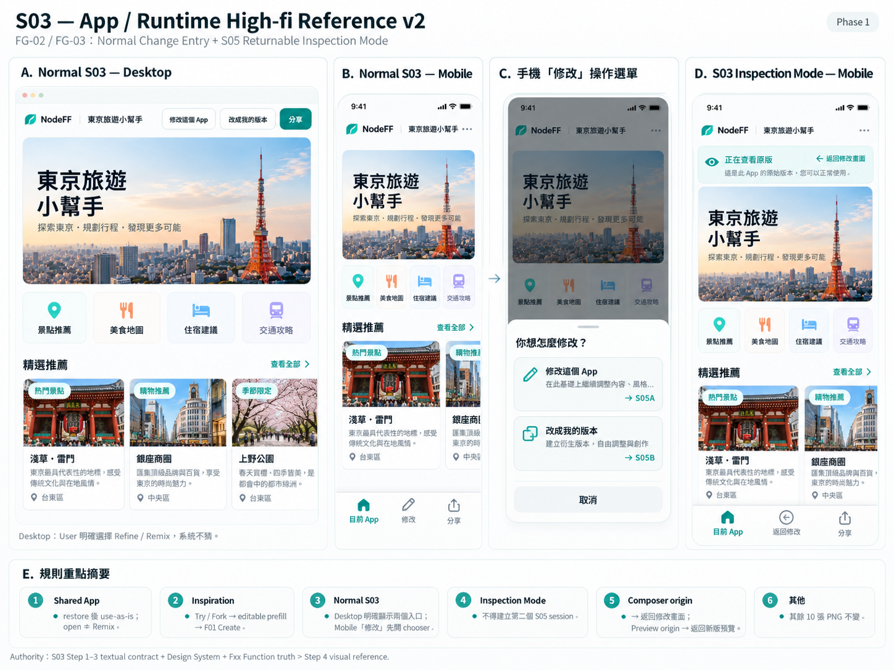

# S03 — App / Runtime

> Governance：本檔為 UI/UX Working Current Truth；Build Freeze / delivery lifecycle 以 `working/common-core/DESIGN-TO-DELIVERY.md` 為準。

> Screen ID：S03
>
> 狀態：**WORKING — ④A LOW_FI_APPROVED / FUNCTION_DELTA_CLOSED / CROSS_SCREEN_REVIEW_APPROVED / ④B HIGH_FI_STEP1–4 APPROVED — WORKING BASELINE**
>
> Phase：Phase 1
>
> Screen-level canonical owner：`working/detailed-design/UI-UX/screens/S03-APP-RUNTIME.md`
>
> Function behavior sources：F00 Experience Shell + F03 Runtime Execution。
>
> 本文件的 ④A Low-fi direction與 Runtime Loading / Timeout Function Delta已完成 User Review；implementation input 仍需 Human-approved Build Freeze。

# 1. User Outcome

S03 的核心任務：

> **User 一進來就能直接使用剛生成的 App；appf2 本身退到背景，只在需要 Share、Remix、Correct、Revert 或 Recovery 時出現。**

S03 不是 Dashboard，也不是 Builder / Editor。

# 2. Canonical Structure

F00 已定義 APP surface 由兩層組成：

    appf2 Shell Chrome
    + Generated App Runtime Frame

Low-fi 原則：

1. **Generated App 是畫面主角**。
2. Shell Chrome 只保留必要產品操作。
3. Shell control 與 App 自己的 controls 必須容易區分。
4. 正常 Runtime interaction 不因 Shell 產生不必要 server calls。
5. 不在 Runtime 畫面顯示 Blueprint / Capability / JSON / technical status。

# 3. Entry / Exit

主要入口：

    S02 APP_READY
    → S03

另一入口：

    S04 Shared App Entry / Restore
    → S03

主要出口 / secondary flow：

    S03 → O01 Share
    S03 → S05 Refine / Remix
    S03 → O02 Correction Composer → S06
    S03 → O03 Recovery
    S03 → O04 Revert Confirmation
    S03 → S01 explicit New / Home

# 4. Proposed Desktop Low-fi

    ┌───────────────────────────────────────────────────────────┐
    │ appf2   App Title                         [Share] [•••] │
    ├───────────────────────────────────────────────────────────┤
    │                                                           │
    │                                                           │
    │               GENERATED APP RUNTIME                       │
    │                                                           │
    │      controls / visualization / interactions              │
    │      rendered by F03 from validated Blueprint             │
    │                                                           │
    │                                                           │
    ├───────────────────────────────────────────────────────────┤
    │ Result area — only when canonical result exists           │
    │ Result / summary                                          │
    │ [調整結果]                          [Remix / 修改 App]     │
    └───────────────────────────────────────────────────────────┘

Top shell 原則：
- Generated App 仍是主體，但 Shell Chrome 內的重要功能必須明顯、可快速操作。
- App identity 可用 App Title、App Logo，或 Logo + Title，依 App metadata / available space決定。
- Share 屬高優先功能，預設 visible。
- Remix / Correct / Revert 等功能依重要性與當前 context決定是否 visible。
- 空間不足時，低優先功能才收進 More / overflow（•••）。

原則不是「全部塞 Header」，也不是「全部藏起來」，而是：
> 重要功能先顯示；顯示不了才收進 overflow。

# 5. Proposed Mobile Low-fi

    ┌────────────────────────────┐
    │ ‹  App Title    Share  ••• │
    ├────────────────────────────┤
    │                            │
    │     GENERATED APP          │
    │     RUNTIME FRAME          │
    │                            │
    │     app controls           │
    │     app result/content     │
    │                            │
    ├────────────────────────────┤
    │ Result（有結果時才出現）    │
    │ [調整結果]   [Remix]       │
    └────────────────────────────┘

Mobile 原則：
- App 本體仍優先佔最大可用空間。
- **採 appf2 permanent bottom navigation**，承接最重要的 Shell actions。
- Bottom navigation 必須精簡，只放高頻／高價值操作。
- Result actions 仍只在需要時出現。
- 若 Generated App 本身需要 bottom controls，必須在 layout 上避免與 appf2 bottom navigation互相遮擋或搶操作區。

# 6. Runtime App Area

Generated App area 完全由 F03 render tree呈現。

S03 Shell：
- 不直接 mutation App state。
- 不把 Generated App 的 button / input 包成 appf2 control。
- 不替 Runtime 猜 result。
- 不攔截正常 local interaction。

User 應感覺：

> 「我現在正在用這個 App。」

而不是：

> 「我還在 appf2 的生成工具裡。」

# 7. Shell Chrome — Proposed Priority

## Always Accessible

- App identity：Title / Logo / Logo + Title。
- Share。
- 其他高優先功能依當前 screen width / device context保持 visible。
- Mobile 由 bottom navigation承接核心 appf2 actions。
- **S03 是 Runtime scope 的 permanent appf2 bottom navigation host；S01 Discover另有 Discover-scope permanent bottom navigation。兩者 scope不同，S05 / S06不繼承。**
- 進入 S05 Refine / Remix 或 S06 Correction Compare 時，不把 S03 bottom navigation 帶入 focused workspace。
- O01 / O02 / blocking O03 / O04 active 時，underlying S03 Shell controls與 bottom navigation 必須 inert；Overlay close後再恢復。

## Contextual

- Correct / 調整結果：只有 canonical result exists 時。
- Previous Version / Revert：只有 current session correction eligible 時。
- Recovery notice：只有 failure / degraded state 時。

Low-fi 建議：
- Share 作 visible action。
- 重要功能能顯示就顯示；只有空間不足或低頻 action才收進 overflow。
- Correct 與 Result 放在一起，避免與 Remix 混淆。
- Remix 明確代表「修改 App 本身」。
- Revert 為 contextual action，只在 eligible 時出現；位置可依空間與重要性決定。

# 8. Result Surface

若 F03 canonical `result.outputs` 有 AVAILABLE output：

S03 可顯示 result area。

    ┌──────────────────────────────┐
    │ 結果                         │
    │ 目前推薦：A 餐廳             │
    │                              │
    │ [調整結果]        [分享]      │
    └──────────────────────────────┘

Rules：
- Result 不從 DOM 猜。
- ERROR output 不顯示 fake value。
- 沒有 result contract 的 App，不硬塞 Result 卡。
- Generated App 如果自己已自然呈現 result，Shell result summary可以省略，避免重複。

# 9. Share Entry — O01

Share 不離開 S03 主 context。

    Share
    → O01 Share Overlay

Share pending / success / failure 都保留 App。

O01 詳細 presentation 見 `working/detailed-design/UI-UX/overlays/O01-SHARE.md`。

# 10. Remix / Refine Entry — S05A / S05B

User 想改的是「這個 App 本身」時，必須在進 S05前明確選擇 intent：

~~~text
S03
├─ 修改這個 App → S05A / REFINE
└─ 改成我的版本 → S05B / REMIX
~~~

- `修改這個 App` = 延續目前 App。
- `改成我的版本` = 以目前 App為 base建立 derivative。
- Shared App restore後預設先直接使用原 App；不因來源是 Shared就自動 Remix。
- Inspiration Capsule仍屬 S01 → editable prefill → F01 Create，不使用 Shared App use-as-is semantics。
- 原 App 必須可返回。
- Runtime input mutation不等於 Refine。

若 S03由 S05 `查看原版`進入，則進入 **Inspection Mode**，不得在此建立第二個 S05 session。

# 11. Correct Result Entry — O02 → S06

只有 result存在時，才顯示：

    調整結果
    邏輯不對
    結果不是我想要的

Flow：

    S03
    → O02 Correction Composer
    → correcting
    → S06 Compare

Correct不是一般 App editing，所以不和 Remix 混成同一個 CTA。

# 12. Previous Version / Revert — O04

只有 active Blueprint 是同 session accepted correction，且 base仍可執行時才出現。

建議位置：
- Desktop：overflow / secondary menu。
- Mobile：overflow。

不常駐 primary action，避免一般使用流程增加噪音。

# 13. Recovery / Partial Failure

F03 node-level failure：

    failed subtree
    → safe fallback
    → rest of App stays usable

S03 不應整頁 white screen。

Recoverable：
- 保留 App。
- O03 / inline notice 說明問題。
- next actions 1–3 個。

Fatal：
- 不 render half-trusted App。
- 進 Blocking Recovery。

# 14. Empty / Loading / Transition

S03 本身不承接長時間 BUILDING；那屬 S02/O05。

S03 可有：
- very short app mounting transition。
- capability-local loading。
- result pending state（若 Blueprint contract本身定義）。

但不能重新顯示「正在理解你的需求」。

## O05 Runtime Loading Function Contract

User 已在 O05 Low-fi 明確要求：

> **S03 normal local Runtime interaction 也要顯示 global loading。**

Working F00/F03/F12已閉合並完成 STEP2 reconciliation；Build Freeze直接讀整合後 canonical Working truth。

Low-fi presentation contract：
- 每次被 F03 accepted / admitted 的 Runtime interaction都建立 operation token並進入 logical global processing state；不是等到 commit後才開始。
- 若有可驗證 checkpoints，使用 Stage + checkpoint-derived Progress %。
- 不用時間預估製造假百分比。
- 只有 commit成立後才可顯示100%。
- 不為了動畫故意延遲操作完成。
- 極快、同一 render frame內完成的 interaction可能看不到完整 loading frame，這不算 violation。
- Soft Timeout停在最後真實 checkpoint；Hard Timeout由 F03 discard未提交 transaction並交 F12回 safe S03或 terminal safe-state。

# 15. Desktop / Mobile Responsive Rules

Desktop：
- Runtime frame優先寬度與可用空間。
- Shell actions 不做大型 sidebar。
- Result area可以在 Runtime下方或 contextually adjacent，但不得擠壓 App 核心操作。

Mobile：
- compact top chrome + permanent bottom navigation。
- Generated App 仍優先取得最大內容空間。
- bottom navigation只放高頻／高價值 Shell actions。
- overflow收納低頻 actions。
- 若 Generated App 自己有 bottom controls，必須預留安全區與避免重疊。
- shell overlay不能破壞 App current state。

# 16. Accessibility Baseline

- Shell control與 Generated App controls都有可辨識 accessible name。
- focus進入 S03後，優先落在 App主要內容 / heading。
- Overlay close後 focus回到觸發入口。
- node failure fallback可被 assistive technology感知。
- Result change / correction success使用非破壞性 live announcement when appropriate。
- Mobile touch targets維持可操作尺寸。

# 17. Confirmed S03 Low-fi Decisions

User 已確認：

1. **Generated App 佔畫面絕對主體**；appf2 Shell Chrome保持極簡，但 Share等重要功能必須明顯。
2. App identity 可以是 **App Title、Logo，或 Logo + Title**。Header / Shell 的重要功能能顯示就顯示；空間不足時才收進 `•••`。
3. **Correct 與 Remix 不混在一起**：
   - Correct = 調整結果 / 邏輯。
   - Remix = 修改 App 本身。
4. **Mobile 採 permanent bottom navigation**，但仍要把最大可用空間留給 Generated App。
5. Generated App若自己有 bottom controls，appf2 bottom navigation必須避免遮擋與操作衝突。

# 18. ④B High-fi Contract — Approved

> Approved by User：2026-09-22
>
> 狀態：**Step 1–4 CLOSED / WORKING BASELINE**
>
> Canonical rule：本節是 S03 唯一有效的 High-fi Current Truth。舊的 Structure Contract / Detailed Visual Rules / Approval Summary / Canonical Summary已合併至此。
>
> Implementation precedence：
> 1. 本節 Step 1–4；
> 2. `working/detailed-design/UI-UX/DESIGN-SYSTEM.md`；
> 3. approved visual reference；
> 4. 其他示意圖。
>
> Product / Runtime semantics仍由 F00 / F03 / F05 / F06 / F12 / F16擁有；S03只能呈現，不得成為第二份 Function truth。

## Step 1 — Structure Lock ✅

> **Step 1 Reopen Record — 2026-09-24 / FG-02 + FG-03**
>
> User final decision：
> 1. Normal S03必須明確承接 S05A `修改這個 App`與 S05B `改成我的版本`；不得由 UI猜 intent。
> 2. Shared App restore後先 use as-is；Inspiration Capsule仍走 Try / Fork → editable prefill → Create。
> 3. S05 `查看原版`進 S03時使用 **Inspection Mode**；保留同一 S05 session，提供 `返回修改畫面`或`返回新版預覽`，不得建立第二個 S05。
>
> Step 1依此更新後：**RE-CLOSED / APPROVED**。
>
> **Step 1 Reopen Record — 2026-09-22**
>
> User reopened Step 1 only for Mobile permanent navigation consumer wording.
>
> Change：`App | 修改 | 分享` → `目前 App | 修改 | 分享`。
>
> Semantics unchanged：`目前 App`仍指 current S03 Runtime destination；不是 S01。
>
> Related Working UI references synced in the same commit。Step 1：**RE-CLOSED / APPROVED**。

### Desktop Shell

Header：

~~~text
appf2 Logo + App Identity        修改這個 App | 改成我的版本 | 分享 | •••
~~~

Rules：
- appf2 Logo = explicit Home / New App escape hatch → S01。
- App identity可為 Logo / Title / Logo + Title。
- 不搬入 S01完整 navigation。
- `修改這個 App` visible → S05A。
- `改成我的版本` visible但視覺權重低於 Share / primary App content → S05B。
- `分享` visible。
- Revert等低頻 contextual action進 `•••`。
- `•••`可包含安全的 Home/New備援入口。

### Generated App Runtime Frame

- Generated App = 畫面絕對主角。
- Shell不直接 mutation App state。
- Shell不把 Generated App controls包成 appf2 controls。
- Shell不從 DOM猜 result。
- Shell不攔截正常 local interaction。
- Runtime可保有自己的 App presentation / visual personality。

### Result Surface

- 只有 canonical `result.outputs`存在 AVAILABLE output且需要 appf2-level result action時才出現。
- Generated App若已自然呈現 result，不重複抄寫 value。
- Result區只保留必要 `調整結果`。
- `修改這個 App`與`改成我的版本`固定由 Shell change-entry區承接，不放進 Result。
- 「改 App / 衍生版本」與「改結果」在 visual placement與 Function semantics天然分流。

### Mobile Shell

Header：
- appf2 Logo / App Identity / `•••`。
- Share / Modify不塞 Header。

Permanent bottom navigation：

~~~text
目前 App | 修改 | 分享
~~~

- `目前 App = current S03 Runtime destination, not S01.`
- `目前 App`只代表目前正在使用的 S03 App / Runtime destination，不自行加入 reset / scroll-top行為，也不是 S01 首頁、App 清單或「建立 App」。
- 2026-09-22：S03 Step 1 依 User 指示 **reopen**，將原 consumer label `App` 改為更明確的 `目前 App`；相關 Working UI引用同步更新後，Step 1重新 CLOSED。
- `目前 App` 是 consumer-facing navigation label；internal destination仍是 S03 App / Runtime。
- `修改`是 **change launcher**，本身不建立 S05 session；tap後開 lightweight action sheet，User必須再明確選：
  - `修改這個 App` → S05A；
  - `改成我的版本` → S05B。
- action sheet consumer title：`你想怎麼改？`；不得把兩條 path合併成模糊的單一「開始修改」。
- `分享` → O01。
- `調整結果`不進 permanent nav。
- `•••`可提供 `回到首頁 / 建立新的 App`文字備援。

### UI ↔ Function Handoff — Mandatory

1. Generated App interaction → **F03**
   - click / input / toggle / local calculate由 F03處理。
   - S03只訂閱 operation lifecycle / checkpoint projection。
   - 同一 Instance遵循 F03 single-writer / FIFO / atomic commit。
   - UI state不得決定 commit。

2. Share → **F05 → O01**
   - 不離開 S03 context。
   - current Runtime Instance保留。
   - Share只分享 Blueprint durable reference，不包含目前 inputs / result。
   - Share failure不得破壞 current App。

3. Change App → **F06 → S05A / S05B**
   - `修改這個 App` → REFINE → S05A。
   - `改成我的版本` → REMIX → S05B。
   - 不用 ownership / shared status猜 intent；User明確選擇。
   - 不原地 mutation immutable Blueprint。
   - 產生 new immutable Blueprint + lineage + fresh Runtime Instance。
   - original App可返回。
   - Runtime input change不等於 Refine。

4. Adjust Result → **F16 → O02 → S06**
   - 只有 canonical AVAILABLE result時可顯示。
   - UI不得從 DOM /畫面文字猜 result。
   - Correction ≠ Modify App。

5. Revert → **F16 / F00 → O04**
   - 只有 same-session accepted correction child + trusted/compatible base時可提供。
   - 預設在 overflow。
   - UI不得自行推定 revert eligibility。

6. Home/New → **F00 → S01**
   - appf2 Logo是 global escape hatch。
   - 不依賴 Browser Back。

### Inspection Mode — Returnable Source App Inspection

Trigger：

~~~text
S05A / S05B
→ 查看原版
→ S03 Inspection Mode
~~~

Inspection Mode不是新的正常 S03 session。

Context truth：
- 保留原 S05 session id、path identity（S05A / S05B）、change draft，以及 origin = Composer | Preview。
- source App可正常操作 / 查看；不得 mutation source Blueprint。
- **不得建立第二個 S05 session。**

Desktop presentation：
- Header保留 App Identity、Share與必要 overflow。
- 正常 `修改這個 App` / `改成我的版本` entry在 Inspection Mode隱藏。
- Header下方顯示 slim contextual bar：`正在查看原版`。
- Composer來源 CTA = **`返回修改畫面`**。
- Preview來源 CTA = **`返回新版預覽`**。

Mobile presentation：
- Header仍以 App Identity為主。
- 保留三槽 Runtime bottom navigation geometry，但中間 change slot改成 origin-specific return：
  - Composer來源：`返回修改`；
  - Preview來源：`返回預覽`。
- 同時在 Runtime上方顯示 `正在查看原版` context strip與完整文字 return action，避免只靠 nav縮寫理解。
- Inspection Mode中不開 change chooser；中間 slot與 context CTA都回**同一既有 S05 session**。
- Share仍可用；`目前 App`仍只代表目前正在查看的 source Runtime。

Exit：
~~~text
Composer origin → 返回修改畫面 → same S05 Composer session
Preview origin  → 返回新版預覽 → same S05 Preview session
~~~

### Explicitly Not Present

S03不做：
- Dashboard sidebar；
- builder / editor chrome；
- Blueprint / JSON / capability / technical status；
- S01完整 navigation；
- duplicated Modify entry in Result；
- permanent Adjust Result nav item；
- full-screen processing spinner for normal interaction。

## Step 2 — Geometry + Visual Hierarchy Lock ✅

### Desktop

- Header：約 `64–72px`。
- Runtime max-width：約 `1200–1280px`。
- viewport左右 breathing room：約 `24–40px`。
- initial usable Runtime area至少約 `70vh`，但不是 fixed height。
- content更長時自然 scroll。
- Result Surface與 Runtime同寬、在 normal document flow。
- 不做右側 sidebar。

Attention hierarchy：

~~~text
Generated App
> App Title / Identity
> Primary appf2 actions
> Result-specific correction
> appf2 brand chrome
> Overflow
~~~

Generated App取得約 80–90% attention。

### Mobile

- Header：約 `56–64px`。
- Runtime horizontal padding：約 `16px`，Capability可依 contract edge-to-edge。
- bottom nav：約 `64–72px + safe area`。
- Generated App若有自己的 bottom controls，需額外預留 spacing，不能互相遮擋。
- Result Surface位於內容流，不 floating在 bottom nav上。
- fixed bottom nav不得遮 Runtime內容。

### Change Entry / Inspection Geometry

Normal Desktop：
- Header change-entry cluster依序：`修改這個 App` → `改成我的版本` → `分享` → `•••`。
- 三個文字 action維持 compact，不建立 builder toolbar；Generated App仍是第一視覺。
- viewport不足時可讓 `改成我的版本`轉入 compact secondary menu，但 menu item wording必須完整，且不得與 S05A混成同一 action。

Normal Mobile：
- Bottom nav仍固定三槽：`目前 App | 修改 | 分享`。
- `修改` action sheet從 bottom edge開啟，內容高度只承接兩個選項與簡短說明，不做 full-screen route。

Inspection Desktop：
- Context bar位於 Header下、Runtime上，與 Runtime同一 content width；約 `44–52px`高。
- 左側：`正在查看原版`；右側：origin-specific return CTA。
- 不新增 sidebar，不縮小 Runtime主內容。

Inspection Mobile：
- Context strip位於 Header下、Runtime上；可兩行，但不得蓋住 App。
- Bottom nav維持三槽 geometry；中間 slot暫時改為 `返回修改`或`返回預覽`。
- full return wording仍在 context strip，以免 nav label過短造成語意不清。

### App Identity

- App Title：約 `18–20px semibold`。
- 過長單行 ellipsis，不撐高 Header。
- appf2 brand visual weight低於 App identity / Runtime。

## Step 3 — Detailed High-fi Visual Rules Lock ✅

### Core Visual Principle

> **appf2 owns the shell; creators own the App presentation.**

- Shell存在但退到背景。
- Generated App可有自己的 UI style；appf2不強制重畫成同一套 App內 controls。
- S03不能看起來像 SaaS admin / builder / editor。

### Shell / Header

- white / very-soft neutral。
- subtle 1px divider。
- 不做 glassmorphism、重陰影、大面積 gradient。
- Share = compact Teal primary shell action。
- `修改這個 App` = secondary / outline。
- `改成我的版本` = lower-emphasis secondary / ghost；必須可辨識，不藏成只有 icon。
- Mobile `修改` action sheet兩個 option同層級呈現，不用顏色暗示 ownership。
- overflow = icon control，target ≥44px。
- Shell action視覺權重不得高於 App內 primary CTA。
- appf2 Logo hover / accessible label可表達「回到首頁」。

### Runtime Canvas

- 不強制再包巨大 card-in-card。
- Runtime canvas可由 Generated App自己決定內部卡片 / imagery / layout。
- appf2不插 sidebar / inspector / debug badges。

### Result / Correction

- Result availability由 F03 truth驅動。
- `調整結果`使用 secondary / outlined treatment，靠近 result context。
- 不讓 Adjust Result比 App本身的 result更搶眼。
- Result ERROR不得顯示 fake value。

### Runtime Processing / Global Loading

每個 F03 accepted / admitted interaction都有 logical processing state。

Visible presentation：
- 極快、同一 render frame完成 → 不強迫 paint loading。
- 看得到的 processing使用 **Runtime Frame內的 in-place compact processing layer**；Generated App與last-known-good state保持可辨識。
- Desktop compact layer約 `320–480px`，位於 Runtime Frame上方 / 上中區；Mobile沿 content edge，左右約 `16–20px`。
- reliable checkpoints → Stage + checkpoint-derived % + progress rail。
- no reliable checkpoints → Stage + bounded activity indicator；不顯示空 rail。
- 不 fake smooth %。
- 不用 elapsed time灌進度。
- 不為動畫拖慢 operation。
- normal processing不 blanket-disable整個 App；只依 Function truth限制 affected interaction。
- Soft Timeout提升 processing presence並保留 last true checkpoint。
- Hard Timeout → F03 discard uncommitted transaction → F12 / O03 Recovery。

### Inspection Context Visual

- Inspection不是 Warning / Error，不使用 Yellow warning、Danger或Recovery styling。
- Context bar使用 soft neutral surface + subtle Teal context indicator。
- `正在查看原版`以 body/label hierarchy呈現，不搶過 Runtime。
- return CTA使用清楚 contextual action treatment；不得長得像 destructive Back。
- normal Modify / Remix entry在 Inspection Mode不顯示；不得用 disabled controls留下「可開新修改」的錯誤暗示。
- focus進入 Inspection Mode時維持 Runtime可操作；context return action必須 keyboard / screen-reader可達。

### Mobile Bottom Navigation

- active `目前 App` = Teal icon + text / indicator。
- `修改` / `分享` = neutral default。
- 不做中央大 FAB。
- 不用大面積 Yellow。
- touch target ≥44 CSS px。
- active state不能只靠顏色。

### Overlay Visual Family

O01：
- Desktop約 `480–560px` centered lightweight dialog。
- Mobile bottom sheet。
- App context仍可辨識。

O01 / O02 / blocking O03 / O04：
- underlying Shell + bottom nav inert。
- close後 focus回 trigger / safe surface。

O03 inline / node-level：
- 留在 affected subtree。
- 不把整頁變 error page。

### Color Management

S03方向：
- Neutral / White：70%+。
- Teal：約20%，用於 primary action / active / focus / processing。
- Yellow：≤10%，實際可更少；一般 screen可作 small energy / new marker；**O05 progress僅在 actual 100% / ready / committed後作 completion accent**。
- Yellow不是 warning / danger。
- 不靠顏色單獨表達 state。

### Motion

- Hover約 `120ms`。
- general transition約 `180ms`。
- completion / recovery state ≤ `240ms`。
- operation完成不做 confetti / fireworks。
- prefers-reduced-motion移除 pulse / slide等非必要效果。

### Interaction / Component States

Shell controls至少：
- Default
- Hover
- Focus Visible
- Pressed
- Disabled
- Loading where applicable

- Overlay trigger duplicate taps需依 source Function去重 / disable。
- Shell不得因 UI loading state自行改 F03 commit semantics。

### Accessibility

- initial focus優先進 App主要內容 / heading，不先落 bottom nav。
- overlay focus trap / restore。
- touch target ≥44 CSS px。
- node failure fallback可被 assistive technology感知。
- Result change / correction success用非破壞性 live announcement when appropriate。
- status / version / active state不能只靠顏色。

### Cursor Guardrails

Cursor不得：
- 從 DOM猜 canonical result；
- 把 Runtime input mutation當 Refine；
- 把 Correction和 Modify合成同一 CTA；
- 每次 Runtime interaction都畫整頁 spinner；
- 為了 loading動畫延遲 operation；
- blanket-disable整個 Runtime除非 Function truth要求；
- 把 S01 nav搬進 S03；
- 把 Generated App重畫成 appf2 dashboard；
- 把 sample mockup內容當 Function requirement；
- 用 Shared / ownership狀態自動替 User選 Refine或 Remix；
- 在 Mobile點`修改`後直接開 S05而沒有 explicit S05A/S05B choice；
- 在 Inspection Mode建立新的 S05 session或遺失既有 draft / Preview context。

## Step 4 — Final Visual Reference Lock ✅

Reopen reason：

> FG-02 / FG-03新增 normal S03雙 change-entry presentation、Mobile explicit chooser與 S05 returnable Inspection Mode。User 已於 2026-09-24 上傳並批准 replacement PNG；GitHub path / blob SHA / size 已驗證。

Replacement visual requirements：
- Normal Desktop：`修改這個 App` / `改成我的版本` / `分享`。
- Normal Mobile：`目前 App | 修改 | 分享` + `修改` action sheet兩個明確 option。
- Inspection Desktop：`正在查看原版` context + origin-specific return CTA；不顯示 normal Modify / Remix entry。
- Inspection Mobile：context strip + `返回修改` / `返回預覽` return behavior。
- Generated App仍為主角；reference不得把 S03畫成 builder。

Canonical replacement reference：

Canonical path：

`working/detailed-design/UI-UX/references/S03-App-Runtime-Highfi-v2.png`

Repository PNG blob SHA：

`47d281d5d184b47855a5c406e26c11aa2801a238`

Repository file size：

`1,704,020 bytes`

舊 v1 reference只保留在 Git history / repository作歷史追溯，不再是 S03 canonical visual reference。

Reference boundary：
- 圖片鎖定 layout / visual hierarchy / component language / color use / Desktop-Mobile relationship。
- sample restaurant content / imagery / labels / annotation examples不自動成為 Function requirements。
- Mobile nav wording若圖片仍顯示舊 `App`，視為已被 Step 1 的 `目前 App` textual contract supersede；不構成重新批准舊 wording。
- Step 1–3文字 contract + Design System + Fxx Function truth優先於圖片生成誤差。

# 19. Review Status / Change Control

> **④A LOW_FI_APPROVED / FUNCTION_DELTA_CLOSED / CROSS_SCREEN_REVIEW_APPROVED / ④B STEP1–4 RE-CLOSED — WORKING BASELINE**

- S03 Step 1–3已依 2026-09-24 FG-02 / FG-03 decision重新 CLOSED。
- Step 4 replacement PNG已由 User上傳並完成 path / blob SHA / size驗證；Step 4 **RE-CLOSED / APPROVED / LOCKED**。
- 任何 Structure / Geometry / Visual Rule / image reference改動，必須 reopen對應 Step。
- 若後續需要 component anatomy / overlay stacking / operation-state mapping等額外細節，可新增 `Step 4.5 — <Layer Name> Lock`。
- Step 4.5不得偷改 Step 1–4；涉及 Function behavior必須回相關 Fxx Working Delta Review。
- STEP2 content reconciliation已完成；仍待 Final Audit + Human-approved Build Freeze。

### Final Cross-Screen High-fi Review — CLOSED / VERIFIED

> Verified：2026-09-24
>
> FG-01–FG-07產品／一致性修正與 S03 v2 replacement reference均已完成；2026-09-24 final full-set re-audit結果：**0 個新的 material finding，CLOSED / VERIFIED。**
>
> Final cross-screen authority：**Step 1–3 textual contract + Design System + Fxx Function truth > Step 4 visual reference。**
>
> S03 v2 PNG已驗證；其餘 10 張 PNG不修改。
