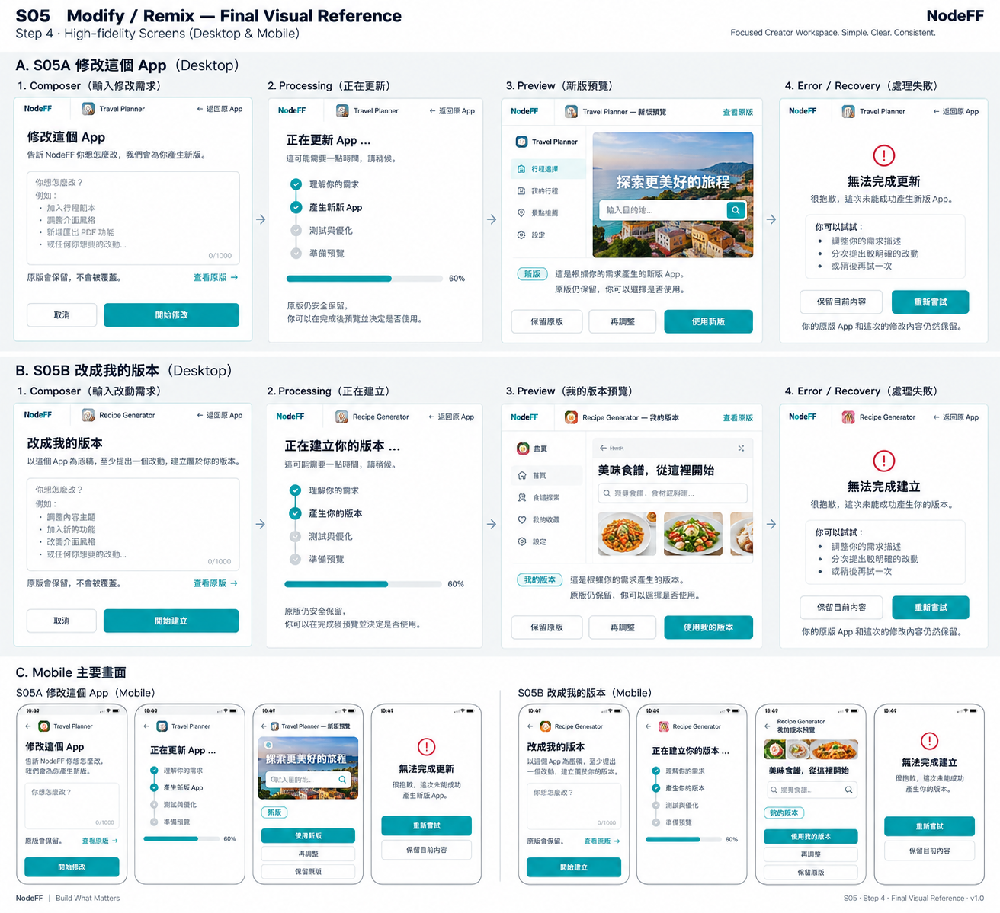

# S05 — Refine / Remix Workspace

> Governance：本檔為 UI/UX Working Current Truth；Build Freeze / delivery lifecycle 以 `working/common-core/DESIGN-TO-DELIVERY.md` 為準。

> Screen ID：S05
>
> 狀態：**WORKING — ④A LOW_FI_APPROVED / ④B HIGH_FI_STEP1–4 APPROVED — WORKING BASELINE**
>
> Phase：Phase 1
>
> Screen-level canonical owner：`working/detailed-design/UI-UX/screens/S05-REFINE-REMIX.md`
>
> Function behavior sources：F06 Remix / Refine + F00 Experience Shell + F01 Intent Compilation + F03 Runtime。
>
> 本文件的④A Low-fi與④B High-fi Step 1–4已完成 User Review；implementation input 仍需 Human-approved Build Freeze。

# 1. User Outcome

S05 的核心任務：

> **User 不用從頭重做，就能以目前 App 為基礎描述想改什麼；原版始終安全，新版先 Preview，再由 User 決定採用、保留舊版或繼續調整。**

# 2. Refine vs Remix — Current Consumer Paths

> **Current Truth：S05A「修改這個 App」與 S05B「改成我的版本」是兩條明確 consumer path；技術元件可共用，但 UI 不得用模糊 Refine / Remix 合併入口替 User 猜 intent。**

Difference 用 **relation label + version visual marker** 說清楚：

- **Refine**（internal relation）→ Consumer UI：**修改這個 App**；延續目前 App，做下一版。
- **Remix**（internal relation）→ Consumer UI：**改成我的版本**；以目前 App 為底稿，做衍生版本。
- 原版 / 新版在 Low-fi 先保留不同的 border / accent token 作為版本識別；**實際顏色值屬 ④B High-fi Design System，不在 Low-fi 鎖定。**

原因：
- 兩者底層流程幾乎一致。
- 不需要讓 User 學兩套介面。
- lineage semantics由 F06決定，不靠不同畫面結構。

# 3. Entry

主要入口：

    S03 Current App
    → Refine / Remix
    → S05

S04 Shared App restore完成後，也是先進 S03，再由 S03進 Remix。

進入 S05 必須保留：
- source App reference。
- source App title / logo。
- relation type：Refine / Remix。
- 原 App仍可返回。

# 4. Core Flow

    Source App
    ↓
    Describe Change
    ↓
    ANALYZING
    ├─ CLARIFICATION_REQUIRED
    ├─ ASSUMPTION_REVIEW
    └─ READY
    ↓
    COMPOSING / VALIDATING
    ↓
    PREVIEW_READY
    ↓
    ├─ Use New Version
    ├─ Keep Previous
    └─ Adjust Again

任何 failure：
    source App remains safe

# 5. Proposed Desktop Low-fi — Change Composer

    ┌──────────────────────────────────────────────────────────┐
    │ appf2    [App Logo] App Title              [回原 App] │
    ├──────────────────────────────────────────────────────────┤
    │ Refine / Remix                                           │
    │                                                          │
    │ 你想怎麼改這個 App？                                     │
    │ ┌──────────────────────────────────────────────────────┐ │
    │ │ 例如：加一個截止時間，結果改成排名顯示…             │ │
    │ └──────────────────────────────────────────────────────┘ │
    │                                                          │
    │ Source App summary（輕量，可展開）                       │
    │ • 目前 App：餐廳投票                                    │
    │ • 原版會保留                                            │
    │                                                          │
    │ [取消]                                [開始修改]          │
    └──────────────────────────────────────────────────────────┘

原版內容不整頁重複 render在左邊，避免畫面太重。

建議只放：
- App identity。
- 簡短 source summary。
- **「查看原版」button**：User 可回原 App / 原結果確認，再返回 S05，修改草稿不得遺失。

# 6. Proposed Mobile Low-fi — Change Composer

    ┌────────────────────────────┐
    │ ‹ 原 App       App Title  │
    │                            │
    │ Refine / Remix             │
    │                            │
    │ 你想怎麼改這個 App？      │
    │ ┌────────────────────────┐ │
    │ │ change request         │ │
    │ └────────────────────────┘ │
    │                            │
    │ 原版會保留                │
    │                            │
    │ [      開始修改      ]    │
    └────────────────────────────┘

Mobile 不做 split-pane；保留明顯的「查看原版」入口，返回 S05 時保留 change draft。

Cross-screen navigation rule：
- S05 是 focused modification workspace，不繼承 S03 permanent bottom navigation。
- 返回 / 查看原版 / decision CTA由 S05自身承接，避免修改中誤觸 S03 Shell actions。

# 7. Change Composer Rules

Minimum UI：
- source App title / logo。
- relation label。
- natural-language change input。
- Cancel。
- Continue / 開始修改。

Optional：
- current assumptions / relevant inputs，只在真的跟 change有關時顯示。
- 不預設 carry Runtime inputs。

User不用看：
- source hash
- lineage
- semantic delta
- JSON
- model/provider

# 8. Clarification / Assumption

S05 沿用 S02 同樣原則：

> **只有真的需要 User decision 才打斷。**

Clarification：
- 1–3 material questions。
- 直接嵌在同一 Workspace。
- 原 change request保留。

Assumption Review：
- 只顯示 material assumptions。
- Accept / Edit / Reject。
- 不顯示 raw provenance enum。

# 9. Change Progress

S05 建議沿用 appf2 creation progress語言，但改成 change context。

Low-fi proposed stages：

1. 理解修改
2. 更新 App
3. 檢查互動
4. 準備新版

Rules：
- 共用 O05：有可靠 checkpoints時顯示 **Stage label + checkpoint-derived Progress %**。
- 沒有 reliable checkpoints時顯示 Stage + bounded activity indicator，不 fake % / empty rail。
- % 代表 work completion，不代表剩餘時間。
- 不為了讓 progress看得到而延遲真正完成。
- 不顯示 Prompt / Validation engineering terminology。
- source App始終保持安全。

# 10. Preview Ready — Core S05 State

F06 已明確要求：

    source App remains safe
    + child fresh Runtime Instance
    → PREVIEW_READY

Low-fi 建議 Preview 狀態直接成為 S05 後半段主要畫面。

Desktop：

    ┌──────────────────────────────────────────────────────────┐
    │ App Title — 新版預覽                        [返回原版]   │
    ├──────────────────────────────────────────────────────────┤
    │                                                          │
    │                  NEW APP PREVIEW                         │
    │                  fresh Runtime                          │
    │                                                          │
    ├──────────────────────────────────────────────────────────┤
    │ 這是新版，原版仍保留                                    │
    │ [查看原版]                                               │
    │                                                          │
    │ [保留原版]      [再調整]             [使用新版]          │
    └──────────────────────────────────────────────────────────┘

Mobile：

    ┌────────────────────────────┐
    │ 新版預覽          原版     │
    ├────────────────────────────┤
    │                            │
    │      NEW APP PREVIEW       │
    │                            │
    ├────────────────────────────┤
    │ 原版仍保留                │
    │ [查看原版]                │
    │ [保留原版]                │
    │ [再調整] [使用新版]        │
    └────────────────────────────┘

# 11. Preview Comparison Philosophy

S05 不是 S06 Correction Compare。

所以預設不做：
- old/new result逐項比較。
- technical diff。
- correction explanation。

S05只需要：
- 明確告訴 User現在看到的是新版。
- 原版安全存在。
- 可以回原版。
- 可以再調整。

若未來 High-fi需要 side-by-side preview，再根據實際 screen size決定，不在 Low-fi先鎖。

# 11.1 View Original

S05 必須讓 User 隨時確認 source App / 原版結果。

Flow：

    S05
    → 查看原版
    → source App / source result
    → 若從 Composer 進入：返回修改畫面
    → 若從 Preview 進入：返回新版預覽
    → 原 S05 current draft / preview context preserved

Rules：
- 「查看原版」不是「保留原版」決策。
- 查看原版不改 active child / source selection。
- 不清空 change draft。
- Preview 已存在時，返回 S05 後仍回到同一 preview context。
- Mobile / Desktop 都必須可達。

# 12. Use New Version

Primary CTA：

    使用新版

結果：
- child Blueprint / Runtime becomes active。
- 回 S03。
- source仍存在。
- lineage保留。

User心智：
> 「好，就用這個版本。」

# 13. Keep Previous

CTA：

    保留原版

結果：
- source remains active。
- 回 S03 source App。
- child artifact不需要刪除。

Consumer不需要知道 immutable hash / lineage。

# 14. Adjust Again

CTA：

    再調整

F06 default：
- base = latest preview child。

UI 必須顯示清楚：

    你正在調整：剛剛的新版本

並提供 secondary option：

    從原版重新調整

避免 User搞不清楚 change是疊在哪一版上。

# 15. Runtime Input Carryover

一般 Refine / Remix：

> **不自動帶現在 Runtime輸入到新版。**

Low-fi不需要每次跳警告。

只有在 User可能誤解時，用簡短 copy：

    新版會從自己的初始狀態開始。

不顯示 privacy/security工程說明。

# 16. Failure / Recovery

任何 failure 都必須保證：

    原 App 還在

Examples：

## Analysis / Compose Failure

    這次修改沒有完成，原版沒有受影響。

    [再試一次]
    [修改需求]
    [回原 App]

## Unsupported Change

    這個修改目前還做不到。

    [簡化修改]
    [回原 App]

## Child Hydration Failure

    新版已產生，但目前無法打開預覽。

    [再試一次]
    [保留原版]

詳細 recovery由 O03 / F12承接。

# 17. Back / Cancel

任何 S05 state：
- Cancel / Back預設回 source App。
- 不丟 change draft when recoverable。
- Preview時 Back不能默認採用新版。
- Adjust Again可回 Preview，不破壞 child。

# 18. Accessibility / Responsive

- relation label不能只靠顏色。
- Composer有明確 label。
- Preview CTA順序與 keyboard focus合理。
- Mobile CTA不遮 Generated App preview。
- preview ready透過非破壞性 live announcement。
- 返回原版 / 使用新版 wording明確，避免 ambiguous「Done」。

# 19. Confirmed S05 Low-fi Decisions

User 已確認：

1. **Low-fi 原決定：Refine / Remix 共用同一個 S05 Workspace；此點已由 ④B Step 1 supersede，Current Truth 改為 S05A / S05B 兩條明確 consumer path。**
2. Refine / Remix 必須同時用 **relation label + version visual marker** 區分。
3. 原版 / 新版的 border / accent 需要可辨識；實際顏色留到 ④B High-fi Design System 決定。
4. Change Composer 只顯示 App identity + 修改需求 +「原版會保留」，不把原 App整頁並排。
5. 必須提供 **「查看原版」button**，讓 User 回原 App / 原結果確認後再回 S05，且 change draft / preview context 不遺失。
6. 新版完成直接進 Preview，三個主要決策 CTA：**保留原版 / 再調整 / 使用新版**。
7. 「再調整」預設基於最新 Preview child，並提供「從原版重新調整」secondary option。

# 19.1 ④B Version Color Management — SUPERSEDED

> **Historical note only.**
>
> 本節原本在 ④B review 中暫存 version color direction；自 S05 High-fi Step 3 核准後，**所有仍有效的 Version / Color / Marker 規則已合併進 Step 3 canonical contract**。
>
> Current Truth 不再以本節為實作依據，避免形成第二份 High-fi visual truth。

# 20. ④B High-fi Contract — Step 1 Structure Lock ✅

> Approved by User：2026-09-22
>
> Step 1：**APPROVED / LOCKED**
>
> Scope：只鎖 Screen structure、consumer wording、state composition、CTA / handoff 邊界；Geometry、spacing、visual hierarchy、detailed color / motion 留給 Step 2–3。
>
> Canonical precedence：本節若與前述 ④A Low-fi direction 衝突，**以本節 ④B Step 1 Current Truth 為準**。

## 20.1 S05 分成兩條明確 Consumer Path

S05 不再把 Refine / Remix 當成一個模糊的 user-facing Workspace。

### S05A — 修改這個 App

來源：

~~~text
S03 Current App
→ 修改這個 App
→ S05A
~~~

User 意義：

> 現在這個 App 基本方向沒錯；User 想加功能、改功能、改規則、改 UI 或其他需求。

Consumer wording：

~~~text
修改這個 App
你想怎麼改？
~~~

Internal relation 可仍為 `REFINE`，但一般 User 不需要看到 `REFINE` 這個工程字。

### S05B — 改成我的版本

來源：

~~~text
S03 Current App
→ 改成我的版本
→ S05B
~~~

User 意義：

> User 以目前看到的 App 為底稿，**至少提出一個實際修改需求**，產生自己的衍生版本；不是「零修改複製」。來源 App 不受影響。

Consumer wording：

~~~text
改成我的版本
拿這個 App 當底稿，改成你要的版本
~~~

S05B 必須要求 User 至少描述一個實際改動；若沒有任何有效修改，不建立 identical fork / self-lineage，也不把「零修改複製」包裝成 Remix 成功。

Internal relation 可仍為 `REMIX`，但一般 User 不需要看到 `REMIX` 這個工程字。

### Split Rule

- S05A / S05B 是兩條不同 consumer intent path。
- **不得**以單一 `Refine / Remix` button、title 或混合 wording 取代。
- 底層 technical implementation、layout primitives、progress shell、preview shell可以共用。
- 共用 technical component **不代表** consumer semantics可以合併。

## 20.2 Shared Structural Skeleton

S05A / S05B 可共用以下結構骨架：

~~~text
Entry from S03
↓
App Identity + Current Path Meaning
↓
Composer / Required Decision
↓
Clarification / Assumption only if needed
↓
Processing in same S05 path
↓
New Version Preview
↓
Decision
├─ 保留原版
├─ 再調整
└─ 使用新版
~~~

S05 不建立另一個 Preview route；Preview 是同一條 S05 path 的後半段 state。

## 20.3 Change Composer Structure

Composer 只承載必要內容：

~~~text
App identity
Path title：
  S05A → 修改這個 App
  S05B → 改成我的版本
Natural-language input / required decision
原版會保留
查看原版
Cancel / Continue
~~~

Rules：

- 不把 source App 整頁並排在 Composer。
- 不顯示 source hash / lineage / semantic delta / JSON / model/provider。
- Clarification / Assumption 若真的需要，留在同一條 S05 path，不跳另一頁。
- 原 change request / working context 必須保留。

## 20.4 Processing Structure

Submit 後不另開 processing page：

~~~text
S05A / S05B
→ O05 processing presentation hosted in current S05 path
→ PREVIEW_READY
~~~

- 原 App 始終安全。
- Progress truth由 O05 Current Truth承接。
- S05 Step 1 不自行發明另一套 progress model。

## 20.5 New Version Preview Structure

Preview Ready 後，新版是主要內容：

~~~text
新版預覽
[Fresh Runtime Preview]

原版仍保留
[查看原版]

[保留原版] [再調整] [S05A：使用新版 / S05B：使用我的版本]
~~~

Rules：

- 不預設把原版 / 新版做 S06-style side-by-side compare。
- S05 不是 Correction Compare。
- S05A：`使用新版` → child becomes active → S03。
- S05B：`使用我的版本` → child becomes active → S03。
- `保留原版` → source remains active → S03 source App。
- `再調整` → 留在 S05，預設基於 latest preview child。
- secondary option：`從原版重新調整`。

## 20.6 查看原版 — Temporary S03 Source Runtime

`查看原版` 的作用只是暫時查看 / 操作 source App；**不是另一個修改入口，也不是採用 / 保留決策**。

Flow：

~~~text
S05 current state
→ 查看原版
→ S03 Source App Runtime
→ 明確返回原 S05 state
~~~

返回 wording 必須依來源 state：

~~~text
從 Composer 查看原版
→ 返回修改畫面

從 Preview 查看原版
→ 返回新版預覽
~~~

返回後必須保留：

- S05A / S05B path identity。
- change draft。
- clarification / assumption context（若存在）。
- processing / recoverable context（若適用）。
- current preview context（若已存在）。

查看原版不得：

- 清空 draft。
- 自動採用新版。
- 改變 source / child selection。
- 把 User 丟回新的 S05 session。

### Returnable Inspection Context — Mandatory

User 從 S05 暫時進 S03 查看原版時，S03 必須視為 **returnable inspection context**，不是新的正常 S03 session。

Canonical rule：

~~~text
S05 current session
→ 查看原版
→ S03 source App inspection context
→ 返回修改畫面 / 返回新版預覽
→ 回到原本同一個 S05 session
~~~

在此 inspection context 中：

- 必須明確顯示返回既有 S05 session 的 action：
  - Composer來源 → `返回修改畫面`
  - Preview來源 → `返回新版預覽`
- S03 正常的 Modify / Remix entry **不得建立第二個 S05 session**。
- S03 Inspection Mode 已於 2026-09-24鎖定：正常 `修改這個 App` / `改成我的版本` entry **隱藏**；以 `正在查看原版` context strip + origin-specific return action回同一既有 S05 session。
- 此處只鎖 behavior：不得 duplication session，不得丟失 draft / preview context。

## 20.7 Navigation Boundary

S05A / S05B 都是 focused creation-change workspace：

- 不繼承 S03 permanent bottom navigation。
- Desktop 不帶完整 S03 action cluster。
- Mobile 不顯示 S03 `目前 App | 修改 | 分享` permanent bottom nav。
- S05 自己承接 Back / 查看原版 / Continue / Preview decision。

只有暫時進入 S03 查看原版時，才顯示 S03 Runtime；並且必須有明確的 context return action 回原 S05 state。

## 20.8 Step 1 Locked Decisions

1. S05A `修改這個 App` 與 S05B `改成我的版本` **拆開**；不得再以 user-facing Refine / Remix 合併入口呈現。
2. 兩條 path 可共用 technical component，但 consumer intent、entry、title 與 wording必須分開。
3. S05A / S05B 都使用同一類結構：Composer → only-if-needed clarification → processing → Preview → decision。
4. Composer 不整頁重複 render原 App。
5. `查看原版` 暫時進 S03 Source App Runtime。
6. Composer 回程 wording = **`返回修改畫面`**。
7. Preview 回程 wording = **`返回新版預覽`**。
8. 返回後原 S05 draft / state / preview context全部保留。
9. Preview 三個主要決策仍為：**保留原版 / 再調整 / Primary adopt**；S05A Primary = `使用新版`，S05B Primary = `使用我的版本`。
10. S05 不做 S06-style correction comparison；不把 correction semantics混入 S05。
11. S05 不承擔「建立全新 App」；全新 App creation仍走 S01 → S02 → S03。
12. S05 不繼承 S03 permanent navigation。
13. S05B「改成我的版本」必須包含至少一個有效修改需求；Phase 1 不支援「零修改複製成我的版本」。
14. 從 S05 查看原版時，S03 進入 returnable inspection context；不得由正常 Modify / Remix entry建立第二個 S05 session。

> Step 1：**APPROVED / LOCKED**。下一步：Step 2 — Geometry + Visual Hierarchy Lock。

## Step 2 — Geometry + Visual Hierarchy Lock ✅

> Approved by User：2026-09-22
>
> Step 2：**APPROVED / LOCKED**
>
> Scope：鎖定 Desktop / Mobile 的畫面寬度、主要區塊排列、Preview geometry、CTA order 與 visual hierarchy。Detailed color / shadow / motion / hover 留給 Step 3。

### 1. Shared Geometry Principle

S05A「修改這個 App」與 S05B「改成我的版本」可共用同一套 geometry skeleton；consumer title / supporting copy / relation meaning 必須分開，但不因此建立兩套版型。

S05 是 focused modification workspace，不做 builder-style split pane，也不做 persistent right sidebar。

### 2. Desktop Composer Geometry

- Screen container：約 `960–1080px`。
- 真正 Composer column：約 `640–720px`。
- 水平置中。
- Header：約 `64–72px`。
- viewport左右 breathing room：約 `24–40px`。
- workspace major section gap依 Design System使用 `32–64px`。
- Composer / supporting row / CTA 不拉到 S03 Runtime 的 1200px 等級寬度。

Reason：

> Composer 是「描述修改需求」的 focused task，不是 dashboard / builder / runtime canvas。

### 3. Desktop Composer Visual Hierarchy

Attention hierarchy：

~~~text
Current path title
「修改這個 App」 / 「改成我的版本」
>
Natural-language change input
>
Primary continue action
>
App identity
>
「原版會保留」 / 「查看原版」
>
appf2 chrome
~~~

Rules：

- App identity 用來確認「現在改哪個 App」，不是主視覺。
- appf2 chrome 不可比 task title / input 更搶眼。
- 不顯示左側 inspector、右側 properties、雙欄 old/new editor。

### 4. Change Input Geometry

Desktop change input：

- width：填滿 Composer column。
- visual height：約 `140–200px`。
- 不做 full-screen textarea。
- 不做 chat bubbles。
- 不在旁邊放 conversation history。
- Clarification / Assumption 若出現，在同一 column 依 normal document flow 往下接，不改成另一套 layout。

### 5. Source / Original Supporting Row

`原版會保留` 與 `查看原版` 位於同一 supporting region。

Recommended geometry：

~~~text
原版會保留                         查看原版 →
~~~

Rules：

- `查看原版` 不做 Primary CTA。
- Visual weight 必須低於 `開始修改` / Continue。
- 不把 source App runtime縮成小 preview card塞在 Composer旁邊。

### 6. Processing Geometry

Submit後不切換成另一個 loading page。

原 Composer主區域轉成 processing state：

~~~text
Path title
↓
Human-readable stage
↓
Progress presentation
↓
「原版仍安全保留」
~~~

Rules：

- O05 presentation hosted inside current S05 path。
- 不開 full-screen spinner page。
- 不為 processing 新增 persistent sidebar。
- 真正 READY 後直接進 Preview geometry。

### 7. Desktop Preview Geometry

Preview Ready後，S05從窄 Composer geometry切換成寬 Runtime preview geometry。

- Preview container：約 `1100–1200px`。
- Runtime preview盡可能取得主內容寬度。
- Decision area 位於 Runtime 下方。
- **Desktop 固定採單欄 Runtime + 底部 decisions。**
- **不做右側 decision sidebar。**
- 不預設做 old/new side-by-side comparison。

Canonical desktop composition：

~~~text
┌──────────────────────────────────────────────┐
│ appf2   App Title — 新版預覽    查看原版    │
├──────────────────────────────────────────────┤
│                                              │
│            NEW APP RUNTIME                   │
│            primary content                   │
│                                              │
├──────────────────────────────────────────────┤
│ 新版預覽                                      │
│ 原版仍保留                                    │
│                                              │
│ [保留原版]      [再調整]   [使用新版／使用我的版本] │
└──────────────────────────────────────────────┘
~~~

### 8. Desktop Preview Visual Hierarchy

Attention hierarchy：

~~~text
New Version Runtime
>
新版預覽 identity
>
S05A：使用新版 / S05B：使用我的版本
>
再調整
>
保留原版 / 查看原版
>
appf2 chrome
~~~

Generated App Runtime應取得約 `75–85%` 的視覺注意力。

Rules：

- Runtime本身必須是主角。
- Decision controls清楚但不能壓過 App。
- `查看原版` 是 supporting inspection action，不和 `使用新版` 同級。
- S05不是 S06，因此不把 compare chrome做成主畫面。

### 9. Preview CTA Hierarchy

Desktop：

- S05A `使用新版` / S05B `使用我的版本` = Primary。
- `再調整` = Secondary。
- `保留原版` = Tertiary / secondary-low。
- `從原版重新調整` 不進三大 CTA 同一層；只作 `再調整` 的 secondary option。

此 visual hierarchy只描述 UI emphasis，不改 Function capability。

### 10. Mobile Composer Geometry

- Header：約 `56–64px`。
- horizontal padding：約 `16–20px`。
- 單欄。
- change input near full-width。
- 不顯示 S03 permanent bottom nav。
- Primary action可使用 near full-width / full-width。
- Back由 top navigation承接時，不必再重複一顆底部 Cancel。

Recommended composition：

~~~text
‹ 原 App

App Title

修改這個 App
或
改成我的版本

你想怎麼改？
[ change input ]

原版會保留
查看原版 →

[開始修改]
~~~

### 11. Mobile Preview Geometry

順序固定：

~~~text
新版預覽
↓
Runtime
↓
原版仍保留 / 查看原版
↓
S05A：使用新版 / S05B：使用我的版本
↓
再調整
↓
保留原版
~~~

Rules：

- Runtime優先。
- CTA採直向堆疊，不硬塞三顆橫排。
- **Mobile CTA order鎖定為：S05A `使用新版 → 再調整 → 保留原版`；S05B `使用我的版本 → 再調整 → 保留原版`。**
- CTA不得以 sticky方式遮住 Generated App controls。
- 若 Generated App本身有 bottom controls，S05需保留足夠下方 spacing / safe area。

### 12. Recovery Geometry

S05 failure 必須在目前 host geometry內承接，不建立新的 error route。

#### Composer / Processing Failure

Desktop：

- Recovery直接承接原本約 `640–720px` 的中央 Composer / processing工作區。
- 可使用 host panel內 blocking state，或 O03允許的 centered lightweight blocking panel。
- 不切換成獨立 error page。
- 原 change draft / clarification / assumption context保留。
- 原 App仍可安全返回。

Mobile：

- 依 O03 severity使用 bottom sheet / full-height recovery sheet。
- 不把 User送到另一個 route。
- 保留目前 S05A / S05B path identity與 draft。

#### Preview Hydration Failure

- Recovery取代 **Runtime preview region**，不是把整個 S05變成 error page。
- Preview decision context仍保留可恢復資訊。
- 原版仍安全存在。
- Retry / Keep Previous / Return Original等 action只依 O03 / F12 truth顯示。

#### Preservation Rule

Recovery前後都必須保留：

- source App reference。
- S05A / S05B path identity。
- change draft。
- resolved clarification / assumption context（可安全保留者）。
- preview child reference（若已生成且可安全保留）。
- return target。

Recovery geometry只決定呈現位置，不改寫 O03 / F12的 retry eligibility與 recovery semantics。

### 13. Responsive / Cross-state Consistency

- S05A / S05B 使用相同 geometry system。
- Composer state偏窄、focused。
- Preview state偏寬、Runtime-first。
- Desktop / Mobile capability一致，只改排列，不刪除主要 decision。
- `查看原版` 從 Composer返回時叫 **`返回修改畫面`**。
- `查看原版` 從 Preview返回時叫 **`返回新版預覽`**。
- 返回後原 S05 draft / state / preview context保持不變。

### 14. Step 2 Locked Decisions

1. Desktop Composer container `960–1080px`；Composer column `640–720px`。
2. Desktop Composer不做 split pane / sidebar。
3. Composer input約 `140–200px` high，Clarification在同一 column往下接。
4. `查看原版` 為 supporting action，不與 primary submit同權重。
5. Processing留在同一 S05 path，不切換 loading page。
6. Desktop Preview切換至約 `1100–1200px` wide Runtime-first layout。
7. **Desktop Preview固定：單欄 Runtime + 底部 decisions；不做右 Sidebar。**
8. Desktop Preview visual hierarchy：Runtime > 新版 identity > S05A `使用新版` / S05B `使用我的版本` > 再調整 > 保留原版 / 查看原版。
9. Mobile Composer單欄，padding `16–20px`，不繼承 S03 bottom nav。
10. Mobile Preview Runtime優先，CTA直向堆疊。
11. **Mobile CTA order固定：S05A = 使用新版 → 再調整 → 保留原版；S05B = 使用我的版本 → 再調整 → 保留原版。**
12. S05A / S05B geometry共用，但 consumer meaning與 wording維持分離。
13. Composer / processing failure在原 `640–720px` 中央工作區承接 Recovery，不換頁。
14. Preview hydration failure以 Recovery取代 Runtime preview region，不把整個 S05變 error page。
15. Desktop Recovery可用 centered lightweight blocking panel / host panel state；Mobile依 O03使用 bottom sheet / full-height recovery sheet。
16. Recovery期間原版與可安全保留的 draft / preview context必須保留。

> Step 2：**APPROVED / LOCKED**。下一步：Step 3 — Detailed High-fi Visual Rules Lock。

## Step 3 — Detailed High-fi Visual Rules Lock ✅

> Approved by User：2026-09-22
>
> Step 3：**APPROVED / LOCKED**
>
> Scope：鎖定 S05A / S05B 的 color usage、typography、component visual treatment、version markers、CTA emphasis、processing / recovery presentation、motion 與 accessibility。不得改寫 Step 1 Function / state structure 或 Step 2 geometry。
>
> Canonical precedence：本節為 S05 High-fi visual Current Truth；若與舊 `#19.1 ④B Version Color Management` 衝突，以本節為準。

### 1. Core Visual Principle — Focused Creator Workspace

S05 是 **Focused Creator Workspace**，不是 Builder / Admin / IDE。

Visual direction：

- White / Soft Neutral為主。
- appf2 chrome低干擾。
- 不做 sidebar / inspector / properties rail。
- 不做大面積 gradient。
- 不做 glassmorphism。
- 不做 neon / rainbow「AI感」。
- Normal surface維持低 elevation / mostly flat。

Brand balance direction沿 Design System：

~~~text
Neutral / White   ≈ 70%+
Teal family       ≈ 20%
Yellow energy     ≤ 10%
~~~

比例不是 pixel quota；原則是「乾淨 creator canvas + 少量 playful energy」。

### 2. Header / App Identity / Task Title

Header：

- White / very-soft neutral。
- subtle `1px` divider。
- 不用重 shadow。
- Header visual weight低於 S05 task title / Composer / Preview Runtime。

App Identity：

- App Logo / Title只是 context：告訴 User「目前正在改哪個 App」。
- App Title建議採 `heading-md 20/28 semibold`。
- 過長單行 ellipsis，不撐高 header。
- 不加入 hash / lineage / provider / technical status。

Task Title：

- Desktop：`heading-xl 32/40`。
- Mobile：`heading-lg 24/32`。
- S05A：`修改這個 App`。
- S05B：`改成我的版本`。

第一視覺焦點必須先回答「現在要做什麼」，而不是先看到 appf2品牌或 source metadata。

### 3. Composer Visual Treatment

Change Composer沿 Design System Input / Composer：

- White / Soft surface。
- default neutral border。
- radius = `12px`。
- Natural-language input text：`body-lg 16/26`。
- helper / preservation copy：`body-md 14/22`。
- placeholder對比可讀，但不得與已輸入文字混淆。
- Focus採 Teal visible treatment。
- Error / Invalid必須同時有文字與 programmatic association，不只紅框 / 顏色。
- 不做大型 glowing prompt box。
- 不做聊天泡泡或 conversation-feed visual。

`原版會保留` 使用 supporting copy。
`查看原版` 使用 Ghost action，不與 Primary Continue競爭。

### 4. S05A / S05B Path Identity

S05A / S05B **不靠不同主色區分**。

共同使用相同 appf2 system palette與 geometry。

區分方式固定為：

1. consumer title；
2. supporting copy；
3. relation / version label where relevant。

不得：

- S05A整體做成一種品牌色、S05B整體做成另一種品牌色；
- 只靠 icon或顏色讓 User猜現在是哪條 path；
- 把 internal `REFINE / REMIX` 當主要 consumer heading。

### 5. S05B Consumer Wording

S05B明確表達：

~~~text
改成我的版本
拿這個 App 當底稿，改成你要的版本
~~~

S05B不是「零修改複製」。

Preview Primary CTA正式鎖定：

~~~text
S05A → 使用新版
S05B → 使用我的版本
~~~

S05B的「我的版本」只代表此次 derivative product semantics，不建立 Phase 1 durable account ownership claim。

### 6. Original / Candidate Version Visual Language

舊 `#19.1 Version Color Management` 的有效內容全部收斂至此。

#### Source / Original

- neutral surface。
- neutral border。
- 必須有 consumer文字：`原版` / `來源`。
- 不使用 Teal selected treatment假裝目前候選版本。
- 不靠灰色 alone 表達 semantic relation。

#### Candidate / New

- Teal / Aqua border或accent。
- 必須有 consumer文字：`新版`；S05B可搭配「我的版本」語意。
- 可使用 very small Yellow `NEW / 新版` energy marker。
- Yellow不可鋪滿候選 surface。
- Yellow不可作 warning / error語意。

Version distinction至少同時依賴：

1. version / relation label；
2. border / accent treatment。

不得只靠 color。

### 7. Button Visual Hierarchy

沿 Design System Button System。

Primary：

- Teal 600 background。
- White text。
- radius `12px`。
- min-height `44px`。
- Hover → Teal 500。
- Focus必須 visible。
- Loading保留原 button geometry與可理解狀態。

S05 Preview：

~~~text
S05A
使用新版      = Primary
再調整        = Secondary
保留原版      = Tertiary / secondary-low

S05B
使用我的版本  = Primary
再調整        = Secondary
保留原版      = Tertiary / secondary-low
~~~

`查看原版` / `取消` = Ghost / low emphasis。

`從原版重新調整` 不與三大決策同層，維持 secondary text / nested option。

UI emphasis不得改變 Function capability；Secondary / Tertiary action仍必須清楚可操作。

### 8. Preview Runtime Visual Boundary

> **appf2 owns preview context; creator App owns its own presentation.**

S05 Preview可以提供克制的 outer context：

- Version label。
- Neutral container boundary when needed。
- Candidate Teal / Aqua accent。
- Decision region。

但不得：

- 強迫 Generated App內部元件改成 appf2 visual style；
- 用巨大 appf2 card-in-card壓縮 Runtime；
- 插入 inspector / debug / blueprint badge；
- 讓 appf2版本 chrome比 Generated App更搶眼。

Runtime仍是 Preview主要視覺。

### 9. Processing Visual Rules

S05 processing完全沿 O05與 Design System Progress：

- Track：neutral border / soft surface。
- Fill：Teal → Aqua。
- completion端可極少量 Yellow energy accent。
- 有 reliable checkpoints → Stage + checkpoint-derived %。
- 無 reliable checkpoints → Stage + bounded activity indicator。
- 100%只有 actual READY後。
- %卡住時停在最後真實 checkpoint。
- 不 fake smooth movement。
- 不用 elapsed time推估。
- 不用持續 pulse假裝有進度。
- 不用巨大 spinner蓋住整頁。

Motion：

- progress / preview transition ≤ `240ms`。
- READY後立即進 Preview，不為 motion故意延遲。

### 10. Recovery Visual Rules

S05不自行建立第二套 Error / Warning semantic palette。

Semantic recovery palette最終由 O03 / shared Recovery component truth擁有。

S05只鎖以下 visual boundary：

- Brand Yellow不是 Warning / Danger。
- Composer / processing recovery留在原 host panel geometry。
- Preview hydration recovery留在 Runtime preview region。
- Desktop blocking recovery可使用 `radius 20 / elevation 2` lightweight panel / dialog。
- Mobile依 O03使用 bottom sheet / full-height sheet，safe-area aware。
- Preservation copy（原 App / draft仍在）視覺優先於 technical code。
- technical code預設不顯示 consumer UI。
- severity不得只靠顏色。

### 11. Motion

沿 Design System：

- Hover / control feedback：約 `120ms`。
- General transition：約 `180ms`。
- Preview / recovery / completion transition：≤ `240ms`。
- easing沿 shared system token。

禁止：

- confetti / fireworks。
- serious recovery bounce。
- long-running decorative pulse。
- 為 motion延遲 operation completion。

`prefers-reduced-motion` 必須移除非必要 slide / pulse / flourish；Function state transition不受影響。

### 12. Interaction / Component States

S05共用元件至少需支援：

~~~text
DEFAULT
HOVER
FOCUS_VISIBLE
PRESSED
DISABLED
LOADING where applicable
ERROR / INVALID where applicable
SELECTED where applicable
~~~

Rules：

- Disabled不能只用極低 opacity造成不可讀。
- Loading不能只靠 spinner。
- duplicate submit / duplicate decision click依 source Function truth去重 / disable。
- UI visual state不得自行改 F06 operation semantics。

### 13. Accessibility

High-fi必須滿足：

- touch target ≥ `44 CSS px`。
- visible focus ring。
- focus不能造成 layout shift。
- keyboard order跟 visual hierarchy一致。
- Composer有明確 accessible label。
- version / path / selected state不能只靠顏色。
- Preview READY使用非破壞性 live announcement when appropriate。
- Recovery blocking surface需正確 focus move / restore。
- reduced-motion有 fallback。
- Mobile keyboard不得遮主要 CTA。
- bottom sheet / full-height sheet尊重 safe-area inset。
- text / control contrast達 shared Design System accessibility gate。

### 14. Cursor Guardrails

Cursor不得：

- 把 S05A / S05B用不同整頁品牌色當作唯一區分。
- 把 `REFINE / REMIX`工程字當 Consumer主標題。
- 把 S05B做成 zero-change copy / ownership flow。
- 把 S05B Primary CTA改回模糊的 `使用新版`。
- 把 Source / Candidate只用顏色區分。
- 把 Yellow當 warning / danger。
- 把 Preview變成 S06-style side-by-side Compare。
- 把 Generated App內部重畫成 appf2 UI。
- 用 fake progress / smooth time-based %。
- 為 animation延遲 READY。
- Recovery時清空可安全保留的 draft / preview context。
- 產生新的 High-fi visual shadow section與本 Step 3競爭 Current Truth。

### 15. Step 3 Locked Decisions

1. S05採 Focused Creator Workspace visual direction，不做 Builder / IDE視覺。
2. Neutral / White主導；Teal作 Primary / Focus / Candidate accent；Yellow只作 small energy marker。
3. Task title visual weight高於 App identity / appf2 chrome。
4. Composer沿 shared radius / focus / error / typography tokens，不做 glowing AI prompt box。
5. S05A / S05B不靠不同主色區分。
6. Source = Neutral +明確文字；Candidate = Teal / Aqua accent +明確文字。
7. S05A Primary CTA = **`使用新版`**。
8. S05B Primary CTA = **`使用我的版本`**。
9. Preview Runtime保有 Generated App自己的 presentation。
10. Processing完全沿 O05 truthful checkpoint presentation。
11. Recovery visual遵守 O03/shared semantic palette，不自行定義第二套 Error / Warning color。
12. Motion採 `120 / 180 / ≤240ms` restrained system。
13. Touch / focus / keyboard / live announcement / reduced-motion全部列為 High-fi acceptance gate。
14. 舊 `#19.1 Version Color Management` 已 superseded；有效規則全部收斂至本 Step 3。

> Step 3：**APPROVED / LOCKED**。下一步：Step 4 — Final Visual Reference Lock。

## Step 4 — Final Visual Reference Lock ✅

> Approved by User：2026-09-23
>
> Step 4：**APPROVED / LOCKED**
>
> Approved visual：
>
> 
>
> Canonical path：
>
> `working/detailed-design/UI-UX/references/S05-Highfi-v1.png`
>
> Repository PNG blob SHA：
>
> `e7b9930928f6397267526598cf213fd3110ebd20`

### Reference Boundary

- 圖片鎖定 layout、visual hierarchy、component language、color use、Desktop / Mobile relationship。
- 圖中的 Travel Planner / Recipe Generator 等 sample content 只作視覺示意，不自動成為 Function requirement。
- **S05A Primary = `使用新版`。**
- **S05B Primary = `使用我的版本`。**
- S05B 必須至少包含一個有效修改需求；圖片不得被解讀為 zero-change copy / ownership flow。
- 圖中的 Processing stage / % 只作 presentation example；truthful checkpoint contract 仍由 O05 擁有。
- 圖中的 Recovery copy / action 只作 visual reference；retry eligibility / recovery semantics 仍由 O03 / F12 擁有。
- 若圖片文字因 rendering 產生 typo / sample discrepancy，**Step 1–3 textual contract + Design System + Fxx Function truth 優先於圖片**。
- S05 不是 S06；圖片不得被解讀為要求 old/new side-by-side correction compare。
- Desktop Preview 維持 Step 2 已鎖定的 **single-column Runtime + bottom decisions**。
- Mobile CTA order 維持 Step 2 已鎖定的 S05A / S05B 各自 wording。

### Step 4 Locked Decision

> 此 PNG 為 S05 唯一 canonical High-fi visual reference。任何後續 visual artifact 若要取代它，必須 reopen Step 4；不得另建 shadow reference 與本圖競爭 Current Truth。

> Step 4：**APPROVED / LOCKED**。

# 21. Review Status

> **④A LOW_FI_APPROVED / ④B HIGH_FI_STEP1–4 APPROVED — WORKING BASELINE**

S05 ④B Step 1–4 已完成 User Review並鎖定。

- S05 High-fi：**CLOSED / WORKING BASELINE**。
- Canonical PNG：`working/detailed-design/UI-UX/references/S05-Highfi-v1.png`。
- Structure / Geometry / Visual Rules / Visual Reference 的 material change 必須 reopen 對應 Step。
- Cross-screen follow-up已於 2026-09-24決定：Normal S03明確承接 S05A `修改這個 App`與 S05B `改成我的版本`；Mobile `修改`先開 explicit chooser。
- STEP2 content reconciliation已完成；仍待 Final Audit + Human-approved Build Freeze。

### Final Cross-Screen High-fi Review — CLOSED / VERIFIED

> Verified：2026-09-24
>
> FG-01–FG-07產品／一致性修正已完成；S03 v2 replacement PNG已完成並驗證。S05 contract本身無需 reopen；2026-09-24 final full-set re-audit結果：**0 個新的 material finding，CLOSED / VERIFIED。**
>
> Final cross-screen authority：**Step 1–3 textual contract + Design System + Fxx Function truth > Step 4 visual reference。**
>
> S05 canonical PNG不修改；Inspection presentation由 S03 Step 1–4承接。
