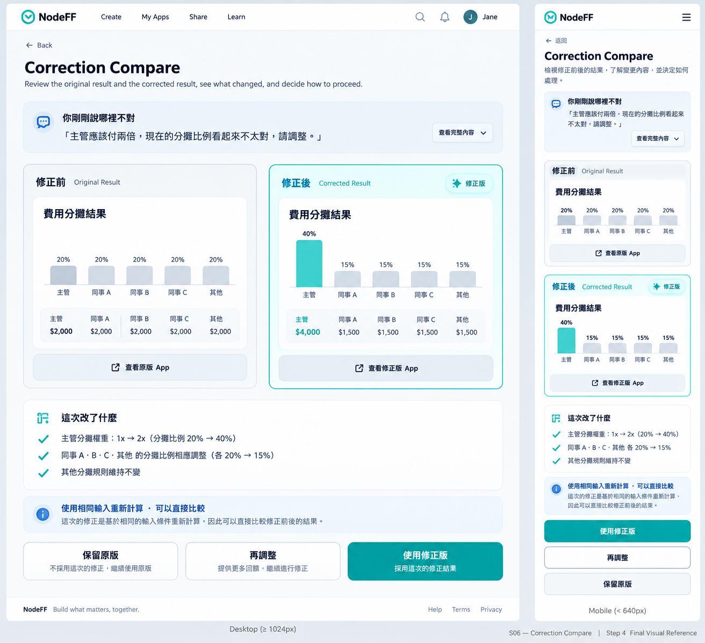

# S06 — Correction Compare

> Governance：本檔為 UI/UX Working Current Truth；Build Freeze / delivery lifecycle 以 `working/common-core/DESIGN-TO-DELIVERY.md` 為準。

> Screen ID：S06
>
> 狀態：**WORKING — ④A LOW_FI_APPROVED / ④B HIGH_FI_STEP1–4 APPROVED — WORKING BASELINE**
>
> Phase：Phase 1
>
> Screen-level canonical owner：`working/detailed-design/UI-UX/screens/S06-CORRECTION-COMPARE.md`
>
> Function behavior sources：F16 Result Correction + F00 Experience Shell + F03 Runtime。
>
> ④A Low-fi與④B High-fi Step 1–4已完成 User Review並鎖定；Build Freeze 與 Cursor implementation 仍維持 HOLD。

# 1. User Outcome

S06 的核心任務：

> **當 User 認為結果 / 規則 / 邏輯不對時，appf2 讓他用相同可重播 inputs 比較修正前後結果，清楚知道改了什麼，再自己決定要不要採用新版。**

S06 不是一般 Refine Preview，也不是技術 diff viewer。

# 2. Entry

Canonical flow：

    S03 Result
    → O02 Correction Composer
    → correction generation / replay
    → S06 Compare

只有 F16 correction 進 S06。

一般新增功能 / 改 UI / 改用途：
    → S05 Refine / Remix
    不進 S06。

# 3. Core Information Hierarchy

S06 必須依序讓 User看到：

1. **你剛剛說哪裡不對**
2. **修正前結果**
3. **修正後結果**
4. **這次改了什麼**
5. **比較可信度 / 限制**
6. **決策 CTA**

Default 不顯示：
- JSON diff
- AST diff
- state key diff
- model reasoning
- internal correction delta IDs

# 4. Proposed Desktop Low-fi

    ┌──────────────────────────────────────────────────────────────┐
    │ appf2   App Title                                            │
    ├──────────────────────────────────────────────────────────────┤
    │ 你說：主管應該付兩倍，但現在沒有                            │
    │                                                              │
    │ ┌────────────────────────┐  ┌────────────────────────┐       │
    │ │ 修正前                 │  │ 修正後                 │       │
    │ │                        │  │                        │       │
    │ │ 結果：$1,200           │  │ 結果：$1,450           │       │
    │ │                        │  │                        │       │
    │ └────────────────────────┘  └────────────────────────┘       │
    │                                                              │
    │ 這次改了什麼                                                 │
    │ • 主管權重改成 2x                                            │
    │ • 其他規則維持不變                                           │
    │                                                              │
    │ 比較品質：可直接比較 / 有限制                                │
    │                                                              │
    │ [保留原版]          [再調整]             [使用修正版]        │
    └──────────────────────────────────────────────────────────────┘

Desktop 預設 side-by-side，因為核心任務就是比較。

# 5. Proposed Mobile Low-fi

Mobile 不強迫左右並排。

    ┌────────────────────────────┐
    │ App Title                 │
    │                            │
    │ 你說：主管應該付兩倍…      │
    │                            │
    │ ┌────────────────────────┐ │
    │ │ 修正前                 │ │
    │ │ 結果：$1,200           │ │
    │ └────────────────────────┘ │
    │                            │
    │        ↓                   │
    │                            │
    │ ┌────────────────────────┐ │
    │ │ 修正後                 │ │
    │ │ 結果：$1,450           │ │
    │ └────────────────────────┘ │
    │                            │
    │ 這次改了什麼              │
    │ 比較品質                  │
    │                            │
    │ [保留原版]                │
    │ [再調整] [使用修正版]      │
    └────────────────────────────┘

Mobile 原則：
- stacked compare。
- Before / After label永遠清楚。
- CTA不遮比較內容。

# 6. Version Visual Distinction

沿用 S05 的版本辨識原則：

- 修正前 / 修正後需有不同 border / accent token。
- 必須有文字 label，不可只靠顏色。
- 實際色值留到 ④B High-fi Design System 決定。

# 7. What User Said Was Wrong

S06 最上方保留簡短 correction statement：

    你說：
    「主管應該付兩倍，但現在沒有」

目的：
- 讓 User知道系統修的是哪一件事。
- 避免只看到兩個不同數字，卻不知道差異對應什麼。

若 feedback 很長，預設摘要 + 展開查看原文。

# 8. Previous Result / New Result

Before / After 必須來自 F16 + F03 canonical result。

Rules：
- 不從 DOM 抓數字。
- unavailable output要標示 unavailable / error，不 fake default。
- SENSITIVE / DO_NOT_PERSIST值依 policy處理。
- 若 result有多個 output，優先顯示 material outputs，其他可展開。

# 9. What Changed

User-facing summary只回答：

> **「為了修正你指出的問題，這次改了什麼？」**

來源：
- Resolved Correction Intent。
- Correction Delta。
- deterministic semantic diff metadata。

Low-fi presentation：

    這次改了什麼
    • 主管分攤權重：1x → 2x
    • 其他分攤規則維持不變

不顯示 technical JSON path。

# 10. Comparison Quality

F16 已定義：

- DETERMINISTIC_REPLAY
- SEEDED_REPLAY
- TIME_CONTEXT_REPLAY
- LIMITED_COMPARISON

Consumer不直接看 enum。

Proposed user-facing mapping：

## Fully Comparable

    使用相同輸入重新計算
    這次結果可以直接比較

## Limited Comparison

    這次比較有部分限制
    隨機 / 時間狀態無法完全重現，因此數值差異不一定全部來自這次修正

Rules：
- LIMITED 必須 visible。
- 不可以把不可 apples-to-apples 的比較包裝成「已修正正確」。

# 11. Use Corrected Version

Primary CTA：

    使用修正版

Effect：
- child corrected Blueprint / Runtime becomes active。
- correction outcome = ACCEPTED。
- 回 S03。
- base Blueprint保留。

User心智：
> 「這個修正比較符合我要的，就用它。」

# 12. Keep Previous

CTA：

    保留原版

Effect：
- correction outcome = REJECTED。
- base App保持 active。
- child仍保留為 immutable artifact。
- 回 S03 base App。

# 13. Adjust Again

CTA：

    再調整

F16 default：
- 保留 current comparison。
- prefill previous feedback + latest change summary。
- base = latest generated child。
- replay inputs重新驗證。

UI 顯示：

    你正在繼續調整：目前這個修正版

Secondary option：

    從原版重新修正

# 14. Return / View App

S06 不提供獨立的「回目前 App」Decision CTA，避免 User無法判斷這代表暫時離開、Reject correction，或 Accept目前版本。

S06 可提供：

    查看原版 App
    查看修正版 App

但兩者只是 Preview，不是決策。

Rules：
- 查看不等於 Accept / Reject。
- Preview結束後回 S06，compare context必須保留。
- 若開 full Runtime preview，應明確標示目前查看哪一版。
- 真正離開 Compare 的產品決策只使用：**保留原版 / 再調整 / 使用修正版**。
- S06 是 focused decision workspace，不繼承 S03 permanent bottom navigation。
- 此規則不新增 F16 outcome；完全沿用既有 ACCEPT / KEEP_PREVIOUS / ADJUST_AGAIN semantics。

# 15. Loading / Replay State

進 S06前可能有：
- CHILD_READY
- REPLAYING
- COMPARE_READY

User-facing不顯示 technical state。

Proposed：

    正在套用相同輸入…
    正在比較修正前後結果…

如果有可靠 progress source可以顯示 progress；沒有就 stage-based，不 fake %。

# 16. Failure / Recovery

任何 technical failure：
- 不破壞 base App。
- 保留 correction draft / before context。
- 交 O03 / F12。

Examples：

## Replay Failed

    目前無法完整比較，但原版還在。

    [再試一次]
    [保留原版]

## Limited Replay

不是 error：

    這次只能做有限比較。

    [查看限制]
    [保留原版]
    [再調整]

# 17. Revert Boundary

S06 是「尚未接受修正版前」的 Compare。

Revert 是：

    User 已接受修正版
    → 回 S03
    → Previous Version / Revert
    → O04

因此 S06 不放 Revert CTA。

S06 只放：
- 使用修正版
- 保留原版
- 再調整

# 18. Accessibility / Responsive

- Before / After 不只靠顏色。
- Desktop side-by-side 在窄寬時自動變 stacked。
- screen reader順序固定：issue → previous → new → changes → quality → actions。
- Result change可用 aria-live適度宣布。
- CTA wording明確，不使用模糊「Done」。
- focus從 O02進 S06後落在 Compare heading。

# 19. Confirmed S06 Low-fi Decisions

User 已確認：

1. Desktop 預設採 **side-by-side 修正前 / 修正後**；Mobile 採上下 stacked compare。
2. S06 頂部保留 **「你剛剛說哪裡不對」** 摘要，下面再顯示 Before / After。
3. 三個主要 CTA 固定為：**保留原版 / 再調整 / 使用修正版**。
4. 若 comparison_mode = LIMITED_COMPARISON，必須明確告知 User「這次只能有限比較」，不可暗示兩邊完全 apples-to-apples。

# 20. ④B High-fi Contract

> Step 1 approved by User：2026-09-23
>
> Canonical rule：本節是 S06 High-fi 的唯一 canonical contract。後續 Step 2–4 必須在本節續寫，不得另建重複 High-fi summary / shadow copy。
>
> Current status：
> - Step 1 — Structure Lock ✅
> - Step 2 — Geometry + Visual Hierarchy Lock ✅
> - Step 3 — Detailed High-fi Visual Rules Lock ✅
> - Step 4 — Final Visual Reference Lock ✅

## Step 1 — Structure Lock ✅

### 1. S06 Role

S06 只服務 **F16 Result Correction**。

Canonical entry：

~~~text
S03 Result
→ O02 Correction Composer
→ correction generation / replay
→ S06 Correction Compare
~~~

新增功能、改 UI、改用途仍走 S05，不進 S06。

S06 是 **Compare Decision Workspace**，不是 Editor、Builder、一般 Refine Preview或 technical diff viewer。

### 2. Canonical Information Order

S06 固定依序呈現：

~~~text
App context
→ 你剛剛說哪裡不對
→ 修正前 / 修正後
→ 這次改了什麼
→ 比較可信度 / 限制
→ Decision actions
~~~

若 correction feedback 過長，可顯示摘要並提供展開原文；不可移除 correction context。

### 3. Before / After Result Surfaces

修正前與修正後都必須來自 F16 + F03 canonical result，且必須有明確文字 label，不可只靠顏色。

Consumer UI不顯示 JSON / AST diff、state key diff、model reasoning、internal correction delta ID、technical Blueprint path。

Unavailable / protected outputs依 Function / policy truth呈現，不 fake default。

### 4. What Changed

「這次改了什麼」只呈現 consumer semantic summary；來源仍是 Resolved Correction Intent / Correction Delta / deterministic semantic diff metadata，UI不得自行推論改動。

### 5. Comparison Quality Is First-class Structure

Comparison quality / limitation不得藏進 technical detail。

若為 LIMITED_COMPARISON：
- 必須明確顯示「這次只能有限比較」；
- 必須說明數值差異不一定全部來自本次修正；
- 不得包裝成「系統已證明修正正確」。

F16允許在限制已明確揭露時仍由 User自行決定是否採用修正版；S06不得自行把 LIMITED等同於失敗。

### 6. Decision Actions

S06只有三個產品決策：**保留原版 / 再調整 / 使用修正版**；Primary = **使用修正版**。

- 保留原版 → correction outcome = REJECTED → 回 S03 base App。
- 再調整 → 繼續 correction lifecycle；Phase 1 default base = latest generated child。
- 使用修正版 → correction outcome = ACCEPTED → corrected child becomes active → 回 S03。

再調整仍保留 secondary option：**從原版重新修正**；使用 original pre-correction Blueprint作 base。

### 7. Preview Is Not A Decision

可以提供 **查看原版 App / 查看修正版 App**，但只能是 Preview action。

- 查看不等於 Accept / Reject。
- Preview返回後保留同一 compare context。
- 若進 full Runtime preview，必須明確標示目前查看版本。
- 不增加第四個「回目前 App」Decision CTA。

### 8. Revert Boundary

S06不提供 Revert。接受修正版後若 User要回前版，由 **S03 → O04 Revert Confirmation** 承接。

### 9. Focused Workspace / Shell Boundary

S06不繼承 S03 permanent bottom navigation；不得把「目前 App / 修改 / 分享」帶進 S06 decision workspace。

### 10. Loading / Recovery Ownership

- correction generation / replay / comparison processing presentation → O05。
- technical failure / retry / preserved context → O03 + F12。
- S06只呈現 compare-ready content與 consumer decision。

### 11. Step 1 Locked Decisions

1. S06只服務 F16 Correction。
2. S06定位為 Compare Decision Workspace，不是 Editor / technical diff viewer。
3. Information order固定為 App context → issue → Before/After → changed summary → quality/limits → decisions。
4. Before / After都是 canonical Result surface，且明確文字標示。
5. What Changed只用 consumer semantic summary。
6. Comparison Quality / LIMITED_COMPARISON是正式可見結構。
7. 三個唯一產品決策為保留原版 / 再調整 / 使用修正版，Primary = 使用修正版。
8. Adjust Again預設以 latest generated child繼續；可 secondary選擇從原版重新修正。
9. 查看原版 / 修正版只屬 Preview，不是 decision。
10. S06不放 Revert；接受後若要回前版由 S03 → O04承接。
11. S06不繼承 S03 permanent bottom navigation。
12. Processing交 O05；Failure / Recovery交 O03 + F12。

> Step 1：**APPROVED / LOCKED**。下一步：Step 2 — Geometry + Visual Hierarchy Lock。

## Step 2 — Geometry + Visual Hierarchy Lock ✅

> Approved by User：2026-09-23
>
> Step 2：**APPROVED / LOCKED**
>
> Scope：鎖定 S06 Desktop / Mobile workspace width、Before / After排列、資訊區塊位置、Preview / Decision action分層、responsive transition與 visual attention order。不得改寫 Step 1 Function / state semantics；final color / border / motion / component styling留給 Step 3。

### 1. Desktop Compare-first Workspace

Desktop S06採單一 centered Compare Workspace。

Recommended main workspace：

~~~text
max-width：約 1120–1200px
~~~

主結構：

~~~text
App Context
→ Correction Statement
→ Before / After Compare
→ What Changed
→ Comparison Quality / Limitation
→ Decision Actions
~~~

S06不採 S05 的 640–720px focused composer width；S06需要足夠水平空間支援真正比較。

### 2. Before / After Geometry

Desktop預設：

~~~text
Before ≈ 50%
After  ≈ 50%
gap    ≈ 20–24px
~~~

Geometry本身不偏袒修正後結果。

不得用「Before很窄 / After很寬」暗示 User應採用新版。

修正後可以在 Step 3透過文字 label / border / accent取得較高 visual attention，但不改變基本 50/50 compare geometry。

### 3. Correction Statement Placement

`你剛剛說哪裡不對` 固定放在 Compare區塊上方。

Recommended content width：

~~~text
約 720–800px
~~~

Rules：
- 不做大型 Hero。
- 短 feedback直接顯示。
- 長 feedback顯示摘要 + 展開原文。
- Correction context不得被藏到 Compare之後。

### 4. Result Surface Sizing

Before / After Result Surface不鎖固定高度。

Desktop建議：

~~~text
minimum visible region：約 280–360px
~~~

Rules：
- 同一 compare row內盡量維持等高。
- 不得為了等高而裁掉 material output。
- material outputs優先；secondary detail可展開。
- Generated App result需要較完整 preview時，可以使用 bounded preview container。
- 不得把 S06變成兩個完整 S03 Runtime並排。

### 5. What Changed Placement

`這次改了什麼` 固定為 Compare下方的獨立 section。

不得塞進 After Result Card，避免把「結果差異」與「系統對本次修正的 semantic summary」混在同一層。

### 6. Comparison Quality Placement

Comparison Quality / Limitation固定放在：

~~~text
What Changed
→ Comparison Quality / Limitation
→ Decision Actions
~~~

正常可直接比較時可使用 compact presentation。

`LIMITED_COMPARISON`時，原位置展開為明顯 limitation notice；不另開 Modal、不改整頁 information architecture。

### 7. Desktop Decision Region

Desktop Decision Actions使用正常 document flow，不採 sticky full-width footer作為 Step 2 baseline。

Canonical order / hierarchy：

~~~text
[保留原版]     [再調整]                  [使用修正版]
low             secondary                  primary
~~~

Rules：
- 三個 decision都清楚可見。
- `使用修正版`在右側作 Primary。
- `再調整`為 Secondary。
- `保留原版`為較低 emphasis decision。
- 只有未來 usability evidence顯示長頁面造成決策不可達，才 reopen Step 2討論 restrained sticky decision bar。

### 8. Preview Actions Are Local To Result Surfaces

`查看原版 App` / `查看修正版 App` 不進入 Decision row。

它們各自附屬對應 Result Surface，作低優先 Preview action。

目的：避免 User把「查看」誤認為 Accept / Reject / Adjust decision。

### 9. Mobile Stacked Compare

Mobile固定採 stacked compare，不使用 Before / After Tabs。

Canonical order：

~~~text
App Context
→ 你剛剛說哪裡不對
→ 修正前
→ 修正後
→ 這次改了什麼
→ Comparison Quality / Limitation
→ Decisions
~~~

Rules：
- Before / After完整文字 label持續可見。
- 不用 Tabs讓其中一個版本消失。
- CTA不得遮 Compare內容。
- mobile edge padding沿 Design System約 16–20px。

### 10. Mobile Decision Order

Mobile固定：

~~~text
[使用修正版]
[再調整]
[保留原版]
~~~

Rules：
- 接近 full-width。
- touch target ≥ 44 CSS px。
- safe-area aware。
- 不被 keyboard / browser chrome遮住。

### 11. Responsive Transition

Responsive不是只靠 viewport breakpoint硬切。

Direction：

~~~text
≥ 1024px
→ side-by-side

640–1023px
→ 依實際 content minimum width / container決定 side-by-side 或 stacked

< 640px
→ stacked
~~~

若 Result內容需要較大 minimum width，必須提早 stack，不可硬塞兩欄。

### 12. Visual Attention Order

S06 Step 2鎖定的預設 attention order：

~~~text
Before / After Result Compare
> Correction Statement
> What Changed
> Decision Primary CTA
> Comparison Quality
> App / appf2 chrome
~~~

例外：

`LIMITED_COMPARISON`時，Limitation notice提升為 Decision前的高注意層級。

appf2 chrome不得壓過 Compare本身。

### 13. Step 2 Locked Decisions

1. Desktop main workspace約 1120–1200px。
2. Desktop Before / After預設約 50/50 side-by-side。
3. Geometry本身不偏袒 After；修正版強弱差異留給 Step 3 visual styling。
4. Correction statement固定在 Compare上方。
5. What Changed獨立放在 Compare下方，不塞進 After。
6. Comparison Quality位於 Decision前；Limited時原地展開。
7. Preview actions附屬各自 Result Surface，不與 Decision Actions混合。
8. Desktop decision row = 保留原版 / 再調整 / 使用修正版。
9. Desktop baseline不採 sticky decision bar。
10. Mobile固定 stacked：Before → After，不使用 Tabs。
11. Mobile decision order = 使用修正版 → 再調整 → 保留原版。
12. 640–1023px採 content/container-aware transition；必要時提早 stack。

> Step 2：**APPROVED / LOCKED**。下一步：Step 3 — Detailed High-fi Visual Rules Lock。

## Step 3 — Detailed High-fi Visual Rules Lock ✅

> Approved by User：2026-09-23
>
> Step 3：**APPROVED / LOCKED**
>
> Scope：鎖定 S06 color usage、typography、Compare Card、Before / After版本辨識、CTA emphasis、LIMITED_COMPARISON presentation、motion、interaction states、accessibility與 Cursor guardrails。不得改寫 Step 1 Function / state semantics或 Step 2 geometry。

### 1. Core Visual Character

S06採 **Compare Decision Workspace** visual direction，沿用 appf2 Design System：**Clean Creator Canvas + Playful Energy**，但比 S05更理性、克制。

Rules：
- White / Soft Neutral為主。
- Teal作 Primary / focus / corrected-version accent。
- Aqua作 supporting accent。
- Yellow只允許 very small changed / new energy marker。
- 不做 neon / rainbow / glassmorphism。
- 不做 heavy shadow。
- 不做 IDE / Git diff viewer視覺。

### 2. Before / After Visual Language

#### Before — 修正前
- 使用 Neutral treatment。
- White / Soft surface。
- Neutral border。
- 明確文字 `修正前`。
- 不做 disabled / faded-out treatment。
- 必須讓 User明確理解原版仍是合法、可保留的版本。

#### After — 修正後
- 使用 Teal / Aqua border或局部 accent。
- 明確文字 `修正後`。
- 可有很小的 `新版 / 修正版` marker。
- Yellow只能作 small energy accent，不可鋪滿 card。
- **After slight emphasis = YES**：修正後可比修正前稍強，但只靠 Teal / Aqua border / accent；不得放大、不得加重 shadow、不得加「推薦」標籤。

Before / After差異至少同時依賴文字 label + border / accent；不得只靠顏色。

### 3. Compare Card

Compare Card是 appf2 comparison context，不重畫 Generated App。

Recommended treatment：
- radius = `16px`。
- border = `1px`。
- elevation = `0–1`。
- padding = `16–24px`。
- label / heading約 `14–16px semibold`。

Canonical principle：

> **appf2 owns the comparison frame; the App owns result presentation.**

不得強迫 Generated App內部 Result改成 appf2 component visual language。

### 4. Correction Statement

`你剛剛說哪裡不對`採 supporting context，不搶過 Compare。

- label約 `body-md / semibold`。
- feedback內容約 `body-lg`。
- Ink primary。
- 可使用 Soft Neutral container。
- 不使用 Yellow warning treatment。
- 長內容的「查看完整內容」使用 Ghost action。

### 5. What Changed

`這次改了什麼`必須容易掃讀，但不是 technical diff。

Rules：
- heading沿 `heading-md 20/28`。
- change item使用 clean row / bullet。
- material changed value可用 Teal emphasis。
- 不用 red / green diff。
- 不使用 Git-style `- / +`。
- 不顯示 JSON path。

### 6. Comparison Quality / LIMITED_COMPARISON

正常可直接比較時，使用低干擾 informational line，例如：

~~~text
使用相同輸入重新計算 · 可以直接比較
~~~

`LIMITED_COMPARISON`時，升級成 clearly visible Inline Notice：
- icon + title + explanation。
- title明確使用「這次只能有限比較」。
- 不只靠顏色。
- 不畫成 catastrophic error。
- 不使用 Brand Yellow冒充 Warning semantic color。
- exact caution / warning semantic palette留給 O03 / shared semantic palette統一，不由 S06自行發明。

`LIMITED_COMPARISON`代表比較有限，不代表 App壞掉。

### 7. Decision Button Hierarchy

`使用修正版` = Primary：
- Teal 600 background。
- White text。
- radius `12px`。
- min-height `44px`。
- Hover → Teal 500。
- visible focus。

`再調整` = Secondary：
- White / neutral surface。
- default border。
- Ink text。

`保留原版` = Tertiary / lower emphasis：
- Ghost或 subtle neutral treatment。
- 仍必須清楚可操作。
- 不使用 destructive red；保留原版不是危險操作。

`從原版重新修正` 再低一級，不進主要 decision row。

### 8. Preview Actions

`查看原版 App` / `查看修正版 App`全部採 Ghost / low emphasis。

Rules：
- 不得長得像 Decision button。
- Preview開啟時清楚標示目前查看版本。
- 返回後回原 compare context。
- Preview不改變 active version。

### 9. LIMITED Does Not Disable Primary

即使為 `LIMITED_COMPARISON`，`使用修正版`仍保持可用 Primary。

不得：
- disabled Primary；
- 隱藏 Primary；
- 使用 danger styling逼 User拒絕。

Limitation Notice必須在 CTA前被清楚看見，讓 User做 informed decision；S06不得把 LIMITED自行升級成 system veto。

### 10. Typography

- Screen title：Desktop `heading-xl 32/40`；Mobile `heading-lg 24/32`。
- Compare label：`label-md / semibold`。
- Section title：`heading-md 20/28`。
- supporting / quality copy：`body-md 14/22`。
- Decision button：`label-md`。
- Material numeric result可使用 tabular numerals where supported。
- appf2不得擅自把 Generated App內不重要的數字放大成主視覺。

### 11. Motion

- Hover / button feedback：約 `120ms`。
- Compare / preview transition：約 `180–240ms`。
- Before → After不得使用 morph animation暗示「變好了」。
- 不做 confetti / fireworks。
- 不做 serious notice shake / bounce。
- 不做持續 pulse。
- `prefers-reduced-motion`必須有 fallback。

### 12. Interaction States

S06共用元件至少支援：

~~~text
DEFAULT
HOVER
FOCUS_VISIBLE
PRESSED
DISABLED
LOADING where applicable
SELECTED where applicable
~~~

Rules：
- Decision提交後避免 duplicate submit。
- Loading presentation交 O05，不在 Button裡假裝 operation已完成。
- Preview action與Decision action不得共用 selected-state semantics。
- Compare Card預設不是 selectable card。

### 13. Accessibility

- Before / After不只靠顏色。
- LIMITED不只靠顏色。
- touch target ≥ `44 CSS px`。
- keyboard / screen-reader順序維持：issue → Before → After → changes → quality → decisions。
- focus visible且不造成 layout shift。
- full Preview開啟 / 關閉需正確 focus move / restore。
- Result change可適度 aria-live。
- assistive tech必須能分辨「修正前結果」與「修正後結果」。
- Mobile CTA不得被 safe-area / browser chrome遮住。
- reduced-motion為 High-fi acceptance gate。

### 14. Cursor Guardrails

Cursor不得：
- 把 S06做成 IDE / Git diff viewer。
- 用 red / green作 Before / After主要區分。
- 把 After做得比 Before大很多。
- 把 Before畫成 disabled / obsolete。
- 把 LIMITED當 Error或禁止 User接受。
- 把 Brand Yellow當 Warning / Danger。
- 把 Preview actions混進 Decision actions。
- 增加第四個 decision。
- 增加 Revert。
- 把 Generated App內部重畫成 appf2 UI。
- 自行發明 progress；processing仍由 O05。
- 自行發明 recovery palette；recovery仍由 O03 / shared semantic system。

### 15. Step 3 Locked Decisions

1. S06採克制的 Compare Decision Workspace visual。
2. Before = Neutral；After = Teal / Aqua accent。
3. Before / After一定有文字 label，不只靠顏色。
4. **After slight emphasis = YES**，但只用 Teal / Aqua border / accent；不放大、不加重 shadow、不標記「推薦」。
5. Compare Card只包 comparison context，不重畫 Generated App。
6. What Changed使用 consumer semantic summary，不做 Git diff。
7. LIMITED使用明顯 Inline Notice，但不是 Error。
8. LIMITED時 `使用修正版`仍保持可用。
9. `使用修正版` Primary；`再調整` Secondary；`保留原版`低 emphasis。
10. Preview actions固定為 Ghost，不與 Decision混層。
11. Yellow不作 Warning / Danger。
12. Motion採 `120 / 180 / ≤240ms` restrained system。
13. Accessibility、focus、keyboard、reduced-motion列為 High-fi acceptance gate。

> Step 3：**APPROVED / LOCKED**。下一步：Step 4 — Final Visual Reference Lock。

## Step 4 — Final Visual Reference Lock ✅

> Approved by User：2026-09-23
>
> Step 4：**APPROVED / LOCKED**
>
> Approved visual：
>
> 
>
> Canonical path：
>
> `working/detailed-design/UI-UX/references/S06-Hi-FI-Debug-v1.png`
>
> Repository PNG blob SHA：
>
> `8eece7d353eee9d58753ef665e5cf453d67451e6`

### Reference Boundary

- 圖片鎖定 Compare Decision Workspace 的 composition、Before / After hierarchy、Desktop / Mobile relationship與 visual language。
- sample result / correction copy只作 presentation example，不自動形成 F16 semantic requirement。
- Before / After geometry、LIMITED_COMPARISON、三個 decision CTA仍以 Step 1–3文字 contract為最高 authority。
- 圖片中的 typo / sample discrepancy不得反向改寫 Function truth。
- Step 1–3 textual contract + Design System + Fxx Function truth優先於圖片生成 / rendering誤差。
- 此 PNG 為本 Screen / Overlay 唯一 canonical High-fi visual reference；後續若要取代，必須 reopen Step 4。

> Step 4：**APPROVED / LOCKED**。

# 21. Review Status

> **④A LOW_FI_APPROVED / ④B HIGH_FI_STEP1–4 APPROVED — WORKING BASELINE**

S06 ④A Low-fi與④B Step 1–4已完成 User Review並鎖定。

Final Cross-Screen High-fi Review：**CLOSED / VERIFIED**。

Build Freeze / appf2-build activation / Cursor implementation 維持 HOLD。

### Final Cross-Screen High-fi Review — CLOSED / VERIFIED

> Verified：2026-09-24
>
> FG-01–FG-07 已全部完成修正與決策；2026-09-24 final full-set re-audit 未發現新的 material cross-screen finding。**Final Cross-Screen High-fi Gate = CLOSED / VERIFIED。**
>
> Final cross-screen authority：**Step 1–3 textual contract + Design System + Fxx Function truth > Step 4 visual reference。**
>
> Final re-audit確認：S03 使用 approved v2 canonical reference；其餘既有 canonical PNG維持不變。圖片不覆蓋 Step 1–3 textual contract / Design System / Fxx Function truth。
